# 命令延迟模式 · LLM 对 LLM 完整战报

- **想定**：IBS-S-01（seed 20270830）
- **双方策略**：zcode-subagent / zcode-subagent —— 双方每个编队各由一个独立子代理指挥（带记忆），舰队总指挥用自然语言下达命令，命令作为电报经通信链路投递
- **结果**：7 回合，胜方 无（平局：胜利点差小于4）；比分 8–5；友军碰撞 0 次
- **代理执行面**：2 次舰队总指挥电报、19 次编队代理决策；其中 5 次代理方案被引擎合法性检查驳回并回退确定性指挥官（详见 [代理自主性与回退披露](#代理自主性与回退披露)）
- **信息边界**：每个代理只能看到自己一侧的过滤视图；本报告为**战后中性文书**，因此正文地图为双方视角，但第 [信息泄露与证据核验](#信息泄露与证据核验) 节单独验证了代理实际收到的材料，并在同节披露该项检查自身的方法与局限

## 逐回合态势与指挥

### 第 1 回合


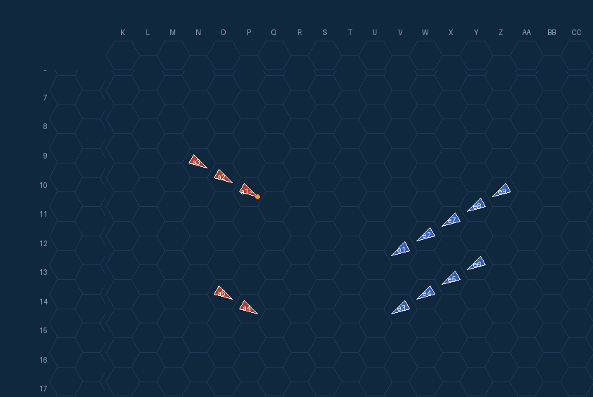

*图：第 1 回合各结算阶段的棋盘（裁剪至行动区域、保留六角标尺），双方视角各取机动结算与炮击结算（`turn-1-gunnery-axis-48.png, turn-1-fire_end-axis-63.png, turn-1-gunnery-allies-48.png, turn-1-fire_end-allies-63.png`）*

**裁决要点**

- `T1 torpedo_effects` **command_message_delivered** — 报文 MSG-00001（contact_report）送达 axis-active-light
- `T1 torpedo_effects` **command_message_delivered** — 报文 MSG-00002（contact_report）送达 allies-active-heavy
- `T1 fire_end` **command_message_delivered** — 报文 MSG-00003（contact_report）送达 axis-active-light
- `T1 fire_end` **command_message_delivered** — 报文 MSG-00004（contact_report）送达 allies-active-heavy
- `T2 reinforcement` **command_message_delivered** — 报文 MSG-00005（contact_report）送达 axis-active-light
- `T2 reinforcement` **command_message_delivered** — 报文 MSG-00006（contact_report）送达 allies-active-heavy

### 第 2 回合

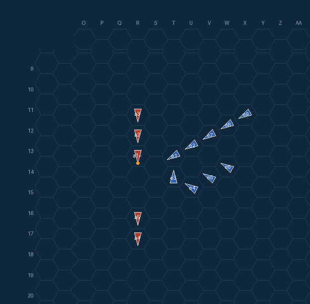


*图：第 2 回合各结算阶段的棋盘（裁剪至行动区域、保留六角标尺），双方视角各取机动结算与炮击结算（`turn-2-movement_resolution-axis-129.png, turn-2-gunnery-axis-191.png, turn-2-movement_resolution-allies-129.png, turn-2-gunnery-allies-191.png`）*

**裁决要点**

- `T2 movement_planning` **command_message_delivered** — 报文 MSG-00007（contact_report）送达 axis-active-light
- `T2 movement_planning` **command_message_delivered** — 报文 MSG-00008（contact_report）送达 allies-active-heavy
- `T2 movement_planning` **formation_agent_decision** — 轴心第1编队 本地代理决策：无上级命令，凭本地情报主动接敌：右转南下以横舷对敌先头纵队，火力权重集中敌巡洋舰、压制远距驱逐舰。
- `T2 movement_planning` **formation_agent_decision** — 轴心第2编队 本地代理决策：无在案命令：敌巡洋舰驱逐混合纵队正向西南逼近，将与北面青叶本队迎头相遇，我率吹雪/初雪占敌纵队南侧翼（R17，预计距旧金山2—4格）保持鱼雷阵位形成南北夹击并预留同向脱离航向，火力优先旧金山/博伊西、贬抑远距驱逐舰。
- `T2 movement_planning` **formation_agent_decision** — 同盟第1编队 本地代理决策：无现行命令，敌重巡纵队以速5沿r2东进逼近，我以MOVE:1S4S转向北占据其航路前方北侧，以整列右舷炮位横越T字集火敌旗舰青叶，同时向北拉开与南侧吹雪、初雪的鱼雷距离；无命令需确认，故acknowledgement为否，仅发SITREP通报转向以防与友邻第2编队航路混淆。
- `T2 movement_planning` **formation_agent_decision** — 同盟第2编队 本地代理决策：无在案命令且敌巡洋纵队正朝我重编队逼近，遂率轻编队直进5格占其纵队南侧约4-6格的雷击阵位，既避免与前卫青叶进入1-2格近战，又保持随后的转向雷击自由，火力优先压制敌前卫并上报接触。
- `T2 torpedo_planning` **command_message_delivered** — 报文 MSG-00011（contact_report）送达 axis-active-light
- `T2 torpedo_planning` **command_message_delivered** — 报文 MSG-00012（contact_report）送达 allies-active-heavy
- `T2 movement_resolution` **command_message_delivered** — 报文 MSG-00013（contact_report）送达 axis-active-light
- `T2 movement_resolution` **command_message_delivered** — 报文 MSG-00014（contact_report）送达 allies-active-heavy
- `T2 movement_resolution` **formation_emergency_stop** — 法伦霍尔特、旧金山 紧急停车，避免友舰相撞
- `T2 movement_resolution` **formation_emergency_stop** — 博伊西 跟随前舰紧急停车
- `T2 movement_resolution` **formation_emergency_stop** — 盐湖城 跟随前舰紧急停车
- `T2 movement_resolution` **formation_emergency_stop** — 海伦娜 跟随前舰紧急停车
- （其余 14 条见附录日志）

**编队代理决策**

| 编队 | 阵营 | 机动方案 | 激活分支 | 决策说明 |
|---|---|---|---|---|
| axis-active-heavy | None | `2S2` | 无 | 0无上级命令，凭本地情报主动接敌：右转南下以横舷对敌先头纵队，火力权重集中敌巡洋舰、压制远距驱逐舰。 |
| axis-active-light | None | `2S2` | 无 | 0无在案命令：敌巡洋舰驱逐混合纵队正向西南逼近，将与北面青叶本队迎头相遇，我率吹雪/初雪占敌纵队南侧翼（R17，预计距旧金山2—4格）保持鱼雷阵位形成南北夹击并预留同向脱离航向，火力优先旧金山/博伊西、贬抑远距驱逐舰。 |
| allies-active-heavy | None | `1S4S` | 无 | 0无现行命令，敌重巡纵队以速5沿r2东进逼近，我以MOVE:1S4S转向北占据其航路前方北侧，以整列右舷炮位横越T字集火敌旗舰青叶，同时向北拉开与南侧吹雪、初雪的鱼雷距离；无命令需确认，故acknowledgement为否 |
| allies-active-light | None | `5` | 无 | 0无在案命令且敌巡洋纵队正朝我重编队逼近，遂率轻编队直进5格占其纵队南侧约4-6格的雷击阵位，既避免与前卫青叶进入1-2格近战，又保持随后的转向雷击自由，火力优先压制敌前卫并上报接触。 |

代理写给自己的备忘：`axis-active-heavy`「主目标旧金山、博伊西；已转南占横舷位迎敌；防拉菲/法伦霍尔特近距雷击；青叶下回合炮恢复即集火敌先头巡洋舰。」；`axis-active-light`「敌纵队西南行，我占其南侧R17，预计距旧金山2-4格；保持南翼鱼雷阵位让青叶本队北面接敌，勿单独冲入敌驱逐屏卫。」；`allies-active-heavy`「敌CA群沿r2东进速5；我已1S4S北转横越，下回合保持航向6右舷集火青叶，勿入吹雪/初雪鱼雷界，留意法伦霍尔特DD航路交叉。」；`allies-active-light`「敌CA纵队(r=2,航向2)直插我重编队，占其纵队南侧4-5格位雷击前卫青叶，勿与CA进入2格内近战」

### 第 3 回合


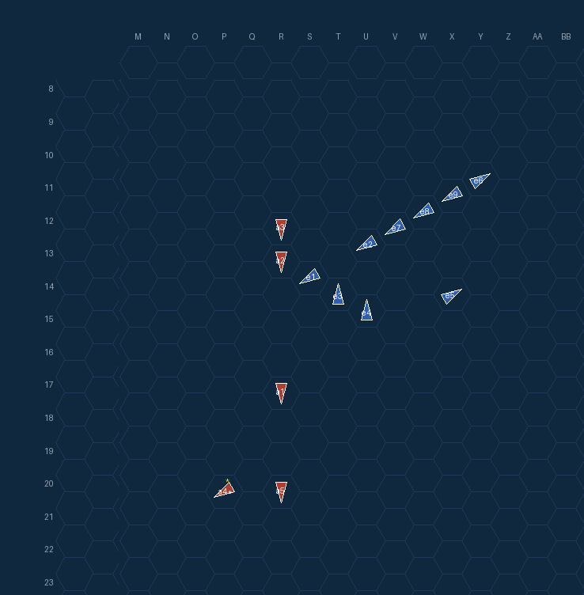
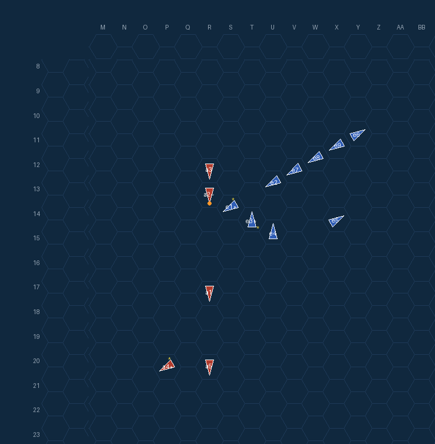

*图：第 3 回合各结算阶段的棋盘（裁剪至行动区域、保留六角标尺），双方视角各取机动结算与炮击结算（`turn-3-movement_resolution-axis-281.png, turn-3-gunnery-axis-327.png, turn-3-movement_resolution-allies-281.png, turn-3-gunnery-allies-327.png`）*

**裁决要点**

- `T3 movement_planning` **command_message_delivered** — 报文 MSG-00023（contact_report）送达 axis-active-light
- `T3 movement_planning` **command_message_delivered** — 报文 MSG-00024（contact_report）送达 allies-active-heavy
- `T3 movement_planning` **formation_agent_decision** — 轴心第1编队 本地代理决策：无上级命令，依本地情报维持航向3全速南下，让敌先头（旧金山/法伦霍尔特）横越舰首时以纵队齐射打击高价值巡洋舰，同时避免左转进入其驱逐舰幕的近距雷击范围；火力权重集中正横近距的旧金山，次选博伊西，轻压远距的盐湖城，并负权重压制对驱逐舰的主炮浪费。
- `T3 movement_planning` **formation_agent_decision** — 轴心第2编队 本地代理决策：命令的'第2回合拦截'时限已过且当面为9舰优势之敌（2CA/2CL/5DD），故依'优势敌兵力'分支就近调整为南侧影子跟踪并报告，率重伤旗舰保持约5格不进入决战，火力对最近的旧金山加权、贬抑8格外驱逐舰。
- `T3 movement_planning` **formation_agent_decision** — 同盟第1编队 本地代理决策：现行命令仍有效且已获确认，依局部接触分支执行拦截：反转机动至敌巡洋舰纵队东侧（S15）转为同向平行航向3，本轮炮击即得以2-4距离取右舷射击位并集火敌旗舰青叶，同时避开其前方驱逐舰的鱼雷界并维持与主力的相对位置。
- `T3 movement_planning` **formation_agent_decision** — 同盟第2编队 本地代理决策：无在案命令且敌CA纵队已逼近至2格与我交错，遂直进5格退占其纵队侧方4格的既定雷击阵位，避开CA近战并卡住前卫青叶航路，同时上报敌航向变化供重编队协调。
- `T3 torpedo_planning` **command_message_delivered** — 报文 MSG-00025（contact_report）送达 axis-active-light
- `T3 torpedo_planning` **command_message_delivered** — 报文 MSG-00026（contact_report）送达 allies-active-heavy
- `T3 movement_resolution` **command_message_delivered** — 报文 MSG-00029（contact_report）送达 axis-active-light
- `T3 movement_resolution` **command_message_delivered** — 报文 MSG-00030（contact_report）送达 allies-active-heavy
- `T3 movement_resolution` **formation_emergency_stop** — 拉菲、旧金山 紧急停车，避免友舰相撞
- `T3 movement_resolution` **formation_emergency_stop** — 博伊西 跟随前舰紧急停车
- `T3 movement_resolution` **formation_emergency_stop** — 布坎南 跟随前舰紧急停车
- `T3 movement_resolution` **formation_emergency_stop** — 麦卡拉 跟随前舰紧急停车
- （其余 12 条见附录日志）

**舰队总指挥电报**

- **轴心（日方）** → `axis-active-light`：「第2编队：美舰9艘在T13—X11一线北航，中坚CA在V12—V14。速取东北航向接敌，抵近约3格对敌中坚鱼雷齐射，优先打CA（旧金山、盐湖城），其次CL；得手后向东南脱离，勿与敌DD缠斗。我第1编队自西北压迫，南北夹击。遇探照灯即烟幕规避，先保船后作战。」（TBS 短距战术，链路开销 +1 回合，within tactical range with line of sight）
- **同盟（美方）** → `allies-active-heavy`：「第1编队：敌重巡衣笠/古鹰/青叶列于R11—R13，敌驱初雪/吹雪在R16—R17，航向3。你部自T14向西接敌，咬住敌重巡线，勿离阵单追驱逐舰；火力优先敌巡洋舰，次驱逐舰。我编队据2回合前位置V12向西北压上夹击。」（TBS 短距战术，链路开销 +1 回合，within tactical range with line of sight）

**编队代理决策**

| 编队 | 阵营 | 机动方案 | 激活分支 | 决策说明 |
|---|---|---|---|---|
| axis-active-heavy | None | `3` | 无 | 0无上级命令，依本地情报维持航向3全速南下，让敌先头（旧金山/法伦霍尔特）横越舰首时以纵队齐射打击高价值巡洋舰，同时避免左转进入其驱逐舰幕的近距雷击范围；火力权重集中正横近距的旧金山，次选博伊西，轻压远距的盐湖城，并负权重 |
| axis-active-light | None | `1P1` | 本地条件分支 | 0命令的'第2回合拦截'时限已过且当面为9舰优势之敌（2CA/2CL/5DD），故依'优势敌兵力'分支就近调整为南侧影子跟踪并报告，率重伤旗舰保持约5格不进入决战，火力对最近的旧金山加权、贬抑8格外驱逐舰。 |
| allies-active-heavy | None | `1PP1P1` | 本地条件分支 | 0现行命令仍有效且已获确认，依局部接触分支执行拦截：反转机动至敌巡洋舰纵队东侧（S15）转为同向平行航向3，本轮炮击即得以2-4距离取右舷射击位并集火敌旗舰青叶，同时避开其前方驱逐舰的鱼雷界并维持与主力的相对位置。 |
| allies-active-light | None | `5` | 无 | 0无在案命令且敌CA纵队已逼近至2格与我交错，遂直进5格退占其纵队侧方4格的既定雷击阵位，避开CA近战并卡住前卫青叶航路，同时上报敌航向变化供重编队协调。 |

代理写给自己的备忘：`axis-active-heavy`「SF旧金山正横距离2：三舰齐射必中，别错过。下回合若其驶离则右转占追击航向，重点跟进博伊西/盐湖城的美巡主力；警惕拉菲（航向东南、与我同向）逼近雷击。」；`axis-active-light`「敌9舰优势兵力确认：按分支改影子跟踪，占敌南侧距CA约5格，禁决战（吹雪 hull1/5）；待青叶北面接敌后乘乱雷击，SF/SLC优先。」；`allies-active-heavy`「我已反转至敌CA线东侧S15航向3同向平行；下回合右舷集火青叶/古鹰，旧金山已损至6/12，低于40%即脱离，勿入初雪/吹雪鱼雷界。」；`allies-active-light`「敌CA纵队沿航向3行进，我抵O16在其纵队侧方约4格；下回合横越雷击前卫青叶，与CA保持4格以上勿近战；重编队在T14近旁，注意协调。」

### 第 4 回合

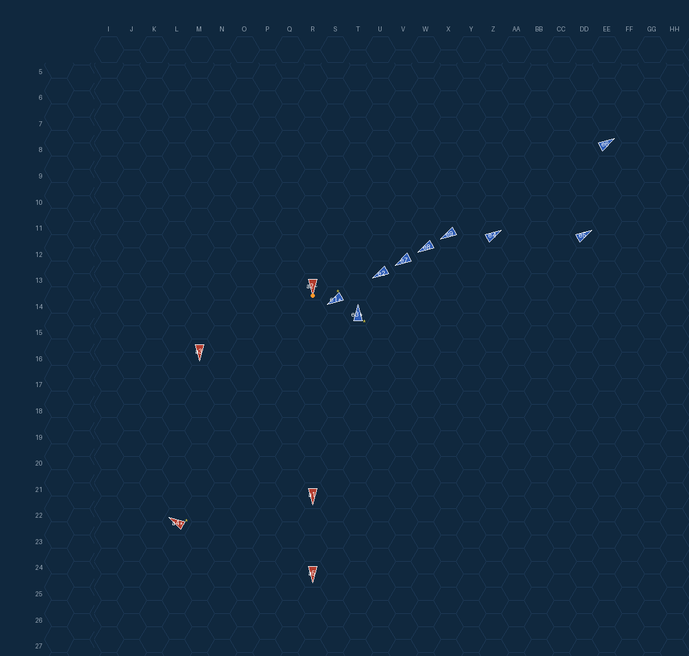


*图：第 4 回合各结算阶段的棋盘（裁剪至行动区域、保留六角标尺），双方视角各取机动结算与炮击结算（`turn-4-movement_resolution-axis-413.png, turn-4-gunnery-axis-446.png, turn-4-movement_resolution-allies-413.png, turn-4-gunnery-allies-446.png`）*

**裁决要点**

- `T4 movement_planning` **command_message_delivered** — 报文 MSG-00039（contact_report）送达 axis-active-light
- `T4 movement_planning` **command_message_delivered** — 报文 MSG-00040（contact_report）送达 allies-active-heavy
- `T4 movement_planning` **formation_agent_decision** — 轴心第1编队 本地代理决策：无上级命令；敌巡洋舰（旧金山/博伊西转北、盐湖城/海伦娜转东北）中止横越，仅余驱逐舰群西南横越我舰首，故依备忘既定意图放弃继续南下直穿敌雷击幕，左转东北规避鱼雷扫掠并尾随美巡主力，火力仍集火正横距离2的旧金山、次选博伊西。
- `T4 movement_planning` **formation_agent_decision** — 轴心第2编队 本地代理决策：第4回合新令刚送达且与眼前9舰接触一致、未过期，故不启用“优势敌兵力”影子分支而按主令接敌：以1PP4东北抢占敌纵队东南侧V19（距旧金山6、博伊西5），既避开西南驶来的拉菲/布坎南DD屏与缠斗，又不越过第1编队自西北的射界；火力按令加权两CA（旧金山、盐湖城）、轻提博伊西并全贬驱逐舰，待北面夹击咬住敌纵队后抵近约3格实施鱼雷齐射。
- `T4 movement_planning` **formation_agent_decision** — 同盟第1编队 本地代理决策：命令第4回合刚确认且未过期，故按其意图继续接敌而非套用'优势之敌'规避分支：选1PP1P1至S15转航向3与敌重巡纵队同向平行，占据其纵队后段侧翼咬住古鹰/衣笠并避开前导驱逐舰鱼雷界，火力遵令集火近距重巡（古鹰+0.5、旗舰青叶+0.25）、对两驱逐舰减权勿逐；旧金山25%损伤的风险约束由满员预备旗舰博伊西保持编队旗舰职能来对冲，维持夹击态势。
- `T4 movement_planning` **formation_agent_decision** — 同盟第2编队 本地代理决策：无在案命令且敌CA纵队（航向3、4格/回合）正掠过受损旗舰（耐久1/5），遂在仅有的合法选项中取横越距离最大的1S1越至纵队西侧Q14，保持3-4格雷击态势而拒绝贴轨的R14/R15与更近的Q15，火力加权最近的古鹰与先导衣笠、弃远处两艘驱逐舰。
- `T4 torpedo_planning` **command_message_delivered** — 报文 MSG-00041（contact_report）送达 axis-active-light
- `T4 torpedo_planning` **command_message_delivered** — 报文 MSG-00042（contact_report）送达 allies-active-heavy
- `T4 movement_resolution` **command_message_delivered** — 报文 MSG-00043（contact_report）送达 axis-active-light
- `T4 movement_resolution` **command_message_delivered** — 报文 MSG-00044（contact_report）送达 allies-active-heavy
- `T4 movement_resolution` **formation_emergency_stop** — 拉菲、旧金山 紧急停车，避免友舰相撞
- `T4 movement_resolution` **ship_sunk** — 法伦霍尔特 沉没，等待下一回合漂移
- `T4 movement_resolution` **formation_emergency_stop** — 布坎南 跟随前舰紧急停车
- `T4 movement_resolution` **formation_emergency_stop** — 麦卡拉 跟随前舰紧急停车
- （其余 8 条见附录日志）

**编队代理决策**

| 编队 | 阵营 | 机动方案 | 激活分支 | 决策说明 |
|---|---|---|---|---|
| axis-active-heavy | None | `2P1P` | 无 | 0无上级命令；敌巡洋舰（旧金山/博伊西转北、盐湖城/海伦娜转东北）中止横越，仅余驱逐舰群西南横越我舰首，故依备忘既定意图放弃继续南下直穿敌雷击幕，左转东北规避鱼雷扫掠并尾随美巡主力，火力仍集火正横距离2的旧金山、次选博伊西 |
| axis-active-light | None | `1PP4` | 无 | 0第4回合新令刚送达且与眼前9舰接触一致、未过期，故不启用“优势敌兵力”影子分支而按主令接敌：以1PP4东北抢占敌纵队东南侧V19（距旧金山6、博伊西5），既避开西南驶来的拉菲/布坎南DD屏与缠斗，又不越过第1编队自西北的 |
| allies-active-heavy | None | `1PP1P1` | 本地条件分支 | 0命令第4回合刚确认且未过期，故按其意图继续接敌而非套用'优势之敌'规避分支：选1PP1P1至S15转航向3与敌重巡纵队同向平行，占据其纵队后段侧翼咬住古鹰/衣笠并避开前导驱逐舰鱼雷界，火力遵令集火近距重巡（古鹰+0.5、 |
| allies-active-light | None | `1S1` | 无 | 0无在案命令且敌CA纵队（航向3、4格/回合）正掠过受损旗舰（耐久1/5），遂在仅有的合法选项中取横越距离最大的1S1越至纵队西侧Q14，保持3-4格雷击态势而拒绝贴轨的R14/R15与更近的Q15，火力加权最近的古鹰与先 |

代理写给自己的备忘：`axis-active-heavy`「敌巡洋北/东北撤离，我已左转东北尾随美巡并避开DD西南雷击扫掠；下回合敌若回轮即转向再战，主炮仍优先SF/博伊西，勿打DD。」；`axis-active-light`「已转强袭：我V19占敌线东南（SF6/博伊西5），T5择CA抵约3格雷击后向东南脱，绕开西南来袭DD屏，留意青叶射界。」；`allies-active-heavy`「SF已3/12低于40%，博伊西(满员)接掌旗舰职能；我自S15航向3平行咬CA线，集火古鹰/青叶勿逐DD；敌若整体转向压我或SF再损，即北转与第2编队会合。」；`allies-active-light`「旗舰仅存1/5，严禁再近CA至2格内；已横越敌CA纵队至其西侧Q14，敌纵队航向3、每回合4格；下回合同向拉开勿追，靠重编队T14方向协调。」

### 第 5 回合


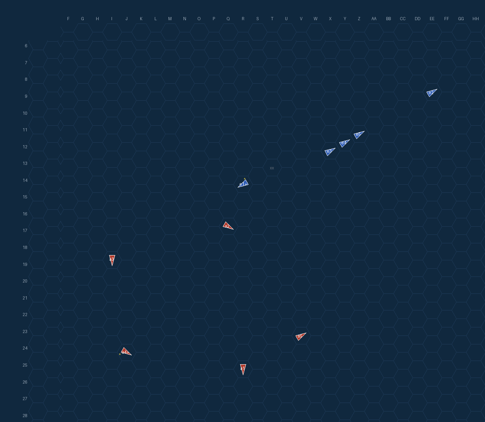
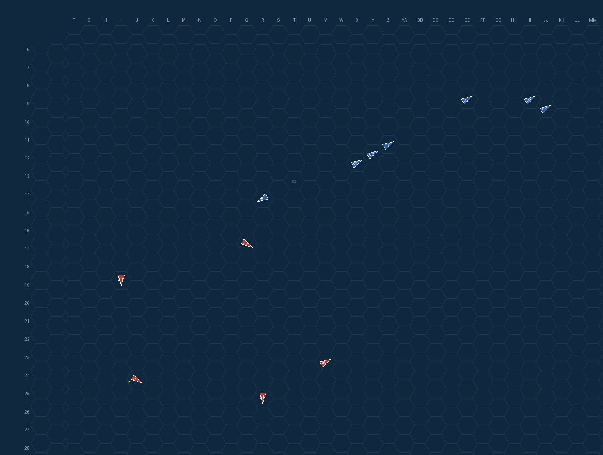
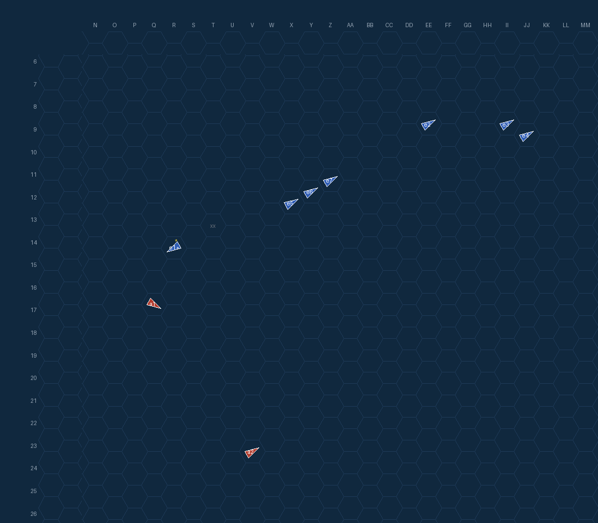

*图：第 5 回合各结算阶段的棋盘（裁剪至行动区域、保留六角标尺），双方视角各取机动结算与炮击结算（`turn-5-movement_resolution-axis-511.png, turn-5-gunnery-axis-545.png, turn-5-movement_resolution-allies-511.png, turn-5-gunnery-allies-545.png`）*

**裁决要点**

- `T5 movement_planning` **command_message_delivered** — 报文 MSG-00051（contact_report）送达 axis-active-light
- `T5 movement_planning` **formation_agent_decision** — 轴心第1编队 本地代理决策：无上级命令；盐湖城/博伊西以6节北撤而本舰仅4节且重伤(5/11)，追击无望，四艘美驱在东北10-13格向西南扫掠，故依备忘既定意图放弃尾随，选MOVE:4直线全速南下拉开与驱逐舰群的距离脱离接触，火力仅对敌巡洋保留+0.3正权、对全部驱逐舰负权以免主炮浪费。
- `T5 movement_planning` **formation_agent_decision** — 轴心第2编队 本地代理决策：第4回合命令未过期且与眼前接触相符（敌9舰纵队西南行、DD屏已进至U13—X11一线，与令中T13—X11一致），故不启用优势敌兵力分支而按主令执行：以1PP4全速转东北占V23沿敌东南翼接敌，谋求对CA中坚约3格的鱼雷齐射阵位并预留东南脱离航向；现视界内仅4艘远距DD（13—16格，超出鱼雷射程），全部负权重以免与DD缠斗并保鱼雷奇袭，待CA/CL入视界再按令加权。
- `T5 movement_planning` **formation_agent_decision** — 同盟第2编队 本地代理决策：无在案命令且敌CA群（航向3、速4-6）正西撤，遂取3S1西移至Q14、保持对古鹰投影位3格的雷击带并规避2格内近战，火力集中最近CA古鹰、略重青叶而弃远处两驱逐舰。
- `T5 torpedo_planning` **command_message_delivered** — 报文 MSG-00052（contact_report）送达 axis-active-light
- `T5 movement_resolution` **command_message_delivered** — 报文 MSG-00053（contact_report）送达 axis-active-light
- `T5 gunnery` **command_message_delivered** — 报文 MSG-00054（contact_report）送达 axis-active-light
- `T5 gunnery` **ship_sunk** — 拉菲 沉没，等待下一回合漂移
- `T5 torpedo_effects` **command_message_delivered** — 报文 MSG-00055（contact_report）送达 axis-active-light
- `T5 fire_end` **command_message_delivered** — 报文 MSG-00056（contact_report）送达 axis-active-light
- `T6 reinforcement` **command_message_delivered** — 报文 MSG-00057（contact_report）送达 axis-active-light

**编队代理决策**

| 编队 | 阵营 | 机动方案 | 激活分支 | 决策说明 |
|---|---|---|---|---|
| axis-active-heavy | None | `4` | 无 | 0无上级命令；盐湖城/博伊西以6节北撤而本舰仅4节且重伤(5/11)，追击无望，四艘美驱在东北10-13格向西南扫掠，故依备忘既定意图放弃尾随，选MOVE:4直线全速南下拉开与驱逐舰群的距离脱离接触，火力仅对敌巡洋保留+0 |
| axis-active-light | None | `1PP4` | 无 | 0第4回合命令未过期且与眼前接触相符（敌9舰纵队西南行、DD屏已进至U13—X11一线，与令中T13—X11一致），故不启用优势敌兵力分支而按主令执行：以1PP4全速转东北占V23沿敌东南翼接敌，谋求对CA中坚约3格的鱼雷 |
| allies-active-light | None | `3S1` | 无 | 0无在案命令且敌CA群（航向3、速4-6）正西撤，遂取3S1西移至Q14、保持对古鹰投影位3格的雷击带并规避2格内近战，火力集中最近CA古鹰、略重青叶而弃远处两驱逐舰。 |

代理写给自己的备忘：`axis-active-heavy`「敌巡6节北撤、我4节重伤(5/11)难追，全速南撤脱离；主炮只留对巡洋正权、勿打DD；若敌巡南返或DD逼近雷击程，即转向抢占横舷位集火敌巡。」；`axis-active-light`「T5取1PP4至V23转东北，沿敌纵队东南翼接敌；视界仅DD屏U13—X11西南行，CA中坚疑在屏后纵队中部，求抵约3格雷击旧金山/盐湖城后转东南脱离；DD全负权重防缠斗，见探照灯即烟幕；初雪独舰4/5须保全，下回合若CA仍无视觉则沿纵队轴再前推或转影子跟踪。」；`allies-active-light`「敌CA散三纵西撤(古鹰r4衣笠r9青叶r12,航向3,速4-6)；我至Q14头西，贴古鹰南侧3格保持雷击带，勿近CA2格，下回合寻横向交叉。」

### 第 6 回合

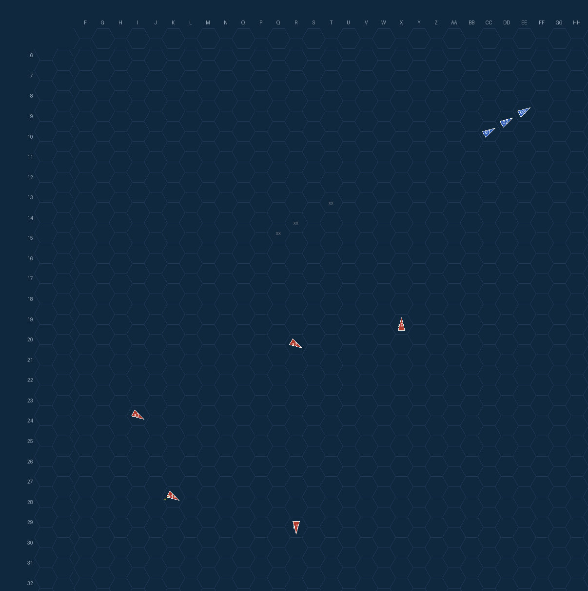
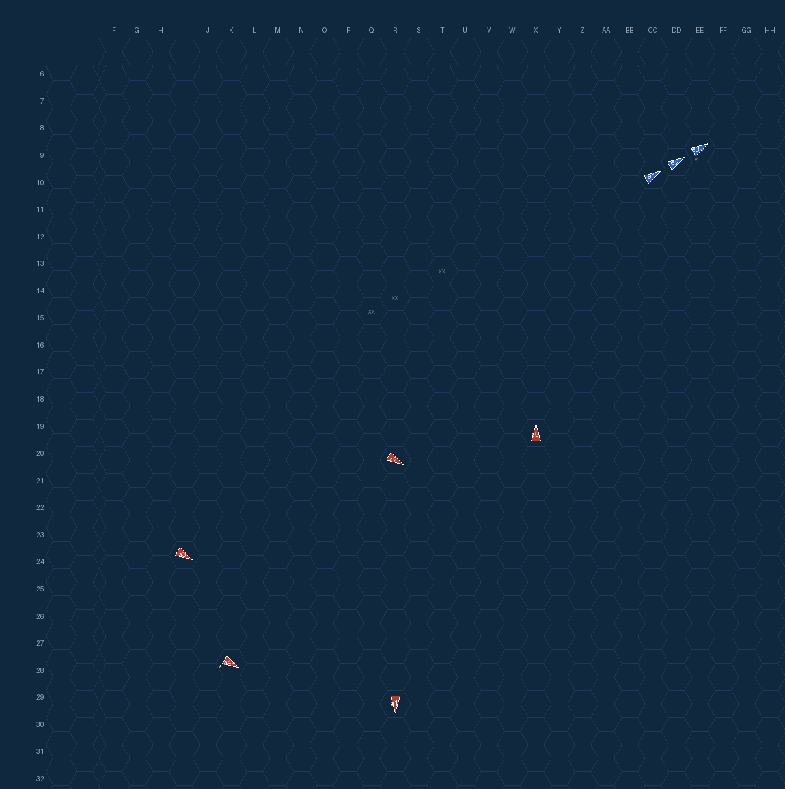
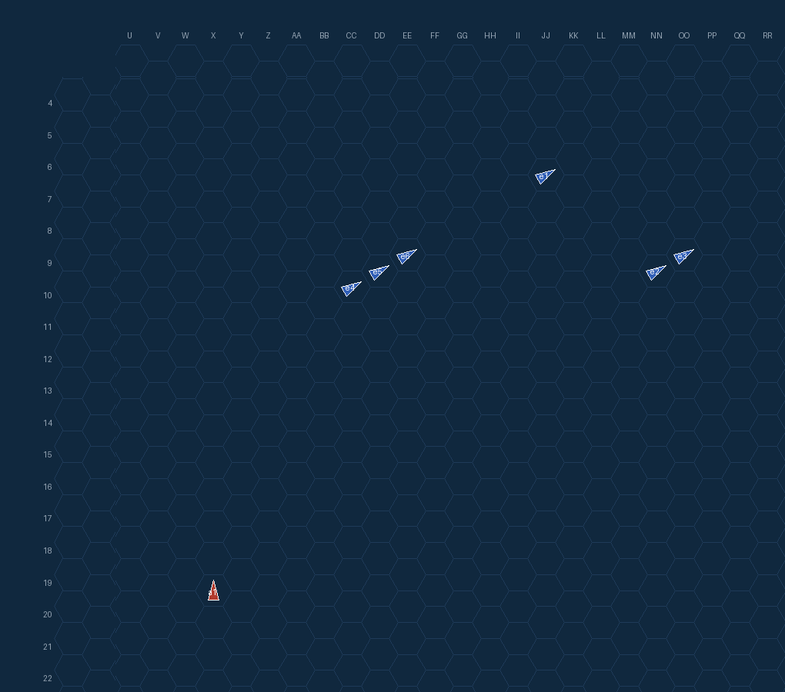


*图：第 6 回合各结算阶段的棋盘（裁剪至行动区域、保留六角标尺），双方视角各取机动结算与炮击结算（`turn-6-movement_resolution-axis-596.png, turn-6-gunnery-axis-610.png, turn-6-movement_resolution-allies-596.png, turn-6-gunnery-allies-610.png`）*

**裁决要点**

- `T6 movement_planning` **command_message_delivered** — 报文 MSG-00058（contact_report）送达 axis-active-light
- `T6 movement_planning` **formation_agent_decision** — 轴心第1编队 本地代理决策：无上级命令；唯一接触布坎南在16格外且向北（航向1）远离、不构成雷击威胁，按既定意图选MOVE:4保持航向3全速南撤继续脱离，火力对远距DD给满负权以免重伤主炮浪费。
- `T6 movement_planning` **formation_agent_decision** — 轴心第2编队 本地代理决策：第4回合命令未过期且与眼前接触相符（敌DD屏已在X11—Z12一线并转东北航向，与令中一线一致，CA仍未入视界），故不启用优势敌兵力影子分支而续行主令：以2P5全速经东北转正北抵X19，沿敌纵队X轴前推逼近中坚CA预定阵位（距屏约7格、不进入缠斗），三艘目视DD全部负权重以免与驱逐舰纠缠并保鱼雷奇袭，若次轮CA仍无视觉则按既定备忘转影子跟踪。
- `T6 torpedo_planning` **command_message_delivered** — 报文 MSG-00059（contact_report）送达 axis-active-light
- `T6 movement_resolution` **command_message_delivered** — 报文 MSG-00060（contact_report）送达 axis-active-light
- `T6 gunnery` **command_message_delivered** — 报文 MSG-00061（contact_report）送达 axis-active-light
- `T6 torpedo_effects` **command_message_delivered** — 报文 MSG-00062（contact_report）送达 axis-active-light
- `T6 fire_end` **command_message_delivered** — 报文 MSG-00063（contact_report）送达 axis-active-light
- `T7 reinforcement` **command_message_delivered** — 报文 MSG-00064（contact_report）送达 axis-active-light

**编队代理决策**

| 编队 | 阵营 | 机动方案 | 激活分支 | 决策说明 |
|---|---|---|---|---|
| axis-active-heavy | None | `4` | 无 | 0无上级命令；唯一接触布坎南在16格外且向北（航向1）远离、不构成雷击威胁，按既定意图选MOVE:4保持航向3全速南撤继续脱离，火力对远距DD给满负权以免重伤主炮浪费。 |
| axis-active-light | None | `2P3` | 无 | 0第4回合命令未过期且与眼前接触相符（敌DD屏已在X11—Z12一线并转东北航向，与令中一线一致，CA仍未入视界），故不启用优势敌兵力影子分支而续行主令：以2P5全速经东北转正北抵X19，沿敌纵队X轴前推逼近中坚CA预定阵 |

代理写给自己的备忘：`axis-active-heavy`「布坎南16格向北远离，我已全速南撤至R29；继续直线南下脱离，见敌巡南返或DD入雷击程再转向抢占横舷位集火敌巡，勿打DD。」；`axis-active-light`「抵X19转北；敌屏X12—Z11东北行，CA未见、估其西南；次轮沿X轴北进抵3—5格寻雷位，见CA转东雷击，DD逼近东脱离。」

### 第 7 回合


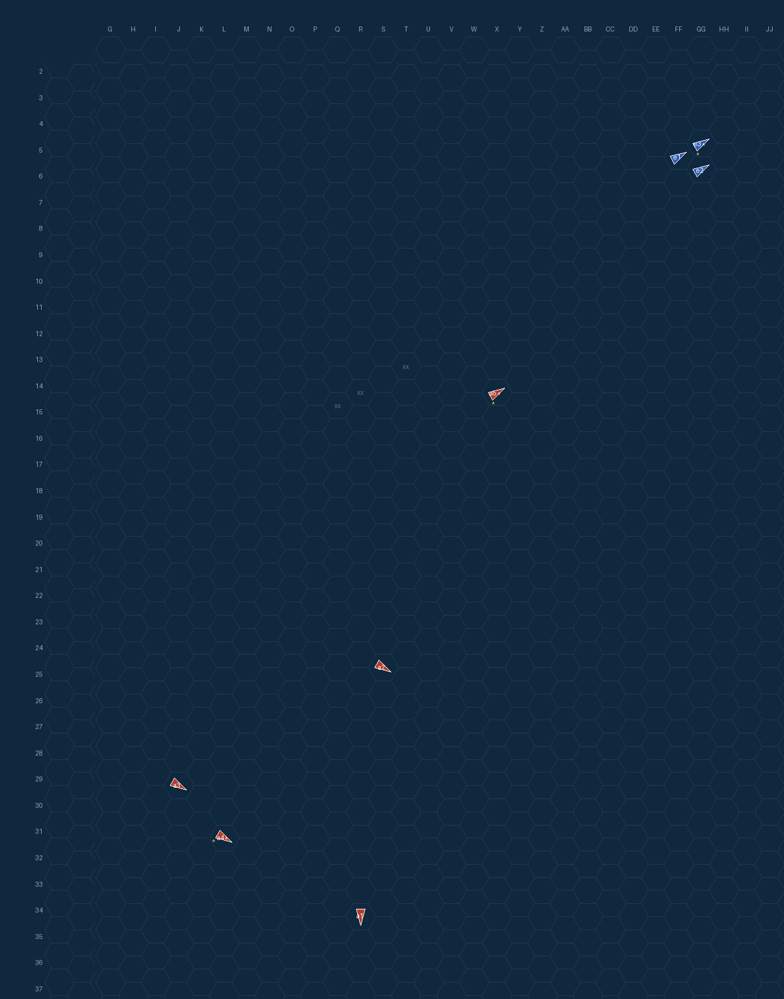
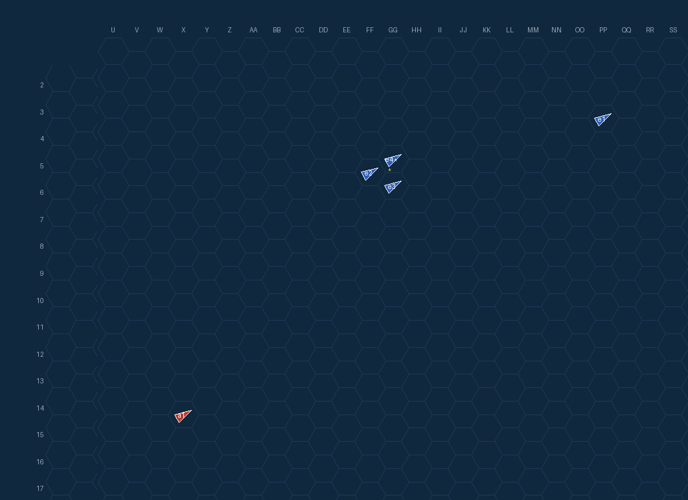
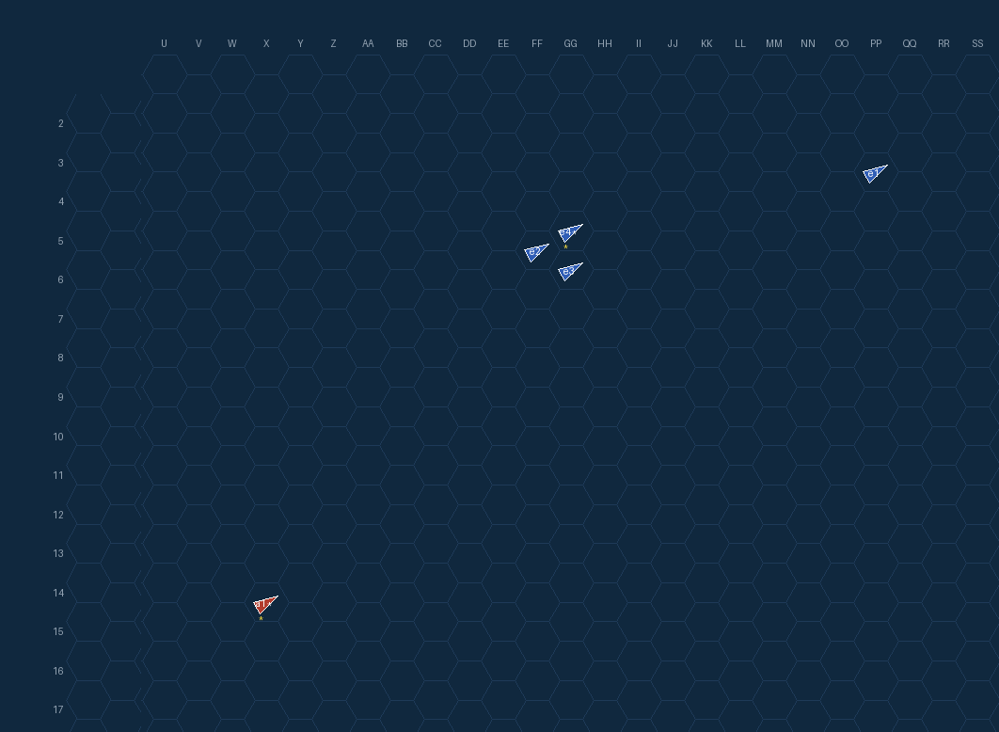

*图：第 7 回合各结算阶段的棋盘（裁剪至行动区域、保留六角标尺），双方视角各取机动结算与炮击结算（`turn-7-movement_resolution-axis-663.png, turn-7-gunnery-axis-673.png, turn-7-movement_resolution-allies-663.png, turn-7-gunnery-allies-673.png`）*

**裁决要点**

- `T7 movement_planning` **command_message_delivered** — 报文 MSG-00065（contact_report）送达 axis-active-light
- `T7 movement_planning` **formation_agent_decision** — 轴心第1编队 本地代理决策：无上级命令且本回合零接触，按既定意图选引擎枚举的最大直线南移MOVE:5至R34尽快拉开与美舰距离脱离接触，目标选项为空故不作火力调整。
- `T7 movement_planning` **formation_agent_decision** — 轴心第2编队 本地代理决策：命令未过期但CA中坚已3回合无视觉、当面仅12—14格敌DD屏而本编队已为60%损伤单舰，故依'优势敌兵力'分支并按上回合备忘就地转影子跟踪：以5S转东北航向保持约12格视界平行敌屏，SITREP续报敌东北动向，三艘DD全负权重防缠斗，待敌转向或第1编队接敌再谋对CA的约3格鱼雷阵位。
- `T7 torpedo_planning` **command_message_delivered** — 报文 MSG-00066（contact_report）送达 axis-active-light
- `T7 movement_resolution` **command_message_delivered** — 报文 MSG-00067（contact_report）送达 axis-active-light
- `T7 movement_resolution` **formation_emergency_stop** — 邓肯、麦卡拉 紧急停车，避免友舰相撞
- `T7 movement_resolution` **ship_withdrawn** — 海伦娜 从 TT5 安全撤出战场
- `T7 movement_resolution` **ship_withdrawn** — 盐湖城 从 TT6 安全撤出战场
- `T7 gunnery` **command_message_delivered** — 报文 MSG-00068（contact_report）送达 axis-active-light

**编队代理决策**

| 编队 | 阵营 | 机动方案 | 激活分支 | 决策说明 |
|---|---|---|---|---|
| axis-active-heavy | None | `5` | 无 | 0无上级命令且本回合零接触，按既定意图选引擎枚举的最大直线南移MOVE:5至R34尽快拉开与美舰距离脱离接触，目标选项为空故不作火力调整。 |
| axis-active-light | None | `5S` | 本地条件分支 | 0命令未过期但CA中坚已3回合无视觉、当面仅12—14格敌DD屏而本编队已为60%损伤单舰，故依'优势敌兵力'分支并按上回合备忘就地转影子跟踪：以5S转东北航向保持约12格视界平行敌屏，SITREP续报敌东北动向，三艘DD |

代理写给自己的备忘：`axis-active-heavy`「无接触，全速南撤中；继续直线离脱。美巡南返或敌驱入雷击程即转横舷位集火敌巡（SF/博伊西），勿打DD；主炮已恢复。」；`axis-active-light`「敌屏3DD东北行距12—14，CA未见：守12格影子跟踪+SITREP；敌转向或青叶接敌再取3格雷击CA位，勿缠斗。」

## 通信台账（全部报文）

| 报文 | 类型 | 媒介 | 优先级 | 发出 | 送达 | 状态 | 说明 |
|---|---|---|---|---|---|---|---|
| `MSG-00001` | contact_report | TBS 短距战术 | urgent | T1 | T1 | 已送达 | within tactical range with line of sight |
| `MSG-00002` | contact_report | TBS 短距战术 | urgent | T1 | T1 | 已送达 | within tactical range with line of sight |
| `MSG-00003` | contact_report | TBS 短距战术 | urgent | T1 | T1 | 已送达 | within tactical range with line of sight |
| `MSG-00004` | contact_report | TBS 短距战术 | urgent | T1 | T1 | 已送达 | within tactical range with line of sight |
| `MSG-00005` | contact_report | TBS 短距战术 | urgent | T1 | T2 | 已送达 | within tactical range with line of sight |
| `MSG-00006` | contact_report | TBS 短距战术 | urgent | T1 | T2 | 已送达 | within tactical range with line of sight |
| `MSG-00007` | contact_report | TBS 短距战术 | urgent | T2 | T2 | 已送达 | within tactical range with line of sight |
| `MSG-00008` | contact_report | TBS 短距战术 | urgent | T2 | T2 | 已送达 | within tactical range with line of sight |
| `MSG-00009` | mission_order | TBS 短距战术 | operational | T2 | T3 | 已送达 | within tactical range with line of sight |
| `MSG-00010` | mission_order | TBS 短距战术 | operational | T2 | T3 | 已送达 | within tactical range with line of sight |
| `MSG-00011` | contact_report | TBS 短距战术 | urgent | T2 | T2 | 已送达 | within tactical range with line of sight |
| `MSG-00012` | contact_report | TBS 短距战术 | urgent | T2 | T2 | 已送达 | within tactical range with line of sight |
| `MSG-00013` | contact_report | TBS 短距战术 | urgent | T2 | T2 | 已送达 | within tactical range with line of sight |
| `MSG-00014` | contact_report | TBS 短距战术 | urgent | T2 | T2 | 已送达 | within tactical range with line of sight |
| `MSG-00015` | contact_report | TBS 短距战术 | urgent | T2 | T2 | 已送达 | within tactical range with line of sight |
| `MSG-00016` | contact_report | TBS 短距战术 | urgent | T2 | T2 | 已送达 | within tactical range with line of sight |
| `MSG-00017` | contact_report | TBS 短距战术 | urgent | T2 | T2 | 已送达 | within tactical range with line of sight |
| `MSG-00018` | contact_report | TBS 短距战术 | urgent | T2 | T2 | 已送达 | within tactical range with line of sight |
| `MSG-00019` | contact_report | TBS 短距战术 | urgent | T2 | T2 | 已送达 | within tactical range with line of sight |
| `MSG-00020` | contact_report | TBS 短距战术 | urgent | T2 | T2 | 已送达 | within tactical range with line of sight |
| `MSG-00021` | contact_report | TBS 短距战术 | urgent | T2 | T3 | 已送达 | within tactical range with line of sight |
| `MSG-00022` | contact_report | TBS 短距战术 | urgent | T2 | T3 | 已送达 | within tactical range with line of sight |
| `MSG-00023` | contact_report | TBS 短距战术 | urgent | T3 | T3 | 已送达 | within tactical range with line of sight |
| `MSG-00024` | contact_report | TBS 短距战术 | urgent | T3 | T3 | 已送达 | within tactical range with line of sight |
| `MSG-00025` | contact_report | TBS 短距战术 | urgent | T3 | T3 | 已送达 | within tactical range with line of sight |
| `MSG-00026` | contact_report | TBS 短距战术 | urgent | T3 | T3 | 已送达 | within tactical range with line of sight |
| `MSG-00027` | mission_order | TBS 短距战术 | operational | T3 | T4 | 已送达 | within tactical range with line of sight |
| `MSG-00028` | mission_order | TBS 短距战术 | operational | T3 | T4 | 已送达 | within tactical range with line of sight |
| `MSG-00029` | contact_report | TBS 短距战术 | urgent | T3 | T3 | 已送达 | within tactical range with line of sight |
| `MSG-00030` | contact_report | TBS 短距战术 | urgent | T3 | T3 | 已送达 | within tactical range with line of sight |
| `MSG-00031` | contact_report | TBS 短距战术 | urgent | T3 | T3 | 已送达 | within tactical range with line of sight |
| `MSG-00032` | contact_report | TBS 短距战术 | urgent | T3 | T3 | 已送达 | within tactical range with line of sight |
| `MSG-00033` | contact_report | TBS 短距战术 | urgent | T3 | T3 | 已送达 | within tactical range with line of sight |
| `MSG-00034` | contact_report | TBS 短距战术 | urgent | T3 | T3 | 已送达 | within tactical range with line of sight |
| `MSG-00035` | contact_report | TBS 短距战术 | urgent | T3 | T3 | 已送达 | within tactical range with line of sight |
| `MSG-00036` | contact_report | TBS 短距战术 | urgent | T3 | T3 | 已送达 | within tactical range with line of sight |
| `MSG-00037` | contact_report | TBS 短距战术 | urgent | T3 | T4 | 已送达 | within tactical range with line of sight |
| `MSG-00038` | contact_report | TBS 短距战术 | urgent | T3 | T4 | 已送达 | within tactical range with line of sight |
| `MSG-00039` | contact_report | TBS 短距战术 | urgent | T4 | T4 | 已送达 | within tactical range with line of sight |
| `MSG-00040` | contact_report | TBS 短距战术 | urgent | T4 | T4 | 已送达 | within tactical range with line of sight |
| `MSG-00041` | contact_report | TBS 短距战术 | urgent | T4 | T4 | 已送达 | within tactical range with line of sight |
| `MSG-00042` | contact_report | TBS 短距战术 | urgent | T4 | T4 | 已送达 | within tactical range with line of sight |
| `MSG-00043` | contact_report | TBS 短距战术 | urgent | T4 | T4 | 已送达 | within tactical range with line of sight |
| `MSG-00044` | contact_report | TBS 短距战术 | urgent | T4 | T4 | 已送达 | within tactical range with line of sight |
| `MSG-00045` | contact_report | TBS 短距战术 | urgent | T4 | T4 | 已送达 | within tactical range with line of sight |
| `MSG-00046` | contact_report | TBS 短距战术 | urgent | T4 | T4 | 已送达 | within tactical range with line of sight |
| `MSG-00047` | contact_report | TBS 短距战术 | urgent | T4 | T4 | 已送达 | within tactical range with line of sight |
| `MSG-00048` | contact_report | TBS 短距战术 | urgent | T4 | T4 | 已送达 | within tactical range with line of sight |
| `MSG-00049` | contact_report | TBS 短距战术 | urgent | T4 | T4 | 已送达 | within tactical range with line of sight |
| `MSG-00050` | contact_report | TBS 短距战术 | urgent | T4 | T5 | 已送达 | within tactical range with line of sight |
| `MSG-00051` | contact_report | TBS 短距战术 | urgent | T5 | T5 | 已送达 | within tactical range with line of sight |
| `MSG-00052` | contact_report | TBS 短距战术 | urgent | T5 | T5 | 已送达 | within tactical range with line of sight |
| `MSG-00053` | contact_report | TBS 短距战术 | urgent | T5 | T5 | 已送达 | within tactical range with line of sight |
| `MSG-00054` | contact_report | TBS 短距战术 | urgent | T5 | T5 | 已送达 | within tactical range with line of sight |
| `MSG-00055` | contact_report | TBS 短距战术 | urgent | T5 | T5 | 已送达 | within tactical range with line of sight |
| `MSG-00056` | contact_report | TBS 短距战术 | urgent | T5 | T5 | 已送达 | within tactical range with line of sight |
| `MSG-00057` | contact_report | TBS 短距战术 | urgent | T5 | T6 | 已送达 | within tactical range with line of sight |
| `MSG-00058` | contact_report | TBS 短距战术 | urgent | T6 | T6 | 已送达 | within tactical range with line of sight |
| `MSG-00059` | contact_report | TBS 短距战术 | urgent | T6 | T6 | 已送达 | within tactical range with line of sight |
| `MSG-00060` | contact_report | TBS 短距战术 | urgent | T6 | T6 | 已送达 | within tactical range with line of sight |
| `MSG-00061` | contact_report | TBS 短距战术 | urgent | T6 | T6 | 已送达 | within tactical range with line of sight |
| `MSG-00062` | contact_report | TBS 短距战术 | urgent | T6 | T6 | 已送达 | within tactical range with line of sight |
| `MSG-00063` | contact_report | TBS 短距战术 | urgent | T6 | T6 | 已送达 | within tactical range with line of sight |
| `MSG-00064` | contact_report | TBS 短距战术 | urgent | T6 | T7 | 已送达 | within tactical range with line of sight |
| `MSG-00065` | contact_report | TBS 短距战术 | urgent | T7 | T7 | 已送达 | within tactical range with line of sight |
| `MSG-00066` | contact_report | TBS 短距战术 | urgent | T7 | T7 | 已送达 | within tactical range with line of sight |
| `MSG-00067` | contact_report | TBS 短距战术 | urgent | T7 | T7 | 已送达 | within tactical range with line of sight |
| `MSG-00068` | contact_report | TBS 短距战术 | urgent | T7 | T7 | 已送达 | within tactical range with line of sight |
| `MSG-00069` | contact_report | 转报/再加密 | urgent | T7 | — | 排队中 | coded set but the ends are under different ciphers |
| `MSG-00070` | contact_report | 转报/再加密 | urgent | T7 | — | 排队中 | coded set but the ends are under different ciphers |
| `MSG-00071` | contact_report | 转报/再加密 | urgent | T7 | — | 排队中 | coded set but the ends are under different ciphers |
| `MSG-00072` | contact_report | 转报/再加密 | urgent | T7 | — | 排队中 | coded set but the ends are under different ciphers |

共 72 条：送达 68（其中跨回合延迟 13），丢弃/被取代 0，其余在队列中。

## 远方命令与当前战局的平衡（逐次决策）

| 回合 | 编队 | 手持命令 | 合法机动选项 | 激活分支 | 采取的方案 | 依据（代理自述） |
|---|---|---|---|---|---|---|
| T2 | axis-active-heavy | 无（自派任务） | 156 | 无 | `2S2` | 无上级命令，凭本地情报主动接敌：右转南下以横舷对敌先头纵队，火力权重集中敌巡洋舰、压制远距驱逐舰。 |
| T2 | axis-active-light | 无（自派任务） | 283 | 无 | `2S2` | 无在案命令：敌巡洋舰驱逐混合纵队正向西南逼近，将与北面青叶本队迎头相遇，我率吹雪/初雪占敌纵队南侧翼（R17，预计距旧金山2—4格）保持鱼雷阵位形成南北夹击并预留同向脱离航向，火力 |
| T2 | allies-active-heavy | 无（自派任务） | 177 | 无 | `1S4S` | 无现行命令，敌重巡纵队以速5沿r2东进逼近，我以MOVE:1S4S转向北占据其航路前方北侧，以整列右舷炮位横越T字集火敌旗舰青叶，同时向北拉开与南侧吹雪、初雪的鱼雷距离；无命令需确 |
| T2 | allies-active-light | 无（自派任务） | 283 | 无 | `5` | 无在案命令且敌巡洋纵队正朝我重编队逼近，遂率轻编队直进5格占其纵队南侧约4-6格的雷击阵位，既避免与前卫青叶进入1-2格近战，又保持随后的转向雷击自由，火力优先压制敌前卫并上报接触 |
| T3 | axis-active-heavy | 无（自派任务） | 156 | 无 | `3` | 无上级命令，依本地情报维持航向3全速南下，让敌先头（旧金山/法伦霍尔特）横越舰首时以纵队齐射打击高价值巡洋舰，同时避免左转进入其驱逐舰幕的近距雷击范围；火力权重集中正横近距的旧金山 |
| T3 | axis-active-light | 有（原文见记忆节） | 48 | 本地条件分支 | `1P1` | 命令的'第2回合拦截'时限已过且当面为9舰优势之敌（2CA/2CL/5DD），故依'优势敌兵力'分支就近调整为南侧影子跟踪并报告，率重伤旗舰保持约5格不进入决战，火力对最近的旧金山 |
| T3 | allies-active-heavy | 有（原文见记忆节） | 177 | 本地条件分支 | `1PP1P1` | 现行命令仍有效且已获确认，依局部接触分支执行拦截：反转机动至敌巡洋舰纵队东侧（S15）转为同向平行航向3，本轮炮击即得以2-4距离取右舷射击位并集火敌旗舰青叶，同时避开其前方驱逐舰 |
| T3 | allies-active-light | 无（自派任务） | 177 | 无 | `5` | 无在案命令且敌CA纵队已逼近至2格与我交错，遂直进5格退占其纵队侧方4格的既定雷击阵位，避开CA近战并卡住前卫青叶航路，同时上报敌航向变化供重编队协调。 |
| T4 | axis-active-heavy | 无（自派任务） | 156 | 无 | `2P1P` | 无上级命令；敌巡洋舰（旧金山/博伊西转北、盐湖城/海伦娜转东北）中止横越，仅余驱逐舰群西南横越我舰首，故依备忘既定意图放弃继续南下直穿敌雷击幕，左转东北规避鱼雷扫掠并尾随美巡主力， |
| T4 | axis-active-light | 有（原文见记忆节） | 283 | 无 | `1PP4` | 第4回合新令刚送达且与眼前9舰接触一致、未过期，故不启用“优势敌兵力”影子分支而按主令接敌：以1PP4东北抢占敌纵队东南侧V19（距旧金山6、博伊西5），既避开西南驶来的拉菲/布坎 |
| T4 | allies-active-heavy | 有（原文见记忆节） | 177 | 本地条件分支 | `1PP1P1` | 命令第4回合刚确认且未过期，故按其意图继续接敌而非套用'优势之敌'规避分支：选1PP1P1至S15转航向3与敌重巡纵队同向平行，占据其纵队后段侧翼咬住古鹰/衣笠并避开前导驱逐舰鱼雷 |
| T4 | allies-active-light | 无（自派任务） | 13 | 无 | `1S1` | 无在案命令且敌CA纵队（航向3、4格/回合）正掠过受损旗舰（耐久1/5），遂在仅有的合法选项中取横越距离最大的1S1越至纵队西侧Q14，保持3-4格雷击态势而拒绝贴轨的R14/R1 |
| T5 | axis-active-heavy | 无（自派任务） | 156 | 无 | `4` | 无上级命令；盐湖城/博伊西以6节北撤而本舰仅4节且重伤(5/11)，追击无望，四艘美驱在东北10-13格向西南扫掠，故依备忘既定意图放弃尾随，选MOVE:4直线全速南下拉开与驱逐舰 |
| T5 | axis-active-light | 有（原文见记忆节） | 283 | 无 | `1PP4` | 第4回合命令未过期且与眼前接触相符（敌9舰纵队西南行、DD屏已进至U13—X11一线，与令中T13—X11一致），故不启用优势敌兵力分支而按主令执行：以1PP4全速转东北占V23沿 |
| T5 | allies-active-light | 无（自派任务） | 177 | 无 | `3S1` | 无在案命令且敌CA群（航向3、速4-6）正西撤，遂取3S1西移至Q14、保持对古鹰投影位3格的雷击带并规避2格内近战，火力集中最近CA古鹰、略重青叶而弃远处两驱逐舰。 |
| T6 | axis-active-heavy | 无（自派任务） | 81 | 无 | `4` | 无上级命令；唯一接触布坎南在16格外且向北（航向1）远离、不构成雷击威胁，按既定意图选MOVE:4保持航向3全速南撤继续脱离，火力对远距DD给满负权以免重伤主炮浪费。 |
| T6 | axis-active-light | 有（原文见记忆节） | 181 | 无 | `2P3` | 第4回合命令未过期且与眼前接触相符（敌DD屏已在X11—Z12一线并转东北航向，与令中一线一致，CA仍未入视界），故不启用优势敌兵力影子分支而续行主令：以2P5全速经东北转正北抵X |
| T7 | axis-active-heavy | 无（自派任务） | 156 | 无 | `5` | 无上级命令且本回合零接触，按既定意图选引擎枚举的最大直线南移MOVE:5至R34尽快拉开与美舰距离脱离接触，目标选项为空故不作火力调整。 |
| T7 | axis-active-light | 有（原文见记忆节） | 283 | 本地条件分支 | `5S` | 命令未过期但CA中坚已3回合无视觉、当面仅12—14格敌DD屏而本编队已为60%损伤单舰，故依'优势敌兵力'分支并按上回合备忘就地转影子跟踪：以5S转东北航向保持约12格视界平行敌 |

「合法机动选项」列是该回合引擎交给代理的机动选项数（`legal_formation_actions`），即它在本地几何约束下真实拥有的选择空间；「依据」列是代理自己写下的理由原句，可据此判断它是按远方命令行动，还是按眼前战局行动。

## 各编队最终记忆

### `allies-active-heavy`

- 当前生效命令（T4收到）：第1编队：敌重巡衣笠/古鹰/青叶列于R11—R13，敌驱初雪/吹雪在R16—R17，航向3。你部自T14向西接敌，咬住敌重巡线，勿离阵单追驱逐舰；火力优先敌巡洋舰，次驱逐舰。我编队据2回合前位置V12向西北压上夹击。
- 记忆条目：order_received 2, report_sent 3, contact_seen 15, decision 3, contingency 2, note 3
- 自己写的备忘：
  - 「敌CA群沿r2东进速5；我已1S4S北转横越，下回合保持航向6右舷集火青叶，勿入吹雪/初雪鱼雷界，留意法伦霍尔特DD航路交叉。」
  - 「我已反转至敌CA线东侧S15航向3同向平行；下回合右舷集火青叶/古鹰，旧金山已损至6/12，低于40%即脱离，勿入初雪/吹雪鱼雷界。」
  - 「SF已3/12低于40%，博伊西(满员)接掌旗舰职能；我自S15航向3平行咬CA线，集火古鹰/青叶勿逐DD；敌若整体转向压我或SF再损，即北转与第2编队会合。」

### `allies-active-light`

- 当前生效命令（TNone收到）：（无）
- 记忆条目：order_received 0, report_sent 4, contact_seen 20, decision 4, contingency 0, note 4
- 自己写的备忘：
  - 「敌CA纵队(r=2,航向2)直插我重编队，占其纵队南侧4-5格位雷击前卫青叶，勿与CA进入2格内近战」
  - 「敌CA纵队沿航向3行进，我抵O16在其纵队侧方约4格；下回合横越雷击前卫青叶，与CA保持4格以上勿近战；重编队在T14近旁，注意协调。」
  - 「旗舰仅存1/5，严禁再近CA至2格内；已横越敌CA纵队至其西侧Q14，敌纵队航向3、每回合4格；下回合同向拉开勿追，靠重编队T14方向协调。」
  - 「敌CA散三纵西撤(古鹰r4衣笠r9青叶r12,航向3,速4-6)；我至Q14头西，贴古鹰南侧3格保持雷击带，勿近CA2格，下回合寻横向交叉。」

### `axis-active-heavy`

- 当前生效命令（TNone收到）：（无）
- 记忆条目：order_received 0, report_sent 6, contact_seen 24, decision 6, contingency 0, note 6
- 自己写的备忘：
  - 「主目标旧金山、博伊西；已转南占横舷位迎敌；防拉菲/法伦霍尔特近距雷击；青叶下回合炮恢复即集火敌先头巡洋舰。」
  - 「SF旧金山正横距离2：三舰齐射必中，别错过。下回合若其驶离则右转占追击航向，重点跟进博伊西/盐湖城的美巡主力；警惕拉菲（航向东南、与我同向）逼近雷击。」
  - 「敌巡洋北/东北撤离，我已左转东北尾随美巡并避开DD西南雷击扫掠；下回合敌若回轮即转向再战，主炮仍优先SF/博伊西，勿打DD。」
  - 「敌巡6节北撤、我4节重伤(5/11)难追，全速南撤脱离；主炮只留对巡洋正权、勿打DD；若敌巡南返或DD逼近雷击程，即转向抢占横舷位集火敌巡。」
  - 「布坎南16格向北远离，我已全速南撤至R29；继续直线南下脱离，见敌巡南返或DD入雷击程再转向抢占横舷位集火敌巡，勿打DD。」
  - 「无接触，全速南撤中；继续直线离脱。美巡南返或敌驱入雷击程即转横舷位集火敌巡（SF/博伊西），勿打DD；主炮已恢复。」

### `axis-active-light`

- 当前生效命令（T4收到）：第2编队：美舰9艘在T13—X11一线北航，中坚CA在V12—V14。速取东北航向接敌，抵近约3格对敌中坚鱼雷齐射，优先打CA（旧金山、盐湖城），其次CL；得手后向东南脱离，勿与敌DD缠斗。我第1编队自西北压迫，南北夹击。遇探照灯即烟幕规避，先保船后作战。
- 记忆条目：order_received 2, report_sent 6, contact_seen 24, decision 6, contingency 5, note 6
- 自己写的备忘：
  - 「敌纵队西南行，我占其南侧R17，预计距旧金山2-4格；保持南翼鱼雷阵位让青叶本队北面接敌，勿单独冲入敌驱逐屏卫。」
  - 「敌9舰优势兵力确认：按分支改影子跟踪，占敌南侧距CA约5格，禁决战（吹雪 hull1/5）；待青叶北面接敌后乘乱雷击，SF/SLC优先。」
  - 「已转强袭：我V19占敌线东南（SF6/博伊西5），T5择CA抵约3格雷击后向东南脱，绕开西南来袭DD屏，留意青叶射界。」
  - 「T5取1PP4至V23转东北，沿敌纵队东南翼接敌；视界仅DD屏U13—X11西南行，CA中坚疑在屏后纵队中部，求抵约3格雷击旧金山/盐湖城后转东南脱离；DD全负权重防缠斗，见探照灯即烟幕；初雪独舰4/5须保全，下回合若CA仍无视觉则沿纵队轴再前推或转影子跟踪。」
  - 「抵X19转北；敌屏X12—Z11东北行，CA未见、估其西南；次轮沿X轴北进抵3—5格寻雷位，见CA转东雷击，DD逼近东脱离。」
  - 「敌屏3DD东北行距12—14，CA未见：守12格影子跟踪+SITREP；敌转向或青叶接敌再取3格雷击CA位，勿缠斗。」

## 代理原始决策记录（抽样）

每条决策的完整提示词、原始回复与记忆快照在 `battle_data.json` 的 `agent_log`；这里抽取首末各一条以见格式：

**`axis-active-heavy` 第 2 回合（zcode-subagent）**

- 手持命令：（无）
- 第 1 次尝试：采纳
  - 原始回复：`{"acknowledgement": false, "memory_note": "主目标旧金山、博伊西；已转南占横舷位迎敌；防拉菲/法伦霍尔特近距雷击；青叶下回合炮恢复即集火敌先头巡洋舰。", "rationale_summary": "无上级命令，凭本地情报主动接敌：右转南下以横舷对敌先头纵队，火力权重集中敌巡洋舰、压制远距驱逐舰。", "report_actions": ["SITREP"], "selected_conting`
- 决策：方案 `2S2`，分支 无，备忘「主目标旧金山、博伊西；已转南占横舷位迎敌；防拉菲/法伦霍尔特近距雷击；青叶下回合炮恢复即集火敌先头巡洋舰。」

**`axis-active-light` 第 7 回合（zcode-subagent）**

- 手持命令：第2编队：美舰9艘在T13—X11一线北航，中坚CA在V12—V14。速取东北航向接敌，抵近约3格对敌中坚鱼雷齐射，优先打CA（旧金山、盐湖城），其次CL；得手后向东南脱离，勿与敌DD缠斗。我第1编队自西北压迫，南北夹击。遇探照灯即烟幕规避，先保船后作战。
- 第 1 次尝试：采纳
  - 原始回复：`{"acknowledgement": false, "memory_note": "敌屏3DD东北行距12—14，CA未见：守12格影子跟踪+SITREP；敌转向或青叶接敌再取3格雷击CA位，勿缠斗。", "rationale_summary": "命令未过期但CA中坚已3回合无视觉、当面仅12—14格敌DD屏而本编队已为60%损伤单舰，故依'优势敌兵力'分支并按上回合备忘就地转影子跟踪：以5S转东北航向保持约12格视界平行敌屏，SI`
- 决策：方案 `5S`，分支 local_condition_branch，备忘「敌屏3DD东北行距12—14，CA未见：守12格影子跟踪+SITREP；敌转向或青叶接敌再取3格雷击CA位，勿缠斗。」

## 多代理指挥协作

- **指挥方向是双向的，但两个方向由不同机制驱动。** 上级方向：2 条自然语言任务命令由舰队总指挥（子代理）拟制并按电报投递，另有 2 条由引擎在 T2 拟制的初始委派（结构式任务/意图/协同，不含打法）；下级方向：68 条接触报告 + 0 条态势报告，由引擎在每个阶段边界**自动**起草（有接触则升为 urgent 优先级的接触报告）。

**任务命令的延迟（电报投递实证）**

| 报文 | 阵营 | 发信人 | 收件编队 | 媒介 | 拟制回合 | 送达回合 | 链路开销 | 命令原文 |
|---|---|---|---|---|---|---|---|---|
| `MSG-00009` | 轴心（日方） | 引擎初始委派 | `axis-active-light` | TBS 短距战术 | T2 | T3 | +1 回合 | （结构式） |
| `MSG-00010` | 同盟（美方） | 引擎初始委派 | `allies-active-heavy` | TBS 短距战术 | T2 | T3 | +1 回合 | （结构式） |
| `MSG-00027` | 轴心（日方） | 舰队总指挥（子代理） | `axis-active-light` | TBS 短距战术 | T3 | T4 | +1 回合 | 第2编队：美舰9艘在T13—X11一线北航，中坚CA在V12—V14。速取东北航向接敌，抵近约3格对敌中坚鱼雷齐射，优先打CA（旧金山、盐湖 |
| `MSG-00028` | 同盟（美方） | 舰队总指挥（子代理） | `allies-active-heavy` | TBS 短距战术 | T3 | T4 | +1 回合 | 第1编队：敌重巡衣笠/古鹰/青叶列于R11—R13，敌驱初雪/吹雪在R16—R17，航向3。你部自T14向西接敌，咬住敌重巡线，勿离阵单追驱 |

两条由子代理拟制的命令都是在 T3 写下、**T4 才被编队读到**：编队指挥官在写命令的同一个回合里无法依据它行动，这正是命令延迟模式要建模的东西。同表可见，编队自己的接触报告走 TBS 时开销为 0（同回合送达）、被排到再加密转报队列时为 +2 回合。

- **代理自己的报告动作已记录、但尚未接线。** 代理逐次选择了报告动作：SITREP 18 次、CONTACT_REPORT 8 次、ACKNOWLEDGEMENT 2 次、NONE 1 次；其中 5 次决策标记了确认。这些选择进入决策记录与本地记忆（`report_sent` 条目），**但不生成、也不改变任何报文**——见文末 [未接线与缺陷披露](#未接线与缺陷披露)。
- **信道与延迟**：全部 72 条报文中 68 条按 urgent 优先级排队，4 条经转报（relay）路由，55 条同回合送达、13 条跨回合送达，4 条在停战时仍在队列里；媒介由双方旗舰距离相对想定自身光学地平线选择（直连/视觉/编码电文/转报），距离只决定走哪条信道，不缩放延迟本身。

## 代理自主性与回退披露

- **代理方案实际执行率**：12 个「回合×阵营」机动批次中，5 个被引擎合法性检查整批驳回，退回确定性指挥官执行教条方案；其余 7 个执行的是代理自己的方案。
- **回复格式反馈回路**：15 次首次回复即被采纳，4 次首次被拒后带着具体错误原因重发并获采纳（例如 `unknown contingency branch 'superior enemy force in local contact'`——代理引用了不存在的预案分支名）。引擎拒绝的是**格式与合法性**，不是战术选择。

| 回合 | 阵营 | 驳回原因（引擎原文，截断） |
|---|---|---|
| T3 | 轴心（日方） | axis-active-light: IBS-U-IJN-FUBUKI forced movement prevents formation following |
| T3 | 同盟（美方） | allies-active-heavy: IBS-U-USN-SALT-LAKE-CITY (盐湖城) cannot follow guide trail before advancing；allies-active-heavy: IBS-U-USN-HELENA (海伦娜) cannot follow guide trail before advancing |
| T4 | 轴心（日方） | axis-active-heavy: speed 3 is outside member limits; reduce or detach |
| T4 | 同盟（美方） | allies-active-heavy: IBS-U-USN-BOISE (博伊西) cannot follow guide trail before advancing |
| T5 | 同盟（美方） | allies-active-light: IBS-U-USN-BUCHANAN (布坎南) cannot follow guide trail: Movement path cannot reverse 180 degrees at S14；allies-active-light: IBS-U-USN-MCCALLA (麦卡拉) cannot follow guide trail: Movement path cannot revers |

回退**不改变双方的信息边界**：确定性指挥官与代理读的是同一侧过滤视图，回退只是把该阵营这一回合的机动决策权收回引擎。因此本报告中「代理自主性」的结论必须按上述执行率打折——被驳回的回合里，编队的动作出自教条，代理的机动意图未被执行。

## 信息泄露与证据核验

**判据。** 本扫描不检查「代理是否知道敌方舰名」——在该想定里这个判据是空转的：双方自第 1 回合起就在光学距离内（轴心可见全部 9 艘美舰、同盟可见全部 5 艘日舰，`vacuous_in_this_scenario: True`），任何时刻敌方舰名都合法可见。真正能泄露的是**文本的出处**，所以判据定为：提示词里的每一个特征串，都必须对它的读者有合法出处——读者自己编队更早回合写下的内容，或已经投递给它的一封舰队命令。敌方的文字、友邻编队的决策文字、以及**任何晚于当时的回合**的文字，都不合法（最后一条同时覆盖「敌方计划泄露」与「读到明天的报纸」两种情形）。

**结果。** 核验 25 条传输记录（`requests/` 下每一份实际交给子代理的请求），检查 4760 个特征串，其中 452 个确有出处可溯；内容出处违规 0 条，报文台账违规 0 条，字段归属违规 0 条。判定 **PASS**。

报文台账一项是精确检查、不需重放：每条 `received_messages[*].message_id` 都必须在引擎台账里存在、属于同一阵营、且收件人是该编队。上一轮发现的两个跨阵营缺陷（编队命令批次与火力优先级混入对方）正是这类检查会拦下的。

**正对照（PASS 之所以算证据）。** 一个不可能失败的检查不是证据，所以对同一份数据做了注入试验：把**本局真实存在**的敌方字符串塞进一份真实的轴心方请求，扫描器必须报错。

| 注入内容 | 注入串（截断） | 是否被抓 |
|---|---|---|
| 敌方舰队命令原文 | `你部自T14向西接敌 勿离阵单追驱逐舰 吹雪在R16—R17 我编队据2回合前位置V12向西北压上夹击 火力优先敌巡洋舰` | 是 |
| 敌方编队决策理由原文 | `1S4S转向北占据其航路前方北侧 下回合保持航向6右舷集火青叶 仅发SITREP通报转向以防与友邻第2编队航路混淆 以整` | 是 |
| 敌方报文台账条目 | `MSG-00002` | 是 |

基线（未注入）发现数 0，三项注入全部被抓，自检判定 **PASS**。

**本扫描未覆盖的范围（如实列出）。**

- 审计对象是**传输面**：实际交给代理的记录。代理从合法材料里「推断」出什么，不在本检查范围内，本检查也不能证明它没推断。
- 可见性包络（`identity` 子项）靠**确定性指挥官重放**重建，而非本局的代理决策——驱动没有持久化被采纳的指令批次，所以该子项只是近似；内容出处与台账两项不依赖重放。
- 本局**不可从产物逐位重放**：没有保存被采纳的指令批次，因此这份战报是「记录审计」，不是「可复现实验」。
- 本报告本身是战后中性文书，含双方视角；它**不得**作为任何代理的输入。本局最后一次代理调用发生在报告生成之前。

## 未接线与缺陷披露

本局暴露的两处「记录得到、但没接线」的缺口，均由代码位置确认，未在本轮修改（它们属于冻结模式的语义，改动会使黄金重放基线漂移，需要 PI 决定）：

1. **代理的确认不进报文台账。** `backend/src/iron_bottom_sound/command_delay.py` 在 `_apply_delivery` 里对 `MessageKind.ACKNOWLEDGEMENT` 直接 `return`，而 `CommandMessage.acknowledged_turn`（`models.py`）全仓库没有任何写入点，本局台账因此 0 条确认记录，尽管代理在 5 次决策里明确确认，且有 2 次选择发出 `ACKNOWLEDGEMENT`。另需注意 `MissionOrder.confirmed_turn` 在送达时即被写成送达回合——它记的是「送达」，不是「确认」，两件事在台账里被合并了。
2. **代理的报告动作不影响通信。** 代理逐次选择 `report_actions`（SITREP / CONTACT_REPORT / ACKNOWLEDGEMENT 等），这些选择只落到本地记忆条目（`report_sent`）与决策记录里；台账中的 68 条接触报告与态势报告全部由 `draft_reports` 在每个阶段边界自动起草，与代理的选择无关。也就是说：**下级上报目前是引擎的自动参谋作业，代理还不能决定何时、向谁、报告什么。**

## 附录：全量裁决事件日志

```
T1 gunnery              gun_mount_attack             博伊西 P1+P2+P3+P4+P5 炮击 青叶：4 发命中
T1 gunnery              gunnery_result               青叶 命中结果 53
T1 gunnery              special_damage               青叶 特殊损伤 24
T1 gunnery              gunnery_result               青叶 命中结果 11
T1 gunnery              gun_mount_destroyed          青叶 P1 被摧毁
T1 gunnery              gunnery_result               青叶 命中结果 56
T1 gunnery              gunnery_result               青叶 命中结果 15
T1 gunnery              gun_mount_attack             博伊西 S3+S4 炮击 青叶：0 发命中
T1 gunnery              gun_mount_attack             布坎南 P1+P2+P3+P4+P5 炮击 青叶：0 发命中
T1 gunnery              gun_mount_attack             邓肯 P1+P2+P3+P4+P5 炮击 古鹰：0 发命中
T1 gunnery              gun_mount_attack             法伦霍尔特 P1+P2+P3+P4+P5 炮击 青叶：0 发命中
T1 gunnery              gun_mount_attack             海伦娜 P1+P2+P3+P4+P5 炮击 青叶：2 发命中
T1 gunnery              special_damage               青叶 特殊损伤 36
T1 gunnery              gunnery_result               青叶 命中结果 34
T1 gunnery              gunnery_result               青叶 命中结果 66
T1 gunnery              gun_mount_attack             海伦娜 S3+S4 炮击 青叶：0 发命中
T1 gunnery              gun_mount_attack             拉菲 P1+P2+P3+P4+P5 炮击 青叶：1 发命中
T1 gunnery              gunnery_result               青叶 命中结果 26
T1 gunnery              gun_mount_attack             麦卡拉 P1+P2+P3+P4+P5 炮击 青叶：0 发命中
T1 gunnery              gun_mount_attack             盐湖城 P1+P2+P3+P4 炮击 青叶：0 发命中
T1 gunnery              gun_mount_attack             盐湖城 S3+S4 炮击 青叶：0 发命中
T1 gunnery              gun_mount_attack             旧金山 P1+P2+P3 炮击 青叶：2 发命中
T1 gunnery              special_damage               青叶 特殊损伤 66
T1 gunnery              gunnery_result               青叶 命中结果 11
T1 gunnery              gun_mount_destroyed          青叶 P2 被摧毁
T1 gunnery              gunnery_result               青叶 命中结果 56
T1 gunnery              gun_mount_attack             旧金山 S3+S4 炮击 青叶：0 发命中
T1 torpedo_effects      command_message_delivered    报文 MSG-00001（contact_report）送达 axis-active-light
T1 torpedo_effects      command_message_delivered    报文 MSG-00002（contact_report）送达 allies-active-heavy
T1 torpedo_effects      command_message_queued       tbs_short 报文 MSG-00003（contact_report）已发出
T1 torpedo_effects      command_message_queued       tbs_short 报文 MSG-00004（contact_report）已发出
T1 torpedo_effects      phase_changed                阶段：torpedo_effects
T1 fire_end             command_message_delivered    报文 MSG-00003（contact_report）送达 axis-active-light
T1 fire_end             command_message_delivered    报文 MSG-00004（contact_report）送达 allies-active-heavy
T1 fire_end             command_message_queued       tbs_short 报文 MSG-00005（contact_report）已发出
T1 fire_end             command_message_queued       tbs_short 报文 MSG-00006（contact_report）已发出
T1 fire_end             phase_changed                阶段：fire_end
T1 fire_end             fire_check                   青叶 火灾检定 3 +1 = 4
T2 reinforcement        command_message_delivered    报文 MSG-00005（contact_report）送达 axis-active-light
T2 reinforcement        command_message_delivered    报文 MSG-00006（contact_report）送达 allies-active-heavy
T2 reinforcement        command_message_queued       tbs_short 报文 MSG-00007（contact_report）已发出
T2 reinforcement        command_message_queued       tbs_short 报文 MSG-00008（contact_report）已发出
T2 reinforcement        command_message_queued       tbs_short 报文 MSG-00009（mission_order）已发出
T2 reinforcement        command_message_queued       tbs_short 报文 MSG-00010（mission_order）已发出
T2 reinforcement        command_delay_turn_state     命令延迟模式：第 2 回合指挥链状态
T2 reinforcement        command_delay_turn_state     命令延迟模式：第 2 回合指挥链状态
T2 reinforcement        phase_changed                阶段：reinforcement
T2 movement_planning    command_message_delivered    报文 MSG-00007（contact_report）送达 axis-active-light
T2 movement_planning    command_message_delivered    报文 MSG-00008（contact_report）送达 allies-active-heavy
T2 movement_planning    command_message_queued       tbs_short 报文 MSG-00011（contact_report）已发出
T2 movement_planning    command_message_queued       tbs_short 报文 MSG-00012（contact_report）已发出
T2 movement_planning    formation_agent_decision     轴心第1编队 本地代理决策：无上级命令，凭本地情报主动接敌：右转南下以横舷对敌先头纵队，火力权重集中敌巡洋舰、压制远距驱逐舰。
T2 movement_planning    formation_agent_decision     轴心第2编队 本地代理决策：无在案命令：敌巡洋舰驱逐混合纵队正向西南逼近，将与北面青叶本队迎头相遇，我率吹雪/初雪占敌纵队南侧翼（R17，预计距旧金山2—4格）保持鱼雷阵位形成南北夹击并预留同向脱离航向，火力优先旧金山/博伊西、贬抑远距驱逐舰。
T2 movement_planning    formation_agent_decision     同盟第1编队 本地代理决策：无现行命令，敌重巡纵队以速5沿r2东进逼近，我以MOVE:1S4S转向北占据其航路前方北侧，以整列右舷炮位横越T字集火敌旗舰青叶，同时向北拉开与南侧吹雪、初雪的鱼雷距离；无命令需确认，故acknowledgement为否，仅发SITREP通报转向以防与友邻第2编队航路混淆。
T2 movement_planning    formation_agent_decision     同盟第2编队 本地代理决策：无在案命令且敌巡洋纵队正朝我重编队逼近，遂率轻编队直进5格占其纵队南侧约4-6格的雷击阵位，既避免与前卫青叶进入1-2格近战，又保持随后的转向雷击自由，火力优先压制敌前卫并上报接触。
T2 movement_planning    phase_changed                阶段：movement_planning
T2 torpedo_planning     command_message_delivered    报文 MSG-00011（contact_report）送达 axis-active-light
T2 torpedo_planning     command_message_delivered    报文 MSG-00012（contact_report）送达 allies-active-heavy
T2 torpedo_planning     command_message_queued       tbs_short 报文 MSG-00013（contact_report）已发出
T2 torpedo_planning     command_message_queued       tbs_short 报文 MSG-00014（contact_report）已发出
T2 torpedo_planning     phase_changed                阶段：torpedo_planning
T2 movement_resolution  command_message_delivered    报文 MSG-00013（contact_report）送达 axis-active-light
T2 movement_resolution  command_message_delivered    报文 MSG-00014（contact_report）送达 allies-active-heavy
T2 movement_resolution  command_message_queued       tbs_short 报文 MSG-00015（contact_report）已发出
T2 movement_resolution  command_message_queued       tbs_short 报文 MSG-00016（contact_report）已发出
T2 movement_resolution  phase_changed                阶段：movement_resolution
T2 movement_resolution  formation_emergency_stop     法伦霍尔特、旧金山 紧急停车，避免友舰相撞
T2 movement_resolution  formation_emergency_stop     博伊西 跟随前舰紧急停车
T2 movement_resolution  formation_emergency_stop     盐湖城 跟随前舰紧急停车
T2 movement_resolution  formation_emergency_stop     海伦娜 跟随前舰紧急停车
T2 movement_resolution  formation_emergency_stop     拉菲 跟随前舰紧急停车
T2 movement_resolution  formation_emergency_stop     布坎南 跟随前舰紧急停车
T2 movement_resolution  formation_emergency_stop     麦卡拉 跟随前舰紧急停车
T2 movement_resolution  formation_emergency_stop     邓肯 跟随前舰紧急停车
T2 movement_resolution  ship_moved                   青叶 移动至 R13
T2 movement_resolution  movement_plan_resolved       青叶：计划 2S2，P10 → 原计划终点 R13；同步结算实际终点 R13
T2 movement_resolution  ship_moved                   古鹰 移动至 R12
T2 movement_resolution  movement_plan_resolved       古鹰：计划 3S1，O10 → 原计划终点 R12；同步结算实际终点 R12
T2 movement_resolution  ship_moved                   衣笠 移动至 R11
T2 movement_resolution  movement_plan_resolved       衣笠：计划 4S，N9 → 原计划终点 R11；同步结算实际终点 R11
T2 movement_resolution  ship_moved                   吹雪 移动至 R17
T2 movement_resolution  movement_plan_resolved       吹雪：计划 2S2，P14 → 原计划终点 R17；同步结算实际终点 R17
T2 movement_resolution  ship_moved                   初雪 移动至 R16
T2 movement_resolution  movement_plan_resolved       初雪：计划 3S1，O14 → 原计划终点 R16；同步结算实际终点 R16
T2 movement_resolution  ship_moved                   法伦霍尔特 移动至 T13
T2 movement_resolution  movement_plan_resolved       法伦霍尔特：计划 5，V12 → 原计划终点 Q15；同步结算实际终点 T13；受阻后提前停止
T2 movement_resolution  ship_moved                   拉菲 移动至 U13
T2 movement_resolution  movement_plan_resolved       拉菲：计划 5，W12 → 原计划终点 R14；同步结算实际终点 U13；受阻后提前停止
T2 movement_resolution  ship_moved                   旧金山 移动至 T14
T2 movement_resolution  movement_plan_resolved       旧金山：计划 1S4S，V14 → 原计划终点 Q13；同步结算实际终点 T14；受阻后提前停止
T2 movement_resolution  ship_moved                   博伊西 移动至 U15
T2 movement_resolution  movement_plan_resolved       博伊西：计划 2S3，W14 → 原计划终点 R13；同步结算实际终点 U15；受阻后提前停止
T2 movement_resolution  ship_moved                   盐湖城 移动至 V14
T2 movement_resolution  movement_plan_resolved       盐湖城：计划 3S2，X13 → 原计划终点 S14；同步结算实际终点 V14；受阻后提前停止
T2 movement_resolution  ship_moved                   海伦娜 移动至 W14
T2 movement_resolution  movement_plan_resolved       海伦娜：计划 4S1，Y13 → 原计划终点 T14；同步结算实际终点 W14；受阻后提前停止
T2 movement_resolution  ship_moved                   布坎南 移动至 V12
T2 movement_resolution  movement_plan_resolved       布坎南：计划 5，X11 → 原计划终点 S14；同步结算实际终点 V12；受阻后提前停止
T2 movement_resolution  ship_moved                   麦卡拉 移动至 W12
T2 movement_resolution  movement_plan_resolved       麦卡拉：计划 5，Y11 → 原计划终点 T13；同步结算实际终点 W12；受阻后提前停止
T2 movement_resolution  ship_moved                   邓肯 移动至 X11
T2 movement_resolution  movement_plan_resolved       邓肯：计划 5，Z10 → 原计划终点 U13；同步结算实际终点 X11；受阻后提前停止
T2 gunnery              command_message_delivered    报文 MSG-00015（contact_report）送达 axis-active-light
T2 gunnery              command_message_delivered    报文 MSG-00016（contact_report）送达 allies-active-heavy
T2 gunnery              command_message_queued       tbs_short 报文 MSG-00017（contact_report）已发出
T2 gunnery              command_message_queued       tbs_short 报文 MSG-00018（contact_report）已发出
T2 gunnery              phase_changed                阶段：gunnery
T2 gunnery              gun_mount_attack             吹雪 P1+P2+P3 炮击 旧金山：3 发命中
T2 gunnery              gun_mount_destroyed          旧金山 S1 被摧毁
T2 gunnery              gunnery_result               旧金山 命中结果 52
T2 gunnery              special_damage               旧金山 特殊损伤 41
T2 gunnery              gunnery_result               旧金山 命中结果 32
T2 gunnery              gunnery_result               旧金山 命中结果 46
T2 gunnery              gun_mount_attack             古鹰 P1+P2+P3 炮击 法伦霍尔特：2 发命中
T2 gunnery              gunnery_result               法伦霍尔特 命中结果 62
T2 gunnery              gunnery_result               法伦霍尔特 命中结果 15
T2 gunnery              gun_mount_attack             古鹰 S1+S2 炮击 法伦霍尔特：0 发命中
T2 gunnery              gun_mount_attack             初雪 P1+P2+P3 炮击 旧金山：2 发命中
T2 gunnery              gun_mount_destroyed          旧金山 P3 被摧毁
T2 gunnery              fire_check                   旧金山 额外火灾检定（日/德4.7"-5"炮） 3 +1 = 4
T2 gunnery              gunnery_result               旧金山 命中结果 33
T2 gunnery              gunnery_result               旧金山 命中结果 24
T2 gunnery              gun_mount_attack             衣笠 P1+P2+P3 炮击 旧金山：2 发命中
T2 gunnery              special_damage               旧金山 特殊损伤 41
T2 gunnery              gunnery_result               旧金山 命中结果 45
T2 gunnery              gun_mount_destroyed          旧金山 S2 被摧毁
T2 gunnery              special_damage               旧金山 特殊损伤 46
T2 gunnery              gunnery_result               旧金山 命中结果 16
T2 gunnery              gun_mount_attack             衣笠 S1+S2 炮击 旧金山：0 发命中
T2 gunnery              gun_mount_attack             博伊西 P1+P2+P3+P4+P5 炮击 吹雪：2 发命中
T2 gunnery              gun_mount_destroyed          吹雪 P2 被摧毁
T2 gunnery              gunnery_result               吹雪 命中结果 46
T2 gunnery              special_damage               吹雪 特殊损伤 32
T2 gunnery              gunnery_result               吹雪 命中结果 44
T2 gunnery              gun_mount_attack             博伊西 S1+S2 炮击 吹雪：2 发命中
T2 gunnery              gunnery_result               吹雪 命中结果 54
T2 gunnery              special_damage               吹雪 特殊损伤 55
T2 gunnery              gunnery_result               吹雪 命中结果 32
T2 gunnery              gun_mount_attack             布坎南 P1+P2+P3+P4+P5 炮击 衣笠：0 发命中
T2 gunnery              gun_mount_attack             邓肯 P1+P2 炮击 青叶：0 发命中
T2 gunnery              gun_mount_attack             法伦霍尔特 P1+P2+P3+P4+P5 炮击 古鹰：0 发命中
T2 gunnery              gun_mount_attack             海伦娜 P1+P2+P3+P4+P5 炮击 初雪：1 发命中
T2 gunnery              gunnery_result               初雪 命中结果 65
T2 gunnery              gun_mount_attack             海伦娜 S1+S2 炮击 初雪：2 发命中
T2 gunnery              gunnery_result               初雪 命中结果 35
T2 gunnery              gunnery_result               初雪 命中结果 43
T2 gunnery              gun_mount_attack             拉菲 P1+P2+P3+P4+P5 炮击 古鹰：0 发命中
T2 gunnery              gun_mount_attack             麦卡拉 P1+P2+P3+P4+P5 炮击 衣笠：2 发命中
T2 gunnery              gun_mount_destroyed          衣笠 S1 被摧毁
T2 gunnery              gunnery_result               衣笠 命中结果 63
T2 gunnery              gun_mount_destroyed          衣笠 P1 被摧毁
T2 gunnery              gunnery_result               衣笠 命中结果 64
T2 gunnery              gun_mount_attack             盐湖城 P1+P2+P3+P4 炮击 吹雪：3 发命中
T2 gunnery              special_damage               吹雪 特殊损伤 34
T2 gunnery              gunnery_result               吹雪 命中结果 34
T2 gunnery              gunnery_result               吹雪 命中结果 63
T2 gunnery              torpedo_launcher_destroyed   吹雪 TT1 被摧毁
T2 gunnery              special_damage               吹雪 特殊损伤 22
T2 gunnery              gunnery_result               吹雪 命中结果 14
T2 gunnery              gun_mount_attack             盐湖城 S1+S2 炮击 吹雪：0 发命中
T2 gunnery              gun_mount_attack             旧金山 P1+P2+P3 炮击 青叶：0 发命中
T2 gunnery              gun_mount_attack             旧金山 S1+S2 炮击 青叶：0 发命中
T2 torpedo_effects      command_message_delivered    报文 MSG-00017（contact_report）送达 axis-active-light
T2 torpedo_effects      command_message_delivered    报文 MSG-00018（contact_report）送达 allies-active-heavy
T2 torpedo_effects      command_message_queued       tbs_short 报文 MSG-00019（contact_report）已发出
T2 torpedo_effects      command_message_queued       tbs_short 报文 MSG-00020（contact_report）已发出
T2 torpedo_effects      phase_changed                阶段：torpedo_effects
T2 fire_end             command_message_delivered    报文 MSG-00019（contact_report）送达 axis-active-light
T2 fire_end             command_message_delivered    报文 MSG-00020（contact_report）送达 allies-active-heavy
T2 fire_end             command_message_queued       tbs_short 报文 MSG-00021（contact_report）已发出
T2 fire_end             command_message_queued       tbs_short 报文 MSG-00022（contact_report）已发出
T2 fire_end             phase_changed                阶段：fire_end
T2 fire_end             fire_check                   青叶 火灾检定 7 +1 = 8
T3 reinforcement        command_message_delivered    报文 MSG-00021（contact_report）送达 axis-active-light
T3 reinforcement        command_message_delivered    报文 MSG-00022（contact_report）送达 allies-active-heavy
T3 reinforcement        command_message_delivered    报文 MSG-00009（mission_order）送达 axis-active-light
T3 reinforcement        command_message_delivered    报文 MSG-00010（mission_order）送达 allies-active-heavy
T3 reinforcement        command_message_queued       tbs_short 报文 MSG-00023（contact_report）已发出
T3 reinforcement        command_message_queued       tbs_short 报文 MSG-00024（contact_report）已发出
T3 reinforcement        command_delay_turn_state     命令延迟模式：第 3 回合指挥链状态
T3 reinforcement        command_delay_turn_state     命令延迟模式：第 3 回合指挥链状态
T3 reinforcement        phase_changed                阶段：reinforcement
T3 reinforcement        reinforcement_roll           想定增援检定 5：失败
T3 movement_planning    command_message_delivered    报文 MSG-00023（contact_report）送达 axis-active-light
T3 movement_planning    command_message_delivered    报文 MSG-00024（contact_report）送达 allies-active-heavy
T3 movement_planning    command_message_queued       tbs_short 报文 MSG-00025（contact_report）已发出
T3 movement_planning    command_message_queued       tbs_short 报文 MSG-00026（contact_report）已发出
T3 movement_planning    formation_agent_decision     轴心第1编队 本地代理决策：无上级命令，依本地情报维持航向3全速南下，让敌先头（旧金山/法伦霍尔特）横越舰首时以纵队齐射打击高价值巡洋舰，同时避免左转进入其驱逐舰幕的近距雷击范围；火力权重集中正横近距的旧金山，次选博伊西，轻压远距的盐湖城，并负权重压制对驱逐舰的主炮浪费。
T3 movement_planning    formation_agent_decision     轴心第2编队 本地代理决策：命令的'第2回合拦截'时限已过且当面为9舰优势之敌（2CA/2CL/5DD），故依'优势敌兵力'分支就近调整为南侧影子跟踪并报告，率重伤旗舰保持约5格不进入决战，火力对最近的旧金山加权、贬抑8格外驱逐舰。
T3 movement_planning    formation_agent_decision     同盟第1编队 本地代理决策：现行命令仍有效且已获确认，依局部接触分支执行拦截：反转机动至敌巡洋舰纵队东侧（S15）转为同向平行航向3，本轮炮击即得以2-4距离取右舷射击位并集火敌旗舰青叶，同时避开其前方驱逐舰的鱼雷界并维持与主力的相对位置。
T3 movement_planning    formation_agent_decision     同盟第2编队 本地代理决策：无在案命令且敌CA纵队已逼近至2格与我交错，遂直进5格退占其纵队侧方4格的既定雷击阵位，避开CA近战并卡住前卫青叶航路，同时上报敌航向变化供重编队协调。
T3 movement_planning    phase_changed                阶段：movement_planning
T3 torpedo_planning     command_message_delivered    报文 MSG-00025（contact_report）送达 axis-active-light
T3 torpedo_planning     command_message_delivered    报文 MSG-00026（contact_report）送达 allies-active-heavy
T3 torpedo_planning     command_message_queued       tbs_short 报文 MSG-00029（contact_report）已发出
T3 torpedo_planning     command_message_queued       tbs_short 报文 MSG-00030（contact_report）已发出
T3 torpedo_planning     phase_changed                阶段：torpedo_planning
T3 movement_resolution  command_message_delivered    报文 MSG-00029（contact_report）送达 axis-active-light
T3 movement_resolution  command_message_delivered    报文 MSG-00030（contact_report）送达 allies-active-heavy
T3 movement_resolution  command_message_queued       tbs_short 报文 MSG-00031（contact_report）已发出
T3 movement_resolution  command_message_queued       tbs_short 报文 MSG-00032（contact_report）已发出
T3 movement_resolution  phase_changed                阶段：movement_resolution
T3 movement_resolution  formation_emergency_stop     拉菲、旧金山 紧急停车，避免友舰相撞
T3 movement_resolution  formation_emergency_stop     博伊西 跟随前舰紧急停车
T3 movement_resolution  formation_emergency_stop     布坎南 跟随前舰紧急停车
T3 movement_resolution  formation_emergency_stop     麦卡拉 跟随前舰紧急停车
T3 movement_resolution  formation_emergency_stop     邓肯 跟随前舰紧急停车
T3 movement_resolution  collision_check              古鹰与法伦霍尔特碰撞检定 6
T3 movement_resolution  collision_result             古鹰碰撞结果：1H/-3MF
T3 movement_resolution  collision_result             法伦霍尔特碰撞结果：1H/-11MF
T3 movement_resolution  formation_emergency_stop     衣笠 跟随前舰紧急停车
T3 movement_resolution  torpedo_launch_cancelled     法伦霍尔特 未到达计划发射格，鱼雷发射取消
T3 movement_resolution  torpedo_launch_cancelled     法伦霍尔特 未到达计划发射格，鱼雷发射取消
T3 movement_resolution  ship_moved                   青叶 移动至 R17
T3 movement_resolution  movement_plan_resolved       青叶：计划 4，R13 → 原计划终点 R17；同步结算实际终点 R17
T3 movement_resolution  ship_moved                   古鹰 移动至 R13
T3 movement_resolution  movement_plan_resolved       古鹰：计划 4，R12 → 原计划终点 R16；同步结算实际终点 R13；受阻后提前停止
T3 movement_resolution  ship_moved                   衣笠 移动至 R12
T3 movement_resolution  movement_plan_resolved       衣笠：计划 4，R11 → 原计划终点 R15；同步结算实际终点 R12；受阻后提前停止
T3 movement_resolution  ship_moved                   吹雪 移动至 P20
T3 movement_resolution  movement_plan_resolved       吹雪：计划 2S2，R17 → 原计划终点 P20；同步结算实际终点 P20
T3 movement_resolution  ship_moved                   初雪 移动至 R20
T3 movement_resolution  movement_plan_resolved       初雪：计划 4，R16 → 原计划终点 R20；同步结算实际终点 R20
T3 movement_resolution  ship_moved                   法伦霍尔特 移动至 S14
T3 movement_resolution  movement_plan_resolved       法伦霍尔特：计划 5，T13 → 原计划终点 O16；同步结算实际终点 S14；受阻后提前停止
T3 movement_resolution  ship_moved                   拉菲 移动至 U13
T3 movement_resolution  movement_plan_resolved       拉菲：计划 5，U13 → 原计划终点 P15；同步结算实际终点 U13；受阻后提前停止
T3 movement_resolution  ship_moved                   旧金山 移动至 T14
T3 movement_resolution  movement_plan_resolved       旧金山：计划 5，T14 → 原计划终点 T9；同步结算实际终点 T14；受阻后提前停止
T3 movement_resolution  ship_moved                   博伊西 移动至 U15
T3 movement_resolution  movement_plan_resolved       博伊西：计划 1S4，U15 → 原计划终点 T10；同步结算实际终点 U15；受阻后提前停止
T3 movement_resolution  ship_moved                   盐湖城 移动至 X14
T3 movement_resolution  movement_plan_resolved       盐湖城：计划 1SS1S2P，V14 → 原计划终点 X14；同步结算实际终点 X14
T3 movement_resolution  ship_moved                   海伦娜 移动至 Y11
T3 movement_resolution  movement_plan_resolved       海伦娜：计划 1S1S3，W14 → 原计划终点 Y11；同步结算实际终点 Y11
T3 movement_resolution  ship_moved                   布坎南 移动至 V12
T3 movement_resolution  movement_plan_resolved       布坎南：计划 5，V12 → 原计划终点 Q15；同步结算实际终点 V12；受阻后提前停止
T3 movement_resolution  ship_moved                   麦卡拉 移动至 W12
T3 movement_resolution  movement_plan_resolved       麦卡拉：计划 5，W12 → 原计划终点 R14；同步结算实际终点 W12；受阻后提前停止
T3 movement_resolution  ship_moved                   邓肯 移动至 X11
T3 movement_resolution  movement_plan_resolved       邓肯：计划 5，X11 → 原计划终点 S14；同步结算实际终点 X11；受阻后提前停止
T3 gunnery              command_message_delivered    报文 MSG-00031（contact_report）送达 axis-active-light
T3 gunnery              command_message_delivered    报文 MSG-00032（contact_report）送达 allies-active-heavy
T3 gunnery              command_message_queued       tbs_short 报文 MSG-00033（contact_report）已发出
T3 gunnery              command_message_queued       tbs_short 报文 MSG-00034（contact_report）已发出
T3 gunnery              phase_changed                阶段：gunnery
T3 gunnery              gun_mount_attack             青叶 P3 炮击 旧金山：2 发命中
T3 gunnery              gunnery_result               旧金山 命中结果 35
T3 gunnery              gunnery_result               旧金山 命中结果 66
T3 gunnery              gun_mount_attack             青叶 S1+S2 炮击 旧金山：0 发命中
T3 gunnery              gun_mount_attack             吹雪 P3 炮击 旧金山：0 发命中
T3 gunnery              gun_mount_attack             古鹰 P1+P2+P3 炮击 法伦霍尔特：2 发命中
T3 gunnery              gun_mount_destroyed          法伦霍尔特 P3 被摧毁
T3 gunnery              gunnery_result               法伦霍尔特 命中结果 35
T3 gunnery              gun_mount_destroyed          法伦霍尔特 P4 被摧毁
T3 gunnery              gunnery_result               法伦霍尔特 命中结果 61
T3 gunnery              gun_mount_attack             古鹰 S1+S2 炮击 法伦霍尔特：2 发命中
T3 gunnery              gunnery_result               法伦霍尔特 命中结果 52
T3 gunnery              gunnery_result               法伦霍尔特 命中结果 24
T3 gunnery              gun_mount_attack             初雪 P1+P2+P3 炮击 盐湖城：0 发命中
T3 gunnery              gun_mount_attack             衣笠 P2+P3 炮击 旧金山：3 发命中
T3 gunnery              gunnery_result               旧金山 命中结果 24
T3 gunnery              gunnery_result               旧金山 命中结果 23
T3 gunnery              special_damage               旧金山 特殊损伤 66
T3 gunnery              gunnery_result               旧金山 命中结果 16
T3 gunnery              gun_mount_attack             衣笠 S2 炮击 旧金山：0 发命中
T3 gunnery              gun_mount_attack             博伊西 P1+P2+P3+P4+P5 炮击 青叶：0 发命中
T3 gunnery              gun_mount_attack             博伊西 S1+S2 炮击 青叶：2 发命中
T3 gunnery              gunnery_result               青叶 命中结果 21
T3 gunnery              gunnery_result               青叶 命中结果 35
T3 gunnery              gun_mount_attack             布坎南 P1+P2 炮击 古鹰：0 发命中
T3 gunnery              gun_mount_attack             邓肯 P1+P2 炮击 青叶：0 发命中
T3 gunnery              gun_mount_attack             法伦霍尔特 P1+P2+P3+P4+P5 炮击 古鹰：0 发命中
T3 gunnery              gun_mount_attack             海伦娜 P4+P5 炮击 古鹰：1 发命中
T3 gunnery              gunnery_result               古鹰 命中结果 22
T3 gunnery              gun_mount_attack             拉菲 P1+P2+P3+P4+P5 炮击 衣笠：0 发命中
T3 gunnery              gun_mount_attack             麦卡拉 P1+P2 炮击 古鹰：0 发命中
T3 gunnery              gun_mount_attack             盐湖城 P1+P2+P3+P4 炮击 古鹰：0 发命中
T3 gunnery              gun_mount_attack             盐湖城 S1+S2 炮击 古鹰：0 发命中
T3 gunnery              gun_mount_attack             旧金山 P1+P2 炮击 古鹰：2 发命中
T3 gunnery              special_damage               古鹰 特殊损伤 33
T3 gunnery              gunnery_result               古鹰 命中结果 16
T3 gunnery              special_damage               古鹰 特殊损伤 31
T3 gunnery              gunnery_result               古鹰 命中结果 11
T3 gunnery              formation_command_transferred 轴心第2编队 指挥权转移至 初雪
T3 torpedo_effects      command_message_delivered    报文 MSG-00033（contact_report）送达 axis-active-light
T3 torpedo_effects      command_message_delivered    报文 MSG-00034（contact_report）送达 allies-active-heavy
T3 torpedo_effects      command_message_queued       tbs_short 报文 MSG-00035（contact_report）已发出
T3 torpedo_effects      command_message_queued       tbs_short 报文 MSG-00036（contact_report）已发出
T3 torpedo_effects      phase_changed                阶段：torpedo_effects
T3 fire_end             command_message_delivered    报文 MSG-00035（contact_report）送达 axis-active-light
T3 fire_end             command_message_delivered    报文 MSG-00036（contact_report）送达 allies-active-heavy
T3 fire_end             command_message_queued       tbs_short 报文 MSG-00037（contact_report）已发出
T3 fire_end             command_message_queued       tbs_short 报文 MSG-00038（contact_report）已发出
T3 fire_end             phase_changed                阶段：fire_end
T3 fire_end             fire_check                   古鹰 火灾检定 6 = 6
T4 reinforcement        command_message_delivered    报文 MSG-00037（contact_report）送达 axis-active-light
T4 reinforcement        command_message_delivered    报文 MSG-00038（contact_report）送达 allies-active-heavy
T4 reinforcement        command_message_delivered    报文 MSG-00027（mission_order）送达 axis-active-light
T4 reinforcement        command_message_delivered    报文 MSG-00028（mission_order）送达 allies-active-heavy
T4 reinforcement        command_message_queued       tbs_short 报文 MSG-00039（contact_report）已发出
T4 reinforcement        command_message_queued       tbs_short 报文 MSG-00040（contact_report）已发出
T4 reinforcement        command_delay_turn_state     命令延迟模式：第 4 回合指挥链状态
T4 reinforcement        command_delay_turn_state     命令延迟模式：第 4 回合指挥链状态
T4 reinforcement        phase_changed                阶段：reinforcement
T4 movement_planning    command_message_delivered    报文 MSG-00039（contact_report）送达 axis-active-light
T4 movement_planning    command_message_delivered    报文 MSG-00040（contact_report）送达 allies-active-heavy
T4 movement_planning    command_message_queued       tbs_short 报文 MSG-00041（contact_report）已发出
T4 movement_planning    command_message_queued       tbs_short 报文 MSG-00042（contact_report）已发出
T4 movement_planning    formation_agent_decision     轴心第1编队 本地代理决策：无上级命令；敌巡洋舰（旧金山/博伊西转北、盐湖城/海伦娜转东北）中止横越，仅余驱逐舰群西南横越我舰首，故依备忘既定意图放弃继续南下直穿敌雷击幕，左转东北规避鱼雷扫掠并尾随美巡主力，火力仍集火正横距离2的旧金山、次选博伊西。
T4 movement_planning    formation_agent_decision     轴心第2编队 本地代理决策：第4回合新令刚送达且与眼前9舰接触一致、未过期，故不启用“优势敌兵力”影子分支而按主令接敌：以1PP4东北抢占敌纵队东南侧V19（距旧金山6、博伊西5），既避开西南驶来的拉菲/布坎南DD屏与缠斗，又不越过第1编队自西北的射界；火力按令加权两CA（旧金山、盐湖城）、轻提博伊西并全贬驱逐舰，待北面夹击咬住敌纵队后抵近约3格实施鱼雷齐射。
T4 movement_planning    formation_agent_decision     同盟第1编队 本地代理决策：命令第4回合刚确认且未过期，故按其意图继续接敌而非套用'优势之敌'规避分支：选1PP1P1至S15转航向3与敌重巡纵队同向平行，占据其纵队后段侧翼咬住古鹰/衣笠并避开前导驱逐舰鱼雷界，火力遵令集火近距重巡（古鹰+0.5、旗舰青叶+0.25）、对两驱逐舰减权勿逐；旧金山25%损伤的风险约束由满员预备旗舰博伊西保持编队旗舰职能来对冲，维持夹击态势。
T4 movement_planning    formation_agent_decision     同盟第2编队 本地代理决策：无在案命令且敌CA纵队（航向3、4格/回合）正掠过受损旗舰（耐久1/5），遂在仅有的合法选项中取横越距离最大的1S1越至纵队西侧Q14，保持3-4格雷击态势而拒绝贴轨的R14/R15与更近的Q15，火力加权最近的古鹰与先导衣笠、弃远处两艘驱逐舰。
T4 movement_planning    phase_changed                阶段：movement_planning
T4 torpedo_planning     command_message_delivered    报文 MSG-00041（contact_report）送达 axis-active-light
T4 torpedo_planning     command_message_delivered    报文 MSG-00042（contact_report）送达 allies-active-heavy
T4 torpedo_planning     command_message_queued       tbs_short 报文 MSG-00043（contact_report）已发出
T4 torpedo_planning     command_message_queued       tbs_short 报文 MSG-00044（contact_report）已发出
T4 torpedo_planning     phase_changed                阶段：torpedo_planning
T4 movement_resolution  command_message_delivered    报文 MSG-00043（contact_report）送达 axis-active-light
T4 movement_resolution  command_message_delivered    报文 MSG-00044（contact_report）送达 allies-active-heavy
T4 movement_resolution  command_message_queued       tbs_short 报文 MSG-00045（contact_report）已发出
T4 movement_resolution  command_message_queued       tbs_short 报文 MSG-00046（contact_report）已发出
T4 movement_resolution  phase_changed                阶段：movement_resolution
T4 movement_resolution  formation_emergency_stop     拉菲、旧金山 紧急停车，避免友舰相撞
T4 movement_resolution  collision_check              古鹰与法伦霍尔特碰撞检定 6
T4 movement_resolution  collision_result             古鹰碰撞结果：Miss
T4 movement_resolution  ship_sunk                    法伦霍尔特 沉没，等待下一回合漂移
T4 movement_resolution  collision_result             法伦霍尔特碰撞结果：2H/-13MF
T4 movement_resolution  formation_emergency_stop     布坎南 跟随前舰紧急停车
T4 movement_resolution  formation_emergency_stop     麦卡拉 跟随前舰紧急停车
T4 movement_resolution  formation_emergency_stop     邓肯 跟随前舰紧急停车
T4 movement_resolution  torpedo_launch_cancelled     法伦霍尔特 未到达计划发射格，鱼雷发射取消
T4 movement_resolution  torpedo_launch_cancelled     法伦霍尔特 未到达计划发射格，鱼雷发射取消
T4 movement_resolution  ship_moved                   青叶 移动至 R21
T4 movement_resolution  movement_plan_resolved       青叶：计划 4，R17 → 原计划终点 R21；同步结算实际终点 R21
T4 movement_resolution  ship_moved                   古鹰 移动至 R13
T4 movement_resolution  movement_plan_resolved       古鹰：计划 4，R13 → 原计划终点 R17；同步结算实际终点 R13；受阻后提前停止
T4 movement_resolution  ship_moved                   衣笠 移动至 M16
T4 movement_resolution  movement_plan_resolved       衣笠：计划 1S5P，R12 → 原计划终点 M16；同步结算实际终点 M16
T4 movement_resolution  ship_moved                   吹雪 移动至 L22
T4 movement_resolution  movement_plan_resolved       吹雪：计划 4S，P20 → 原计划终点 L22；同步结算实际终点 L22
T4 movement_resolution  ship_moved                   初雪 移动至 R24
T4 movement_resolution  movement_plan_resolved       初雪：计划 4，R20 → 原计划终点 R24；同步结算实际终点 R24
T4 movement_resolution  ship_moved                   法伦霍尔特 移动至 S14
T4 movement_resolution  movement_plan_resolved       法伦霍尔特：计划 2，S14 → 原计划终点 Q15；同步结算实际终点 S14；受阻后提前停止
T4 movement_resolution  ship_moved                   拉菲 移动至 U13
T4 movement_resolution  movement_plan_resolved       拉菲：计划 3，U13 → 原计划终点 R14；同步结算实际终点 U13；受阻后提前停止
T4 movement_resolution  ship_moved                   旧金山 移动至 T14
T4 movement_resolution  movement_plan_resolved       旧金山：计划 5，T14 → 原计划终点 T9；同步结算实际终点 T14；受阻后提前停止
T4 movement_resolution  ship_moved                   博伊西 移动至 Z11
T4 movement_resolution  movement_plan_resolved       博伊西：计划 1S5，U15 → 原计划终点 Z11；同步结算实际终点 Z11
T4 movement_resolution  ship_moved                   盐湖城 移动至 DD11
T4 movement_resolution  movement_plan_resolved       盐湖城：计划 6，X14 → 原计划终点 DD11；同步结算实际终点 DD11
T4 movement_resolution  ship_moved                   海伦娜 移动至 EE8
T4 movement_resolution  movement_plan_resolved       海伦娜：计划 6，Y11 → 原计划终点 EE8；同步结算实际终点 EE8
T4 movement_resolution  ship_moved                   布坎南 移动至 V12
T4 movement_resolution  movement_plan_resolved       布坎南：计划 3，V12 → 原计划终点 S14；同步结算实际终点 V12；受阻后提前停止
T4 movement_resolution  ship_moved                   麦卡拉 移动至 W12
T4 movement_resolution  movement_plan_resolved       麦卡拉：计划 3，W12 → 原计划终点 T13；同步结算实际终点 W12；受阻后提前停止
T4 movement_resolution  ship_moved                   邓肯 移动至 X11
T4 movement_resolution  movement_plan_resolved       邓肯：计划 3，X11 → 原计划终点 U13；同步结算实际终点 X11；受阻后提前停止
T4 gunnery              command_message_delivered    报文 MSG-00045（contact_report）送达 axis-active-light
T4 gunnery              command_message_delivered    报文 MSG-00046（contact_report）送达 allies-active-heavy
T4 gunnery              command_message_queued       tbs_short 报文 MSG-00047（contact_report）已发出
T4 gunnery              command_message_queued       tbs_short 报文 MSG-00048（contact_report）已发出
T4 gunnery              phase_changed                阶段：gunnery
T4 gunnery              gun_mount_attack             青叶 P3 炮击 旧金山：2 发命中
T4 gunnery              gun_mount_destroyed          旧金山 S3 被摧毁
T4 gunnery              special_damage               旧金山 特殊损伤 46
T4 gunnery              gunnery_result               旧金山 命中结果 11
T4 gunnery              gun_mount_destroyed          旧金山 S4 被摧毁
T4 gunnery              gunnery_result               旧金山 命中结果 62
T4 gunnery              gun_mount_attack             吹雪 P1+P3 炮击 旧金山：0 发命中
T4 gunnery              gun_mount_attack             古鹰 P1+P2+P3 炮击 旧金山：0 发命中
T4 gunnery              gun_mount_attack             古鹰 S1+S2 炮击 旧金山：1 发命中
T4 gunnery              ship_sunk                    旧金山 沉没，等待下一回合漂移
T4 gunnery              gunnery_result               旧金山 命中结果 54
T4 gunnery              gun_mount_attack             初雪 P2+P3 炮击 旧金山：0 发命中
T4 gunnery              gun_mount_attack             衣笠 P2+P3 炮击 旧金山：2 发命中
T4 gunnery              gun_mount_destroyed          旧金山 P1 被摧毁
T4 gunnery              gunnery_result               旧金山 命中结果 36
T4 gunnery              gunnery_result               旧金山 命中结果 63
T4 gunnery              gun_mount_attack             衣笠 S2 炮击 旧金山：0 发命中
T4 gunnery              gun_mount_attack             博伊西 P4+P5 炮击 古鹰：1 发命中
T4 gunnery              gun_mount_destroyed          古鹰 S1 被摧毁
T4 gunnery              gunnery_result               古鹰 命中结果 31
T4 gunnery              gun_mount_attack             布坎南 P1+P2 炮击 古鹰：0 发命中
T4 gunnery              gun_mount_attack             邓肯 P1+P2 炮击 古鹰：0 发命中
T4 gunnery              gun_mount_attack             海伦娜 P4+P5 炮击 古鹰：0 发命中
T4 gunnery              gun_mount_attack             拉菲 P1+P2 炮击 古鹰：0 发命中
T4 gunnery              gun_mount_attack             麦卡拉 P1+P2 炮击 古鹰：0 发命中
T4 gunnery              gun_mount_attack             盐湖城 P3+P4 炮击 古鹰：0 发命中
T4 gunnery              formation_command_transferred 同盟第2编队 指挥权转移至 拉菲
T4 torpedo_effects      command_message_delivered    报文 MSG-00047（contact_report）送达 axis-active-light
T4 torpedo_effects      command_message_delivered    报文 MSG-00048（contact_report）送达 allies-active-heavy
T4 torpedo_effects      command_message_queued       tbs_short 报文 MSG-00049（contact_report）已发出
T4 torpedo_effects      phase_changed                阶段：torpedo_effects
T4 fire_end             command_message_delivered    报文 MSG-00049（contact_report）送达 axis-active-light
T4 fire_end             command_message_queued       tbs_short 报文 MSG-00050（contact_report）已发出
T4 fire_end             phase_changed                阶段：fire_end
T4 fire_end             fire_check                   古鹰 火灾检定 9 = 9
T5 reinforcement        command_message_delivered    报文 MSG-00050（contact_report）送达 axis-active-light
T5 reinforcement        command_message_queued       tbs_short 报文 MSG-00051（contact_report）已发出
T5 reinforcement        command_delay_turn_state     命令延迟模式：第 5 回合指挥链状态
T5 reinforcement        command_delay_turn_state     命令延迟模式：第 5 回合指挥链状态
T5 reinforcement        phase_changed                阶段：reinforcement
T5 movement_planning    command_message_delivered    报文 MSG-00051（contact_report）送达 axis-active-light
T5 movement_planning    command_message_queued       tbs_short 报文 MSG-00052（contact_report）已发出
T5 movement_planning    formation_agent_decision     轴心第1编队 本地代理决策：无上级命令；盐湖城/博伊西以6节北撤而本舰仅4节且重伤(5/11)，追击无望，四艘美驱在东北10-13格向西南扫掠，故依备忘既定意图放弃尾随，选MOVE:4直线全速南下拉开与驱逐舰群的距离脱离接触，火力仅对敌巡洋保留+0.3正权、对全部驱逐舰负权以免主炮浪费。
T5 movement_planning    formation_agent_decision     轴心第2编队 本地代理决策：第4回合命令未过期且与眼前接触相符（敌9舰纵队西南行、DD屏已进至U13—X11一线，与令中T13—X11一致），故不启用优势敌兵力分支而按主令执行：以1PP4全速转东北占V23沿敌东南翼接敌，谋求对CA中坚约3格的鱼雷齐射阵位并预留东南脱离航向；现视界内仅4艘远距DD（13—16格，超出鱼雷射程），全部负权重以免与DD缠斗并保鱼雷奇袭，待CA/CL入视界再按令加权。
T5 movement_planning    formation_agent_decision     同盟第2编队 本地代理决策：无在案命令且敌CA群（航向3、速4-6）正西撤，遂取3S1西移至Q14、保持对古鹰投影位3格的雷击带并规避2格内近战，火力集中最近CA古鹰、略重青叶而弃远处两驱逐舰。
T5 movement_planning    phase_changed                阶段：movement_planning
T5 torpedo_planning     command_message_delivered    报文 MSG-00052（contact_report）送达 axis-active-light
T5 torpedo_planning     command_message_queued       tbs_short 报文 MSG-00053（contact_report）已发出
T5 torpedo_planning     phase_changed                阶段：torpedo_planning
T5 movement_resolution  command_message_delivered    报文 MSG-00053（contact_report）送达 axis-active-light
T5 movement_resolution  command_message_queued       tbs_short 报文 MSG-00054（contact_report）已发出
T5 movement_resolution  phase_changed                阶段：movement_resolution
T5 movement_resolution  sinking_marker_placed        法伦霍尔特 向舰首漂移一格后移出游戏并放置沉没标记
T5 movement_resolution  sinking_marker_placed        旧金山 向舰首漂移一格后移出游戏并放置沉没标记
T5 movement_resolution  collision_check              古鹰与船骸碰撞检定 4
T5 movement_resolution  collision_check              拉菲与船骸碰撞检定 3
T5 movement_resolution  collision_check              拉菲与船骸碰撞检定 2
T5 movement_resolution  collision_check              拉菲与船骸碰撞检定 2
T5 movement_resolution  collision_check              拉菲与船骸碰撞检定 5
T5 movement_resolution  collision_result             拉菲碰撞结果：1H/-5MF
T5 movement_resolution  ship_moved                   青叶 移动至 R25
T5 movement_resolution  movement_plan_resolved       青叶：计划 4，R21 → 原计划终点 R25；同步结算实际终点 R25
T5 movement_resolution  ship_moved                   古鹰 移动至 Q17
T5 movement_resolution  movement_plan_resolved       古鹰：计划 2S1P1P，R13 → 原计划终点 Q17；同步结算实际终点 Q17
T5 movement_resolution  ship_moved                   衣笠 移动至 I19
T5 movement_resolution  movement_plan_resolved       衣笠：计划 1S4P，M16 → 原计划终点 I19；同步结算实际终点 I19
T5 movement_resolution  ship_moved                   吹雪 移动至 J24
T5 movement_resolution  movement_plan_resolved       吹雪：计划 1P1P2P，L22 → 原计划终点 J24；同步结算实际终点 J24
T5 movement_resolution  ship_moved                   初雪 移动至 V23
T5 movement_resolution  movement_plan_resolved       初雪：计划 1PP4，R24 → 原计划终点 V23；同步结算实际终点 V23
T5 movement_resolution  ship_moved                   拉菲 移动至 R14
T5 movement_resolution  movement_plan_resolved       拉菲：计划 3，U13 → 原计划终点 R14；同步结算实际终点 R14；受阻后提前停止
T5 movement_resolution  ship_moved                   博伊西 移动至 EE9
T5 movement_resolution  movement_plan_resolved       博伊西：计划 5，Z11 → 原计划终点 EE9；同步结算实际终点 EE9
T5 movement_resolution  ship_moved                   盐湖城 移动至 II9
T5 movement_resolution  movement_plan_resolved       盐湖城：计划 5，DD11 → 原计划终点 II9；同步结算实际终点 II9
T5 movement_resolution  ship_moved                   海伦娜 移动至 JJ9
T5 movement_resolution  movement_plan_resolved       海伦娜：计划 1S4P，EE8 → 原计划终点 JJ9；同步结算实际终点 JJ9
T5 movement_resolution  ship_moved                   布坎南 移动至 X12
T5 movement_resolution  movement_plan_resolved       布坎南：计划 1PP1P2，V12 → 原计划终点 X12；同步结算实际终点 X12
T5 movement_resolution  ship_moved                   麦卡拉 移动至 Y12
T5 movement_resolution  movement_plan_resolved       麦卡拉：计划 1PP1P2，W12 → 原计划终点 Y12；同步结算实际终点 Y12
T5 movement_resolution  ship_moved                   邓肯 移动至 Z11
T5 movement_resolution  movement_plan_resolved       邓肯：计划 1PP1P2，X11 → 原计划终点 Z11；同步结算实际终点 Z11
T5 gunnery              command_message_delivered    报文 MSG-00054（contact_report）送达 axis-active-light
T5 gunnery              command_message_queued       tbs_short 报文 MSG-00055（contact_report）已发出
T5 gunnery              phase_changed                阶段：gunnery
T5 gunnery              gun_mount_attack             青叶 P3 炮击 拉菲：0 发命中
T5 gunnery              gun_mount_attack             吹雪 P1+P3 炮击 拉菲：0 发命中
T5 gunnery              gun_mount_attack             古鹰 P1+P2+P3 炮击 拉菲：4 发命中
T5 gunnery              gun_mount_destroyed          拉菲 P4 被摧毁
T5 gunnery              gunnery_result               拉菲 命中结果 61
T5 gunnery              gunnery_result               拉菲 命中结果 53
T5 gunnery              gun_mount_destroyed          拉菲 P1 被摧毁
T5 gunnery              gunnery_result               拉菲 命中结果 36
T5 gunnery              gunnery_result               拉菲 命中结果 54
T5 gunnery              gun_mount_attack             古鹰 S2 炮击 拉菲：1 发命中
T5 gunnery              gunnery_result               拉菲 命中结果 21
T5 gunnery              gun_mount_attack             初雪 P1+P2+P3 炮击 拉菲：0 发命中
T5 gunnery              gun_mount_attack             衣笠 P2+P3 炮击 拉菲：3 发命中
T5 gunnery              ship_sunk                    拉菲 沉没，等待下一回合漂移
T5 gunnery              gunnery_result               拉菲 命中结果 23
T5 gunnery              gun_mount_destroyed          拉菲 P2 被摧毁
T5 gunnery              gunnery_result               拉菲 命中结果 36
T5 gunnery              gunnery_result               拉菲 命中结果 41
T5 gunnery              gun_mount_attack             衣笠 S2 炮击 拉菲：1 发命中
T5 gunnery              special_damage               拉菲 特殊损伤 24
T5 gunnery              gunnery_result               拉菲 命中结果 32
T5 gunnery              gun_mount_attack             布坎南 P4+P5 炮击 古鹰：0 发命中
T5 gunnery              gun_mount_attack             邓肯 P4+P5 炮击 古鹰：0 发命中
T5 gunnery              gun_mount_attack             拉菲 P1+P2+P3+P4+P5 炮击 古鹰：2 发命中
T5 gunnery              gun_mount_destroyed          古鹰 S2 被摧毁
T5 gunnery              gunnery_result               古鹰 命中结果 43
T5 gunnery              gun_mount_destroyed          古鹰 P3 被摧毁
T5 gunnery              gunnery_result               古鹰 命中结果 46
T5 gunnery              gun_mount_attack             麦卡拉 P4+P5 炮击 古鹰：0 发命中
T5 torpedo_effects      command_message_delivered    报文 MSG-00055（contact_report）送达 axis-active-light
T5 torpedo_effects      command_message_queued       tbs_short 报文 MSG-00056（contact_report）已发出
T5 torpedo_effects      phase_changed                阶段：torpedo_effects
T5 fire_end             command_message_delivered    报文 MSG-00056（contact_report）送达 axis-active-light
T5 fire_end             command_message_queued       tbs_short 报文 MSG-00057（contact_report）已发出
T5 fire_end             phase_changed                阶段：fire_end
T6 reinforcement        command_message_delivered    报文 MSG-00057（contact_report）送达 axis-active-light
T6 reinforcement        command_message_queued       tbs_short 报文 MSG-00058（contact_report）已发出
T6 reinforcement        command_delay_turn_state     命令延迟模式：第 6 回合指挥链状态
T6 reinforcement        command_delay_turn_state     命令延迟模式：第 6 回合指挥链状态
T6 reinforcement        phase_changed                阶段：reinforcement
T6 movement_planning    command_message_delivered    报文 MSG-00058（contact_report）送达 axis-active-light
T6 movement_planning    command_message_queued       tbs_short 报文 MSG-00059（contact_report）已发出
T6 movement_planning    formation_agent_decision     轴心第1编队 本地代理决策：无上级命令；唯一接触布坎南在16格外且向北（航向1）远离、不构成雷击威胁，按既定意图选MOVE:4保持航向3全速南撤继续脱离，火力对远距DD给满负权以免重伤主炮浪费。
T6 movement_planning    formation_agent_decision     轴心第2编队 本地代理决策：第4回合命令未过期且与眼前接触相符（敌DD屏已在X11—Z12一线并转东北航向，与令中一线一致，CA仍未入视界），故不启用优势敌兵力影子分支而续行主令：以2P5全速经东北转正北抵X19，沿敌纵队X轴前推逼近中坚CA预定阵位（距屏约7格、不进入缠斗），三艘目视DD全部负权重以免与驱逐舰纠缠并保鱼雷奇袭，若次轮CA仍无视觉则按既定备忘转影子跟踪。
T6 movement_planning    phase_changed                阶段：movement_planning
T6 torpedo_planning     command_message_delivered    报文 MSG-00059（contact_report）送达 axis-active-light
T6 torpedo_planning     command_message_queued       tbs_short 报文 MSG-00060（contact_report）已发出
T6 torpedo_planning     phase_changed                阶段：torpedo_planning
T6 movement_resolution  command_message_delivered    报文 MSG-00060（contact_report）送达 axis-active-light
T6 movement_resolution  command_message_queued       tbs_short 报文 MSG-00061（contact_report）已发出
T6 movement_resolution  phase_changed                阶段：movement_resolution
T6 movement_resolution  sinking_marker_placed        拉菲 向舰首漂移一格后移出游戏并放置沉没标记
T6 movement_resolution  ship_moved                   青叶 移动至 R29
T6 movement_resolution  movement_plan_resolved       青叶：计划 4，R25 → 原计划终点 R29；同步结算实际终点 R29
T6 movement_resolution  ship_moved                   古鹰 移动至 R20
T6 movement_resolution  movement_plan_resolved       古鹰：计划 1S3P，Q17 → 原计划终点 R20；同步结算实际终点 R20
T6 movement_resolution  ship_moved                   衣笠 移动至 I24
T6 movement_resolution  movement_plan_resolved       衣笠：计划 5P，I19 → 原计划终点 I24；同步结算实际终点 I24
T6 movement_resolution  ship_moved                   吹雪 移动至 K28
T6 movement_resolution  movement_plan_resolved       吹雪：计划 1S3P，J24 → 原计划终点 K28；同步结算实际终点 K28
T6 movement_resolution  ship_moved                   初雪 移动至 X19
T6 movement_resolution  movement_plan_resolved       初雪：计划 2P3，V23 → 原计划终点 X19；同步结算实际终点 X19
T6 movement_resolution  ship_moved                   博伊西 移动至 JJ6
T6 movement_resolution  movement_plan_resolved       博伊西：计划 5，EE9 → 原计划终点 JJ6；同步结算实际终点 JJ6
T6 movement_resolution  ship_moved                   盐湖城 移动至 NN9
T6 movement_resolution  movement_plan_resolved       盐湖城：计划 2S3P，II9 → 原计划终点 NN9；同步结算实际终点 NN9
T6 movement_resolution  ship_moved                   海伦娜 移动至 OO9
T6 movement_resolution  movement_plan_resolved       海伦娜：计划 3S2P，JJ9 → 原计划终点 OO9；同步结算实际终点 OO9
T6 movement_resolution  ship_moved                   布坎南 移动至 CC10
T6 movement_resolution  movement_plan_resolved       布坎南：计划 5，X12 → 原计划终点 CC10；同步结算实际终点 CC10
T6 movement_resolution  ship_moved                   麦卡拉 移动至 DD9
T6 movement_resolution  movement_plan_resolved       麦卡拉：计划 5，Y12 → 原计划终点 DD9；同步结算实际终点 DD9
T6 movement_resolution  ship_moved                   邓肯 移动至 EE9
T6 movement_resolution  movement_plan_resolved       邓肯：计划 5，Z11 → 原计划终点 EE9；同步结算实际终点 EE9
T6 gunnery              command_message_delivered    报文 MSG-00061（contact_report）送达 axis-active-light
T6 gunnery              command_message_queued       tbs_short 报文 MSG-00062（contact_report）已发出
T6 gunnery              phase_changed                阶段：gunnery
T6 gunnery              gun_mount_attack             古鹰 P1+P2 炮击 布坎南：0 发命中
T6 gunnery              gun_mount_attack             初雪 P1+P2+P3 炮击 邓肯：3 发命中
T6 gunnery              gunnery_result               邓肯 命中结果 23
T6 gunnery              gunnery_result               邓肯 命中结果 53
T6 gunnery              gunnery_result               邓肯 命中结果 26
T6 gunnery              gun_mount_attack             布坎南 P1+P2+P3+P4+P5 炮击 初雪：0 发命中
T6 gunnery              gun_mount_attack             邓肯 P1+P2+P3+P4+P5 炮击 初雪：1 发命中
T6 gunnery              gunnery_result               初雪 命中结果 53
T6 gunnery              gun_mount_attack             麦卡拉 P1+P2+P3+P4+P5 炮击 初雪：0 发命中
T6 torpedo_effects      command_message_delivered    报文 MSG-00062（contact_report）送达 axis-active-light
T6 torpedo_effects      command_message_queued       tbs_short 报文 MSG-00063（contact_report）已发出
T6 torpedo_effects      phase_changed                阶段：torpedo_effects
T6 fire_end             command_message_delivered    报文 MSG-00063（contact_report）送达 axis-active-light
T6 fire_end             command_message_queued       tbs_short 报文 MSG-00064（contact_report）已发出
T6 fire_end             phase_changed                阶段：fire_end
T7 reinforcement        command_message_delivered    报文 MSG-00064（contact_report）送达 axis-active-light
T7 reinforcement        command_message_queued       tbs_short 报文 MSG-00065（contact_report）已发出
T7 reinforcement        command_delay_turn_state     命令延迟模式：第 7 回合指挥链状态
T7 reinforcement        command_delay_turn_state     命令延迟模式：第 7 回合指挥链状态
T7 reinforcement        phase_changed                阶段：reinforcement
T7 movement_planning    command_message_delivered    报文 MSG-00065（contact_report）送达 axis-active-light
T7 movement_planning    command_message_queued       tbs_short 报文 MSG-00066（contact_report）已发出
T7 movement_planning    formation_agent_decision     轴心第1编队 本地代理决策：无上级命令且本回合零接触，按既定意图选引擎枚举的最大直线南移MOVE:5至R34尽快拉开与美舰距离脱离接触，目标选项为空故不作火力调整。
T7 movement_planning    formation_agent_decision     轴心第2编队 本地代理决策：命令未过期但CA中坚已3回合无视觉、当面仅12—14格敌DD屏而本编队已为60%损伤单舰，故依'优势敌兵力'分支并按上回合备忘就地转影子跟踪：以5S转东北航向保持约12格视界平行敌屏，SITREP续报敌东北动向，三艘DD全负权重防缠斗，待敌转向或第1编队接敌再谋对CA的约3格鱼雷阵位。
T7 movement_planning    phase_changed                阶段：movement_planning
T7 torpedo_planning     command_message_delivered    报文 MSG-00066（contact_report）送达 axis-active-light
T7 torpedo_planning     command_message_queued       tbs_short 报文 MSG-00067（contact_report）已发出
T7 torpedo_planning     phase_changed                阶段：torpedo_planning
T7 movement_resolution  command_message_delivered    报文 MSG-00067（contact_report）送达 axis-active-light
T7 movement_resolution  command_message_queued       tbs_short 报文 MSG-00068（contact_report）已发出
T7 movement_resolution  phase_changed                阶段：movement_resolution
T7 movement_resolution  formation_emergency_stop     邓肯、麦卡拉 紧急停车，避免友舰相撞
T7 movement_resolution  ship_moved                   青叶 移动至 R34
T7 movement_resolution  movement_plan_resolved       青叶：计划 5，R29 → 原计划终点 R34；同步结算实际终点 R34
T7 movement_resolution  ship_moved                   古鹰 移动至 S25
T7 movement_resolution  movement_plan_resolved       古鹰：计划 1S4P，R20 → 原计划终点 S25；同步结算实际终点 S25
T7 movement_resolution  ship_moved                   衣笠 移动至 J29
T7 movement_resolution  movement_plan_resolved       衣笠：计划 1S5P，I24 → 原计划终点 J29；同步结算实际终点 J29
T7 movement_resolution  ship_moved                   吹雪 移动至 L31
T7 movement_resolution  movement_plan_resolved       吹雪：计划 1S3P，K28 → 原计划终点 L31；同步结算实际终点 L31
T7 movement_resolution  ship_moved                   初雪 移动至 X14
T7 movement_resolution  movement_plan_resolved       初雪：计划 5S，X19 → 原计划终点 X14；同步结算实际终点 X14
T7 movement_resolution  ship_moved                   博伊西 移动至 PP3
T7 movement_resolution  movement_plan_resolved       博伊西：计划 6，JJ6 → 原计划终点 PP3；同步结算实际终点 PP3
T7 movement_resolution  ship_moved                   盐湖城 移动至 TT6
T7 movement_resolution  movement_plan_resolved       盐湖城：计划 6，NN9 → 原计划终点 TT6；同步结算实际终点 TT6
T7 movement_resolution  ship_moved                   海伦娜 移动至 TT5
T7 movement_resolution  movement_plan_resolved       海伦娜：计划 5P1S，OO9 → 原计划终点 TT5；同步结算实际终点 TT5
T7 movement_resolution  ship_moved                   布坎南 移动至 FF5
T7 movement_resolution  movement_plan_resolved       布坎南：计划 3P3S，CC10 → 原计划终点 FF5；同步结算实际终点 FF5
T7 movement_resolution  ship_moved                   麦卡拉 移动至 GG6
T7 movement_resolution  movement_plan_resolved       麦卡拉：计划 3P3S，DD9 → 原计划终点 GG5；同步结算实际终点 GG6；受阻后提前停止
T7 movement_resolution  ship_moved                   邓肯 移动至 GG5
T7 movement_resolution  movement_plan_resolved       邓肯：计划 2P3S，EE9 → 原计划终点 GG5；同步结算实际终点 GG5；受阻后提前停止
T7 movement_resolution  ship_withdrawn               海伦娜 从 TT5 安全撤出战场
T7 movement_resolution  ship_withdrawn               盐湖城 从 TT6 安全撤出战场
T7 gunnery              command_message_delivered    报文 MSG-00068（contact_report）送达 axis-active-light
T7 gunnery              command_message_queued       wt_reencipher_relay 报文 MSG-00069（contact_report）已发出
T7 gunnery              phase_changed                阶段：gunnery
T7 gunnery              gun_mount_attack             初雪 P1 炮击 麦卡拉：0 发命中
T7 gunnery              gun_mount_attack             布坎南 P4+P5 炮击 初雪：0 发命中
T7 gunnery              gun_mount_attack             邓肯 P4+P5 炮击 初雪：2 发命中
T7 gunnery              gunnery_result               初雪 命中结果 26
T7 gunnery              gunnery_result               初雪 命中结果 53
T7 gunnery              gun_mount_attack             麦卡拉 P4+P5 炮击 初雪：0 发命中
T7 torpedo_effects      command_message_queued       wt_reencipher_relay 报文 MSG-00070（contact_report）已发出
T7 torpedo_effects      phase_changed                阶段：torpedo_effects
T7 fire_end             command_message_queued       wt_reencipher_relay 报文 MSG-00071（contact_report）已发出
T7 fire_end             phase_changed                阶段：fire_end
T7 complete             victory                      无胜方：平局：胜利点差小于4
T7 complete             command_message_queued       wt_reencipher_relay 报文 MSG-00072（contact_report）已发出
T7 complete             phase_changed                阶段：complete
```

*由 `research/command_delay/generate_battle_md.py` 从 `battle/battle_data.json` 自动生成；引擎事件、报文台账、代理决策与记忆均为引擎记录原样，未手工修饰。*
