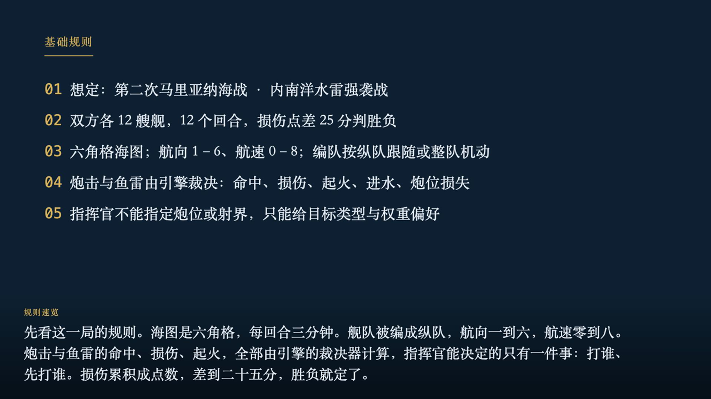
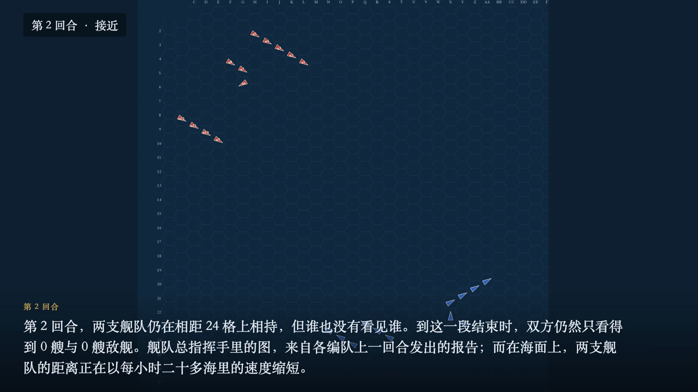
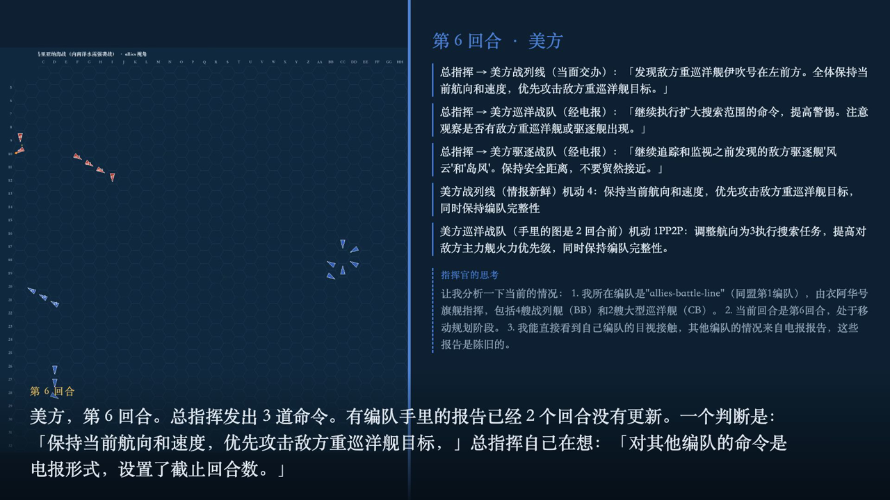
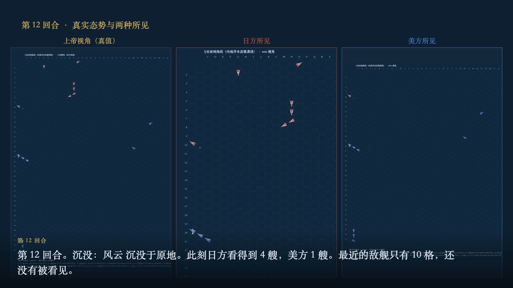

# 第二次马里亚纳海战（内南洋水雷强袭战）· 命令延迟模式 LLM 对 LLM 战报

- **想定**：IBS-S-EM-01（seed 19440619），12 回合后结束
- **指挥链**：舰队总指挥（独立 agent）→ 3 个分舰队指挥（各自 agent + 记忆）；总指挥随队编队当面受令、零延迟，其余编队经电报按媒介延迟
- **模型**：编队级 `llm:zhipu/glm-4.5-flash`；舰队级 `llm-fleet:zhipu/glm-4.5-flash`；思维链开启，每次调用预算 4000 tokens
- **结果**：平局：损伤分差 7，未达到 25 分；比分 轴心 13 : 20 盟军；友军碰撞 0 次
- **调用记账**：92 次成功调用（另有 43 次传输失败被重试），提示 725,441 tokens / 生成 101,833 tokens，平均思维链 1669 字
- **引擎拒绝并回退教条的次数**：3（明细见下）
- **配套影像**：`research/battle_video/out/documentary.mp4`（12.0 分钟，1080p30；同一份记录生成，另附 720p 与字幕）

## 逐回合：真实态势与双方决策

### 第 2 回合

> 第 2 回合，两支舰队仍在相距 24 格上相持，但谁也没有看见谁。到这一段结束时，双方仍然只看得到 0 艘与 0 艘敌舰。舰队总指挥手里的图，来自各编队上一回合发出的报告；而在海面上，两支舰队的距离正在以每小时二十多海里的速度缩短。

## 日方的指挥与上报

| 回合 | 总指挥命令（原文摘录） | 下达方式 | 媒介 | 延迟 |
|---|---|---|---|---|
| T2 → axis-battle-line | 保持当前航向和速度，维持编队完整性。保持最高级别警戒，随时准备应对突发情况。如有发现敌情，立即报告并准备交战。 | 当面交办 | TBS 短距 | +0 |
| T2 → axis-cruiser-line | 保持当前航向和速度，与第1编队保持适当距离。扩大搜索范围，保持警惕。如有发现敌情，立即报告并根据情况采取适当行动。 | 电报 | TBS 短距 | +1 |
| T2 → axis-destroyer-line | 保持当前航向和速度，在前方扩大搜索范围。保持无线电静默，但定期报告位置。如有发现敌情，立即报告并准备侦察或攻击。 | 电报 | TBS 短距 | +1 |
| T3 → axis-battle-line | 保持当前航向和速度，维持编队完整性。提高警惕，密切观察周围海域，随时准备应对突发情况。如有发现敌情，立即报告并准备交战。 | 当面交办 | TBS 短距 | +0 |
| T3 → axis-cruiser-line | 继续探索指定区域，保持编队完整性。与主力编队保持通讯联系，共享侦察信息。根据当前态势调整航速，但不要与主力编队失去联系。 | 电报 | TBS 短距 | +1 |
| T3 → axis-destroyer-line | 继续执行当前任务，保持与主力编队的协调。作为侦察和警戒力量，优先发现敌方动向。根据需要调整航速和位置，确保覆盖关键海域。 | 电报 | TBS 短距 | +1 |
| T4 → axis-battle-line | 保持当前航向和速度，维持编队完整性。提高警惕，密切观察周围海域，随时准备应对突发情况。如有发现敌情，立即报告并准备交战。 | 当面交办 | TBS 短距 | +0 |
| T4 → axis-cruiser-line | 保持当前航向和速度，维持编队完整性。扩大搜索范围，与主力保持通讯联系。如发现敌情，立即报告并根据情况决定是否接战。 | 电报 | TBS 短距 | +1 |
| T4 → axis-destroyer-line | 保持当前航向和速度，维持编队完整性。加强前方搜索，保持无线电静默但随时准备接收和发送紧急信息。如发现敌情，立即报告并准备 | 电报 | TBS 短距 | +1 |
| T5 → axis-battle-line | 保持当前航向2和速度0，维持编队完整性。提高警戒级别，准备随时支援其他编队。保持与各编队的通讯联系，密切关注第3编队报告 | 当面交办 | TBS 短距 | +0 |
| T5 → axis-cruiser-line | 向第3编队位置靠拢，增强侦察力量。保持与主力的通讯联系，提高警惕，准备应对可能的敌情。根据实际情况调整航速，但请保持编队 | 电报 | TBS 短距 | +1 |
| T5 → axis-destroyer-line | 继续监视已发现的敌情，但不主动接触。保持与第2编队的通讯联系，如敌情有变化，立即报告。保持安全距离，准备随时撤退或请求支 | 电报 | TBS 短距 | +1 |
| T6 → axis-battle-line | 保持当前航向和速度，维持编队完整性。提高警戒级别，做好随时支援前线的准备。保持与各编队的通讯联系，密切关注敌情变化。 | 当面交办 | TBS 短距 | +0 |
| T6 → axis-cruiser-line | 根据当前敌情，可考虑适当调整航向以保持有利阵位，但优先保持编队完整性。敌舰以CA为主，优先打击敌重巡洋舰。保持与第3编队 | 电报 | TBS 短距 | +1 |
| T6 → axis-destroyer-line | 敌舰距离较近，保持警惕但避免过早交火。可考虑调整航向以保持有利阵位，但优先保持编队完整性。优先打击敌重巡洋舰，同时警惕敌 | 电报 | TBS 短距 | +1 |
| T7 → axis-battle-line | 保持当前航向和速度，维持编队完整性。提高警戒级别，做好随时支援前线的准备。密切观察周围海域，随时准备应对突发情况。如有需 | 当面交办 | TBS 短距 | +0 |
| T7 → axis-destroyer-line | 继续保持高度警戒，维持与敌编队的安全距离。优先监视敌舰动向，随时报告敌情变化。维持编队完整性，不主动接触敌舰。根据敌情变 | 电报 | TBS 短距 | +1 |
| T8 → axis-battle-line | 本编队立即提高速度至10节，保持当前航向不变。维持编队完整性，密切监视敌战列舰动向。优先目标为敌方战列舰，保持警戒准备交 | 当面交办 | TBS 短距 | +0 |
| T8 → axis-destroyer-line | 继续监视敌重巡洋舰动向，根据实际情况调整战术。保持与主力编队的通讯联系，及时报告敌情变化。如有机会可对敌进行骚扰，但避免 | 电报 | TBS 短距 | +1 |
| T9 → axis-battle-line | 本编队维持当前航向和10节速度，保持编队完整性。密切监视衣阿华号战列舰动向，准备应对可能的交战。优先目标为敌方战列舰，保 | 当面交办 | TBS 短距 | +0 |
| T9 → axis-destroyer-line | 继续向东扩大搜索范围，监视敌重巡洋舰和轻巡洋舰动向。保持安全距离，根据敌情变化决定是否接触。如敌舰有移动迹象，立即报告。 | 电报 | TBS 短距 | +1 |
| T10 → axis-destroyer-line | 第3编队，你们报告的敌情（两艘重巡洋舰和一艘轻巡洋舰）需要高度关注。保持当前航向和速度，继续监视敌情。如敌舰接近至8海里 | 电报 | TBS 短距 | +1 |
| T10 → axis-battle-line | 本编队，将速度提升至10节，维持航向2，保持编队完整性。继续密切监视衣阿华号战列舰动向，准备应对可能的交战。优先目标为敌 | 当面交办 | TBS 短距 | +0 |
| T11 → axis-battle-line | 维持当前航向2和速度10节，保持编队完整性。继续密切监视衣阿华号战列舰动向，保持最高警戒级别。如敌舰接近，准备交战，优先 | 当面交办 | TBS 短距 | +0 |
| T11 → axis-destroyer-line | 根据当前敌情，评估与敌重巡洋舰和轻巡洋舰交战的可行性。如决定交战，请保持编队完整性并集中火力攻击敌方重巡洋舰。如敌情不利 | 电报 | TBS 短距 | +1 |
| T12 → axis-battle-line | 衣阿华号已确认沉没。维持当前航向和速度继续前进，保持编队完整性。提高警戒级别，密切监视周围海域，特别是第3编队方向的情况 | 当面交办 | TBS 短距 | +0 |
| T12 → axis-destroyer-line | 你们报告的敌重巡洋舰和轻巡洋舰情况已收到。根据敌舰速度为0，可能是停泊或低速移动。保持当前监视态势，但提高警戒级别。如果 | 电报 | TBS 短距 | +1 |

**分舰队的上报**（agent 亲笔正文 + 引擎保底态势）

| 报文 | 上报编队 | 类型 | 发出 | 送达 | 延迟 | 正文摘录 |
|---|---|---|---|---|---|---|
| `MSG-00011` | axis-cruiser-line | 态势报告 | T2 | T2 | +0 | 未收到具体命令，保持编队完整性并继续当前航向探索区域。 |
| `MSG-00013` | axis-destroyer-line | 态势报告 | T2 | T2 | +0 | 未收到具体命令，保持当前航向和航速继续执行任务。 |
| `MSG-00024` | axis-cruiser-line | 态势报告 | T3 | T3 | +0 | 确认收到命令。编队当前位于G6-G5-F4，航向4，速度3，保持完整队形并扩大搜索范围。 |
| `MSG-00026` | axis-destroyer-line | 态势报告 | T3 | T3 | +0 | 编队按命令前进至F10，保持航向2和速度1，扩大前方搜索范围。目前未发现敌情，无线电静默保持中。 |
| `MSG-00038` | axis-cruiser-line | 态势报告 | T4 | T4 | +0 | 已收到命令，继续探索指定区域并保持编队完整性，与主力编队保持通讯联系。 |
| `MSG-00040` | axis-destroyer-line | 接触报告 | T4 | T4 | +0 | 已确认命令。编队正在向东扩大搜索范围，发现两艘重巡洋舰和三艘驱逐舰在东北方向12-15海里外，保持警戒态势。 |
| `MSG-00052` | axis-cruiser-line | 接触报告 | T5 | T5 | +0 | 发现多艘美舰：2艘CA(得梅因、塞勒姆)、1艘CL(伍斯特)及3艘DD，距离13-15海里。保持编队完整性并扩大 |
| `MSG-00054` | axis-destroyer-line | 接触报告 | T5 | T5 | +0 | 发现两艘美国重巡洋舰得梅因和塞勒姆距离9海里，多艘驱逐舰在10-15海里范围内。保持航向2扩大搜索范围，维持编队 |
| `MSG-00066` | axis-cruiser-line | 接触报告 | T6 | T6 | +0 | 发现美舰编队：得梅因CA、塞勒姆CA和伍斯特CL，正以航向5速度5向东北移动，距离11-13格。正在保持编队完整 |
| `MSG-00068` | axis-destroyer-line | 接触报告 | T6 | T6 | +0 | 发现敌重巡洋舰得梅因和塞勒姆及轻巡洋舰伍斯特在我西北12海里处，航向5速度5。我已调整航向向东南移动以保持安全距 |
| `MSG-00079` | axis-cruiser-line | 接触报告 | T7 | — | +0 | 发现3艘美舰：得梅因(CA)距离11、塞勒姆(CA)距离12、伍斯特(CL)距离13，正以东北方向移动。保持编队 |
| `MSG-00081` | axis-destroyer-line | 接触报告 | T7 | T7 | +0 | 确认收到命令，当前两艘美重巡洋舰在10海里处，正向东机动保持安全距离，已提高对重巡洋舰火力优先级。 |
| `MSG-00093` | axis-destroyer-line | 接触报告 | T8 | T8 | +0 | 确认收到命令。当前侦测到两艘美重巡洋舰和一艘轻巡洋舰，距离10海里，敌舰静止。我编队正向东扩大搜索范围，保持安全 |
| `MSG-00104` | axis-destroyer-line | 接触报告 | T9 | T9 | +0 | 确认收到命令。当前发现两艘美重巡洋舰(得梅因、塞勒姆)和一艘轻巡洋舰(伍斯特)在我西北10海里处，航向5速度0。 |
| `MSG-00115` | axis-destroyer-line | 接触报告 | T10 | T10 | +0 | 确认收到命令。当前发现两艘美国重巡洋舰和一艘轻巡洋舰在10海里处，航向5速度0。我编队向东移动扩大搜索范围，保持 |
| `MSG-00126` | axis-destroyer-line | 接触报告 | T11 | T11 | +0 | 确认收到命令。两艘重巡洋舰和一艘轻巡洋舰在我西北10海里处，航向5速度0。保持当前航向和速度继续监视，已提高重巡 |
| `MSG-00136` | axis-destroyer-line | 接触报告 | T12 | T12 | +0 | 发现敌两艘重巡洋舰和一艘轻巡洋舰在10-12海里处，航向5速度0。我方单艘驱逐舰火力不足以对抗敌方重巡洋舰编队， |

## 美方的指挥与上报

| 回合 | 总指挥命令（原文摘录） | 下达方式 | 媒介 | 延迟 |
|---|---|---|---|---|
| T2 → allies-battle-line | 保持当前队形和航向，继续前进。全体保持高度警戒，扩大搜索范围，密切注意周围海域情况。如有发现敌情，立即报告。 | 当面交办 | TBS 短距 | +0 |
| T2 → allies-cruiser-line | 向右前方偏移，扩大搜索范围，保持与主力编队的联系。保持高度警戒，注意观察左右舷和前方海域。根据实际情况调整搜索范围，确保 | 电报 | TBS 短距 | +1 |
| T2 → allies-destroyer-line | 进一步向右前方偏移，扩大搜索范围，保持与主力编队的联系。保持高度警戒，注意观察左右舷和前方海域。根据实际情况调整搜索范围 | 电报 | TBS 短距 | +1 |
| T3 → allies-battle-line | 本编队继续保持当前队形和航向，继续执行扩大搜索任务。全体保持高度警戒，注意观察周围海域情况。如有发现敌情，立即报告并根据 | 当面交办 | TBS 短距 | +0 |
| T3 → allies-cruiser-line | 继续执行扩大搜索任务，保持高度警惕。根据当前态势灵活调整搜索范围，注意保持与主力编队的协同。如有发现敌情，立即报告并评估 | 电报 | TBS 短距 | +1 |
| T3 → allies-destroyer-line | 继续保持当前航向和速度，扩大搜索范围。注意观察海面和空中情况，保持无线电静默但定期报告位置。如有发现敌情，立即报告并根据 | 电报 | TBS 短距 | +1 |
| T4 → allies-battle-line | 本编队继续保持当前队形，航向微调为2，扩大东南方向搜索范围。全体保持高度警戒，注意观察周围海域情况。如有发现敌情，立即报 | 当面交办 | TBS 短距 | +0 |
| T4 → allies-cruiser-line | 继续执行扩大搜索任务，将航向调整为3，以扩大东南方向搜索范围。保持与主力编队的联系，保持高度警戒，注意观察周围海域。如有 | 电报 | 转报再加密 | +2 |
| T4 → allies-destroyer-line | 继续执行扩大搜索任务，将航向调整为3，以扩大东南方向搜索范围。保持与主力编队的联系，保持高度警戒，注意观察周围海域。如有 | 电报 | 转报再加密 | +2 |
| T5 → allies-battle-line | 本编队继续保持当前队形，航向调整为3，进一步扩大东南方向搜索范围。全体保持高度警戒，注意观察周围海域情况。如有发现敌情， | 当面交办 | TBS 短距 | +0 |
| T5 → allies-cruiser-line | 继续执行扩大搜索任务，可根据当前态势适当调整搜索方向，保持与主力编队联系。保持高度警戒，一旦发现敌情，立即报告并采取适当 | 电报 | 转报再加密 | +2 |
| T5 → allies-destroyer-line | 继续执行扩大搜索任务，可根据当前态势适当调整搜索方向，保持与主力编队联系。保持高度警戒，一旦发现敌情，立即报告并采取适当 | 电报 | 转报再加密 | +2 |
| T6 → allies-battle-line | 发现敌方重巡洋舰伊吹号在左前方。全体保持当前航向和速度，优先攻击敌方重巡洋舰目标。同时注意观察周围海域，警惕可能的敌方驱 | 当面交办 | TBS 短距 | +0 |
| T6 → allies-cruiser-line | 继续执行扩大搜索范围的命令，提高警惕。注意观察是否有敌方重巡洋舰或驱逐舰出现。如有发现敌情，立即报告并根据敌情调整战术。 | 电报 | 转报再加密 | +2 |
| T6 → allies-destroyer-line | 继续追踪和监视之前发现的敌方驱逐舰'风云'和'岛风'。保持安全距离，不要贸然接近。如有变化，立即报告。同时继续扩大搜索范 | 电报 | 转报再加密 | +2 |
| T7 → allies-battle-line | 保持当前航向和速度，继续作为主力支援。优先攻击敌方重巡洋舰目标，同时保持编队完整性，警惕可能的敌方驱逐舰威胁。根据敌情变 | 当面交办 | TBS 短距 | +0 |
| T7 → allies-cruiser-line | 继续追踪敌方重巡洋舰伊吹号，优先攻击此目标。警惕并准备应对敌方驱逐舰的威胁，保持编队完整性。根据敌情变化调整战术，确保火 | 电报 | 转报再加密 | +2 |
| T7 → allies-destroyer-line | 处理发现的敌方驱逐舰，优先攻击敌方驱逐舰目标。保持无线电静默，保持编队完整性。根据敌情变化调整战术，确保自身安全的同时有 | 电报 | 转报再加密 | +2 |
| T8 → allies-battle-line | 保持当前航向和速度，继续作为主力支援。优先攻击敌方重巡洋舰目标，同时保持编队完整性，警惕可能的敌方驱逐舰威胁。根据敌情变 | 当面交办 | TBS 短距 | +0 |
| T8 → allies-cruiser-line | 继续追踪并攻击敌方重巡洋舰伊吹号，保持高度警戒，注意敌方驱逐舰威胁。根据实际情况调整战术，保持编队完整性，随时准备应对敌 | 电报 | 转报再加密 | +2 |
| T8 → allies-destroyer-line | 继续监视敌方驱逐舰，根据需要提供支援。保持高度警戒，保持编队完整性，随时准备应对敌情变化。 | 电报 | 转报再加密 | +2 |
| T9 → allies-battle-line | 保持当前航向和速度，继续作为主力支援。优先攻击敌方战列舰(大和)目标，同时保持编队完整性，警惕可能的敌方驱逐舰威胁。 | 当面交办 | TBS 短距 | +0 |
| T9 → allies-cruiser-line | 继续追踪并攻击敌方重巡洋舰目标，保持高度警戒。根据敌情变化，可适当调整战术，但务必保持编队完整性。若遭遇敌方驱逐舰威胁， | 电报 | 转报再加密 | +2 |
| T9 → allies-destroyer-line | 继续监视并处理敌方驱逐舰编队，保持编队完整性。在确保自身安全的前提下，可考虑支援第2编队对抗敌方重巡洋舰。根据敌情变化灵 | 电报 | 转报再加密 | +2 |
| T10 → allies-battle-line | 继续保持航向5速度6，全力攻击大和号战列舰，集中火力优先摧毁敌方主力。保持编队完整性，同时为第2和第3编队提供火力支援。 | 当面交办 | TBS 短距 | +0 |
| T10 → allies-cruiser-line | 继续监视和攻击发现的敌方驱逐舰编队。如有可能，尝试恢复机动能力以占据有利位置。保持与主力的通信联系。如敌方驱逐舰威胁解除 | 电报 | 转报再加密 | +2 |
| T10 → allies-destroyer-line | 继续按当前航向3速度5扩大东南方向搜索范围，寻找伊吹号重巡洋舰。保持高度警戒状态，随时准备应对可能的敌方接触。如发现敌方 | 电报 | 转报再加密 | +2 |
| T11 → allies-battle-line | 继续全力攻击大和号战列舰，集中火力优先摧毁敌方主力。调整航向以缩短与大和号的距离，同时保持编队完整性。各舰注意观察周围水 | 当面交办 | TBS 短距 | +0 |
| T11 → allies-cruiser-line | 继续处理已发现的敌方驱逐舰威胁，保持高度警戒。扩大搜索范围寻找敌方重巡洋舰，特别是伊吹号。根据实际情况调整战术，保持编队 | 电报 | 转报再加密 | +2 |
| T11 → allies-destroyer-line | 继续监视敌方驱逐舰'岛风'，扩大搜索范围寻找其他敌方目标。保持编队完整性，警惕敌方可能的伏击行动。若发现敌方重巡洋舰，立 | 电报 | 转报再加密 | +2 |
| T12 → allies-cruiser-line | 第2编队，根据最新情报，你们已发现敌方三艘驱逐舰在B10-D11区域。由于未发现伊吹号重巡洋舰，请根据当前态势调整战术： | 电报 | 转报再加密 | +2 |
| T12 → allies-destroyer-line | 第3编队，继续执行驱逐舰搜索任务，扩大搜索范围寻找敌方驱逐舰。根据之前报告，岛风驱逐舰可能在你们活动区域。保持高度警惕， | 电报 | 转报再加密 | +2 |

**分舰队的上报**（agent 亲笔正文 + 引擎保底态势）

| 报文 | 上报编队 | 类型 | 发出 | 送达 | 延迟 | 正文摘录 |
|---|---|---|---|---|---|---|
| `MSG-00015` | allies-cruiser-line | 态势报告 | T2 | T2 | +0 | 得梅因编队当前位置V25-W26-X26，航向5，速度6，编队完整，未发现敌情。 |
| `MSG-00016` | allies-destroyer-line | 态势报告 | T2 | T2 | +0 | Flotilla proceeding on course with formation intact. No  |
| `MSG-00028` | allies-cruiser-line | 态势报告 | T3 | T3 | +0 | 正在执行向右前方偏移，扩大搜索范围的命令，当前航向改为4，未发现敌情。 |
| `MSG-00030` | allies-destroyer-line | 态势报告 | T3 | T3 | +0 | 正在执行向右前方偏移命令，扩大搜索范围并保持与主力编队联系，目前无敌方接触。 |
| `MSG-00042` | allies-cruiser-line | 态势报告 | T4 | T6 | +2 | 无敌方接触，继续向东南方向扩大搜索范围，保持编队完整性。 |
| `MSG-00044` | allies-destroyer-line | 接触报告 | T4 | T6 | +2 | 发现两艘敌方驱逐舰'风云'和'岛风'，位于我编队左前方约12-13格处，航向2，速度1。正在扩大搜索范围并保持警 |
| `MSG-00056` | allies-cruiser-line | 接触报告 | T5 | T7 | +2 | 发现敌编队：伊吹(CA)在A10，四艘驱逐舰在E10-H11区域。敌航向2-4，速度2-4。我正在扩大搜索范围并 |
| `MSG-00058` | allies-destroyer-line | 接触报告 | T5 | T7 | +2 | 发现四艘敌方驱逐舰，距离12-13海里，位于我编队前方。继续执行扩大搜索范围任务，保持无线电静默。 |
| `MSG-00070` | allies-cruiser-line | 接触报告 | T6 | T8 | +2 | 发现敌伊吹(CA)及四艘驱逐舰在A10-H11区域，航向2-4，速度0-1。已调整航向为3扩大搜索范围，保持高度 |
| `MSG-00072` | allies-destroyer-line | 接触报告 | T6 | T8 | +2 | 编队保持航向2速度5，继续向右前方偏移扩大搜索范围。未发现新敌情，继续监视距离12-13范围内的四艘敌方驱逐舰。 |
| `MSG-00083` | allies-cruiser-line | 接触报告 | T7 | T9 | +2 | 发现敌方编队：五濑(CL)在A9，四艘驱逐舰在G13-I13区域。敌舰航向3-5，速度0-3。我方无法执行航向调 |
| `MSG-00084` | allies-cruiser-line | 偏离报告 | T7 | T9 | +2 | 发现敌方编队：五濑(CL)在A9，四艘驱逐舰在G13-I13区域。敌舰航向3-5，速度0-3。我方无法执行航向调 |
| `MSG-00086` | allies-destroyer-line | 态势报告 | T7 | T9 | +2 | 执行航向调整命令，当前航向已调整为3，正在扩大东南方向搜索范围，保持与主力编队联系，维持高度警戒状态。 |
| `MSG-00095` | allies-cruiser-line | 接触报告 | T8 | T10 | +2 | 我编队位于A20-C21，发现敌四艘驱逐舰(E12-H12)保持与我方相同航向5，速度2，距离10。无法执行航向 |
| `MSG-00097` | allies-destroyer-line | 态势报告 | T8 | T10 | +2 | 继续执行扩大搜索任务，当前航向4速度5，编队完整。无新发现敌情，保持高度警戒状态。 |
| `MSG-00106` | allies-cruiser-line | 接触报告 | T9 | T11 | +2 | 发现敌方四艘驱逐舰(风云、卷波、长波、岛风)与我方保持相同航向5，速度2，距离10。无重巡洋舰发现。保持当前位置 |
| `MSG-00108` | allies-destroyer-line | 接触报告 | T9 | T11 | +2 | 发现敌方驱逐舰'岛风'在距离25处，航向5速度2。我编队正在扩大搜索范围，保持对敌监视。 |
| `MSG-00117` | allies-cruiser-line | 接触报告 | T10 | T12 | +2 | 发现敌方三艘驱逐舰在B10-D11区域，航向5，速度2，距离10。伊吹号不在当前视野中。保持当前位置并维持警戒。 |
| `MSG-00119` | allies-destroyer-line | 态势报告 | T10 | T12 | +2 | 未见新敌方接触，但记忆中有多艘敌方驱逐舰在12-25距离范围内，保持高度警戒。 |
| `MSG-00128` | allies-cruiser-line | 接触报告 | T11 | — | +2 | 发现两艘敌方驱逐舰在A10和C11，距离10，航向5。伊吹号不在视野内，继续追踪任务。维持编队完整性，保持高度警 |
| `MSG-00130` | allies-destroyer-line | 态势报告 | T11 | — | +2 | 当前无直接可见敌方目标，编队保持完整性和高度警戒状态，继续执行监视任务。 |
| `MSG-00138` | allies-cruiser-line | 接触报告 | T12 | — | +2 | 确认收到命令。当前仅见风云号驱逐舰在A10，距离10，航向5。我方编队保持航向5，速度0，维持编队完整性。 |
| `MSG-00140` | allies-destroyer-line | 态势报告 | T12 | — | +2 | 当前无可见接触，编队保持完整性，继续执行监视任务，维持无线电静默。 |

## 代理自主性：如实记账

被引擎拒绝、改由确定性教条执行的回合：

| 回合 | 阵营 | 驳回原因（引擎原文） |
|---|---|---|
| T3 | 日方 | axis-cruiser-line: IBS-U-IJN-ERMA-KURAMA (鞍马) cannot follow guide trail before advancing |
| T6 | 美方 | allies-battle-line: speed 4 is outside member limits; reduce or detach |
| T9 | 日方 | axis-battle-line: IBS-U-IJN-ERMA-YAMATO forced movement prevents formation following |

## 思维链摘录（每位指挥每回合的判断）

- **t3_axis**：让我分析一下当前的情况： 1. 我所在的编队是"轴心第1编队"，包括大和、武藏、信浓、吾妻和石狩，这些船都是大型战舰。 2. 我们目前处于第3回合的移动规划阶段。 3. 我可以看到自己编队的目视接触，但目前没有目视敌情。 4. 我还有两个其他编队：轴心第2编队（巡洋舰编队）和轴心第3编队（驱逐舰编队）。 5. 根据报告，轴心第2编队位于G5，航向2，速度6；轴心第3编队位于D9，航向2，速度6。
- **t3_allies**：让我分析一下当前情况： 1. 我所在编队：allies-battle-line（同盟第1编队） - 包含4艘战列舰（BB）：衣阿华、新泽西、密苏里、威斯康星 - 包含2艘大型巡洋舰（CB）：阿拉斯加、关岛 - 当前位置：从AA20到Y23，呈列队形式前进 - 航向：1（基本向东） - 速度：5 - 当前命令：保持当前队形和航向，继续前进，
- **t4_axis**：让我分析一下当前的情况： 1. 我所在的编队是"轴心第1编队"（axis-battle-line），由大和号战列舰指挥，包括： - 大和（BB） - 武藏（BB） - 信浓（BB） - 吾妻（CB） - 石狩（CB） 2. 当前回合是第4回合，处于移动规划阶段。
- **t4_allies**：让我分析一下当前局势和需要下达的命令： **当前局势分析：** 1. **我方编队情况：** - 同盟第1编队（allies-battle-line）：由衣阿华旗舰领导，包括4艘战列舰（Iowa, New Jersey, Missouri, Wisconsin）和2艘大型巡洋舰（Alaska, Guam），当前位于AA17-Z20区域，航向1-6，速度4，编队呈列队形。
- **t5_axis**：让我分析当前的情况： ### 当前状态 - 当前回合：第5回合，运动规划阶段 - 我所在的编队：轴心第1编队（axis-battle-line），包括大和、武藏、信浓（BB）、吾妻、石狩（CB） - 其他编队： - 轴心第2编队（axis-cruiser-line）：2艘船，在D7位置，航向4，速度3 - 轴心第3编队（axis-destroyer-line）：4艘船，在F10位置，航向2，
- **t5_allies**：让我分析当前的情况： 1. 我所在的编队是"allies-battle-line"（同盟第1编队），我作为总指挥可以直接给这个编队下达当面命令，即刻生效。 2. 我还可以通过电报给其他两个编队下达命令："allies-cruiser-line"（同盟第2编队）和"allies-destroyer-line"（同盟第3编队），但这些命令会有延迟。 3. 当前是第5回合，处于movement_planning阶段（移动规划阶段）。
- **t6_axis**：让我分析当前局势并决定是否需要下达新命令： 当前情况： 1. 我所在的轴心第1编队（axis-battle-line）包括大和、武藏、信浓（BB）、吾妻和石狩（CB），位于J3-N5区域，航向2，速度0。 2. 轴心第2编队（axis-cruiser-line）在A10区域，航向4，速度4，报告发现多艘美舰：2艘CA(得梅因、塞勒姆)、1艘CL(伍斯特)及3艘DD，距离13-15海里。
- **t6_allies**：让我分析一下当前的情况： 1. 我所在编队是"allies-battle-line"（同盟第1编队），由衣阿华号旗舰指挥，包括4艘战列舰（BB）和2艘大型巡洋舰（CB）。 2. 当前回合是第6回合，处于移动规划阶段。 3. 我能直接看到自己编队的目视接触，其他编队的情况来自电报报告，这些报告是陈旧的。
- **t7_axis**：让我分析当前的情况： 1. 我所在的编队是轴心第1编队（axis-battle-line），包括大和、武藏、信浓、吾妻和石狩，位于J3-N5区域，航向2，速度0。 2. 根据报告，轴心第2编队（巡洋舰编队）位于A10，航向4，速度0，发现了美舰编队（得梅因CA、塞勒姆CA和伍斯特CL），距离11-13格，航向5，速度5。
- **t7_allies**：让我分析一下当前的情况： 1. 我所在编队是"同盟第1编队"，由我指挥，位于CC19，航向6，速度4。 2. 我能看到自己编队的情况，其他编队的情况通过电报报告获取，但这些信息是滞后的。 3. 当前是第7回合，处于移动计划阶段。
- **t8_axis**：让我分析一下当前态势： 1. 我所在的编队是"轴心第1编队"，由大和号旗舰率领，包括武藏、信浓、吾妻和石狩，目前位于J3-N5区域，航向2，速度0。 2. 我只能看到自己编队的目视接触，目前看到的是美军的衣阿华号战列舰(CC13位置，航向6)。 3. 其他编队情况来自电报报告： - 轴心第3编队（驱逐舰编队）：在G13区域，航向5，速度3，报告称有两艘美重巡洋舰在10海里处，向东机动保持安全距离，已提高对重巡洋舰火力优先级。
- **t8_allies**：我需要分析当前局势，并决定是否需要下达新命令。让我梳理一下关键信息： ## 当前态势分析 ### 自己所在的编队（allies-battle-line） - 位置：CC13 - 航向：6 - 速度：6 - 舰船：6艘（包括旗舰衣阿华） - 几何排列：列阵 - 当前命令：保持当前航向和速度，继续作为主力支援。优先攻击敌方重巡洋舰目标，同时保持编队完整性，警惕可能的敌方驱逐舰威胁。
- **t9_axis**：让我分析当前局势并决定需要下达哪些命令。 当前情况： 1. 我所在的编队是轴心第1编队（axis-battle-line），包括大和、武藏、信浓、吾妻和石狩，目前位于J3-N5区域，航向2，速度0，但之前的命令是提高速度至10节。 2. 轴心第3编队（axis-destroyer-line）报告他们侦测到两艘美重巡洋舰和一艘轻巡洋舰，距离10海里，敌舰静止。他们正在向东扩大搜索范围，保持安全距离，未主动接触。
- **t9_allies**：我需要分析当前局势并下达适当的命令。让我先整理一下已知信息： 1. 我所在的编队是"同盟第1编队"(allies-battle-line)，这是一艘衣阿华级战列舰(IBS-U-USN-ERMA-IOWA)。 2. 当前是第9回合，处于移动规划阶段。
- **t10_axis**：我需要分析当前局势并决定是否需要下达新命令。让我整理一下关键信息： 1. 当前回合：第10回合，规划阶段 2. 我所在的编队：轴心第1编队（axis-battle-line） - 包含：武藏（BB）、信浓（BB）、吾妻（CB）、石狩（CB） - 当前位置：从M5到J3，航向2，速度0-1节 - 编队形态：纵列 3. 其他编队情况： - 轴心第3编队（axis-destroyer-line，驱逐舰编队） - 位于C11，航向5，
- **t10_allies**：让我分析当前局势并制定适当的命令： ### 当前态势分析 1. **自己所在编队（同盟第1编队）**： - 位置：Y23（AA11） - 航向：5 - 速度：6 - 舰船：6艘（包括旗舰衣阿华号） - 队形：纵列 - 目视接触：大和号（BB）在O6位置 2. **同盟第2编队（重巡洋舰编队）**： - 位置：A20-C21 - 航向：5 - 速度：0 - 舰船：3艘 - 最新报告：发现敌4艘驱逐舰在E12-H12，航向5，速度2，
- **t11_axis**：让我分析当前情况： 1. **当前回合**：第11回合，处于movement_planning阶段 2. **我所在的编队**： - 轴心第1编队（axis-battle-line） - 包括：武藏（BB）、信浓（BB）、吾妻（CB）、石狩（CB） - 当前位置：M5, L4, K4, J3（呈纵列） - 当前航向：2 - 当前速度：0（但根据命令，
- **t11_allies**：我需要分析当前态势并为各编队下达适当的命令。让我先梳理一下当前情况： **当前回合信息：** - 回合：11 - 阶段：movement_planning（移动规划） - 我所在的编队：allies-battle-line（同盟第1编队），
- **t12_axis**：让我分析当前情况并决定是否需要下达新命令。 ## 当前态势分析 ### 自己所在编队（axis-battle-line）情况 - 位置：J3，航向2，速度5 - 舰船：武藏(BB)、信浓(BB)、吾妻(CB)、石狩(CB) - 当前命令：维持当前航向2和速度5，保持编队完整性，继续密切监视衣阿华号战列舰动向 - 目视接触：衣阿华(BB)在AA11，航向2，
- **t12_allies**：让我分析当前的情况： 1. 我是舰队总指挥，位于自己的编队中（虽然没有明确说明是哪个编队，但从我的记忆来看，我似乎是主力编队的指挥官）。 2. 我只能看到自己所在编队的目视接触，其他编队的情况来自电报报告，这些报告是陈旧的，有延迟。 3. 我需要给编队下达命令，命令会通过电报投递，给本队的命令是当面下达、即刻生效，给其他编队的命令需要时间。 4. 我不能指定炮位、射界、射击解或具体命中计算，只能指定目标类型优先级。

## 数据文件

| 文件 | 内容 |
|---|---|
| `battle_data.json` | 对局全记录：逐回合事件、决策、记忆、电报台账、三视角观测索引 |
| `calls.jsonl` | 每次模型调用：提示词、回复、思维链、token 用量、延迟、传输失败 |
| `orders.jsonl` | 引擎接受的每一个指令批次（可用 replay_battle.py 逐位重演） |
| `reports.jsonl` | 每一封上报：作者、正文、发出/送达回合与延迟 |
| `views/` | 逐阶段三视角观测（上帝/日方/美方）与全状态快照 |
| `replay_verification.json` | 从 orders.jsonl 重演与本局终局的一致性核验 |
| `leak_scan.json` | 提示词泄漏核验（含上报正文判据与注入正对照） |
