# 第二次马里亚纳海战（内南洋水雷强袭战）· 命令延迟模式 · GLM 双级指挥对战战报

> 本战报由对局记录自动生成：正文中每一个数字、每一句命令、每一封上报都取自
> `battle_data.json` / `calls.jsonl` / `reports.jsonl`，配图取自同一份记录拍成的影片。

## 0. 一页摘要

| 项 | 值 |
|---|---|
| 想定 / seed | `IBS-S-EM-01` / 19440619 |
| 模型（编队级 / 舰队级） | `llm:zhipu/glm-4.5-flash` / `llm-fleet:zhipu/glm-4.5-flash` |
| 思维链 | 开启并逐次记录，每次调用输出预算 4000 tokens |
| 指挥链 | 舰队总指挥（独立 agent）→ 3 个分舰队指挥（各自 agent + 记忆）；总指挥随队编队当面受令、零延迟，其余编队经电报延迟 |
| 回合 / 结局 | 12 回合 · 平局：损伤分差 7，未达到 25 分 |
| 比分 | 轴心 13 : 20 同盟 |
| 友军碰撞 | 0 次 |
| 模型调用 | 92 次成功（另有 43 次传输失败，全部重试后成功）；提示 725,441 / 生成 101,833 tokens |
| 调用延迟 | 均值 43.3 s，最短 15.6 s，最长 239.1 s；思维链均值 1669 字 |
| 代理自主性 | 引擎驳回并改由教条执行的批次：**3** 次 |
| 报文 | 141 封；其中任务命令 63 封、确认 38 封 |
| 上报 | 40 封，其中跨回合送达 15 封 |
| 重演核验 | PASS：80 个阶段快照、0 处不一致；重演同时重放了 60 条编队回复与 22 条舰队回复 |
| 泄漏核验 | PASS：92 条提示词、0 处违规；注入正对照 被抓 |
| 影像 | `research/battle_video/out/documentary.mp4`（12.0 分钟 1080p30）+ 720p + 字幕 |

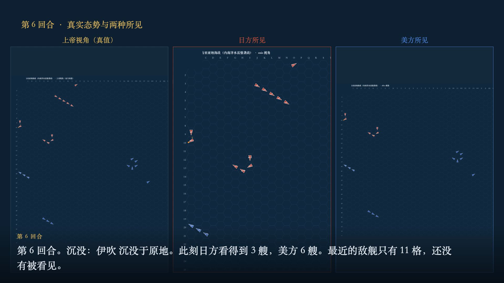

*图：第 6 回合的三视图——左为上帝视角（真值），中为日方所见，右为美方所见。*

## 1. 指挥链与编成

| 阵营 | 编队 | 舰数 | 旗舰 | 总指挥是否随队 |
|---|---|---|---|---|
| 日方 | 日方第一战队（战列线） | 5 | `IBS-U-IJN-ERMA-YAMATO` | **是**（当面受令） |
| 日方 | 日方第二战队（巡洋战队） | 3 | `IBS-U-IJN-ERMA-IBUKI` | 否（等电报） |
| 日方 | 日方第三战队（水雷战队） | 4 | `IBS-U-IJN-ERMA-SHIMAKAZE` | 否（等电报） |
| 美方 | 美方战列线 | 6 | `IBS-U-USN-ERMA-IOWA` | **是**（当面受令） |
| 美方 | 美方巡洋战队 | 3 | `IBS-U-USN-ERMA-DES-MOINES` | 否（等电报） |
| 美方 | 美方驱逐战队 | 3 | `IBS-U-USN-ERMA-ALLEN-M-SUMNER` | 否（等电报） |

指挥链的执行规则（`docs/rules/command-delay.md` §五之二）：

- **当面交办**：总指挥与自己同队的编队，命令在同一回合内生效，不占用通信信道，但仍在台账里记一条报文（注明「同编队当面下令」）。
- **电报**：给其他编队的命令按媒介与队列延迟送达：TBS 短距复杂任务 +1 回合、编码电文 +1、转报再加密 +2，等待超过 3 回合的报文被丢弃。
- **上报**：每个分舰队每回合向总指挥发回一封报文，内容是引擎保底的态势与目击，加上该编队 agent 亲笔写的一句判断。
- **权限边界**：指挥官不得指定炮位、射界、射击解或命中计算，只能给目标类型优先级权重（±0.5）。

## 2. 逐回合详录

### 第 1 回合

**真实态势**：日方 12 舰在航、美方 12 舰在航；此刻日方只看得见 0 艘敌舰、美方只看得见 0 艘
，而距离最近的、尚未被看见的敌舰只有 **24 格**。

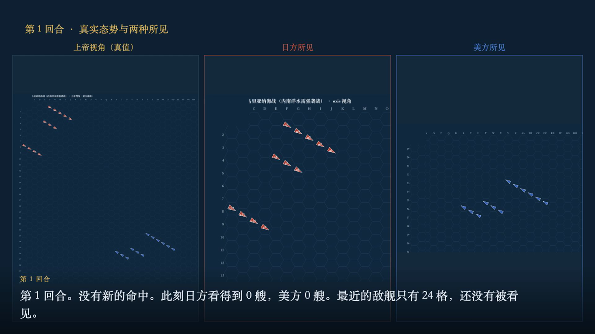

### 第 2 回合

**真实态势**：日方 12 舰在航、美方 12 舰在航；此刻日方只看得见 0 艘敌舰、美方只看得见 0 艘
，而距离最近的、尚未被看见的敌舰只有 **24 格**。

裁决要点：

- `movement_resolution` **formation_emergency_stop** — 鞍马 紧急停车，避免撞上本编队前舰
- `movement_resolution` **formation_emergency_stop** — 五濑 紧急停车，避免撞上本编队前舰

**日方**

总指挥的命令：

| 收件编队 | 命令原文 | 送达方式 | 媒介 | 链路开销 | 实际可读回合 |
|---|---|---|---|---|---|
| 日方第一战队（战列线） | 保持当前航向和速度，维持编队完整性。保持最高级别警戒，随时准备应对突发情况。如有发现敌情，立即报告并准备交战。 | **当面交办** | TBS 短距 | +0 | T2 |
| 日方第二战队（巡洋战队） | 保持当前航向和速度，与第1编队保持适当距离。扩大搜索范围，保持警惕。如有发现敌情，立即报告并根据情况采取适当行动。 | 经电报 | TBS 短距 | +1 | T3 |
| 日方第三战队（水雷战队） | 保持当前航向和速度，在前方扩大搜索范围。保持无线电静默，但定期报告位置。如有发现敌情，立即报告并准备侦察或攻击。 | 经电报 | TBS 短距 | +1 | T3 |

分舰队指挥的决策：

| 编队 | 机动方案 | 情报新鲜度 | 报告动作 | 确认 | 理由（agent 自述） |
|---|---|---|---|---|---|
| 日方第一战队（战列线） | `2` | 情报新鲜 | ACKNOWLEDGEMENT | 是 | 确认收到命令，选择保持航向的机动方案维持编队完整性 |
| 日方第二战队（巡洋战队） | `1SS1` | 情报新鲜 | ACKNOWLEDGEMENT | 是 | 无命令情况下保持编队完整性并继续探索 |
| 日方第三战队（水雷战队） | `1` | 情报新鲜 | ACKNOWLEDGEMENT、SITREP | 是 | 无具体命令，保持当前航向和航速继续前进。 |

本回合发回的上报：

| 上报编队 | 类型 | 媒介 | 送达 | 延迟 | 亲笔正文 |
|---|---|---|---|---|---|
| 日方第二战队（巡洋战队） | 态势报告 | TBS 短距 | T2 | +0 | 未收到具体命令，保持编队完整性并继续当前航向探索区域。 |
| 日方第三战队（水雷战队） | 态势报告 | TBS 短距 | T2 | +0 | 未收到具体命令，保持当前航向和航速继续执行任务。 |

> **总指挥的思考**（思维链结论）：3. 由于没有具体情报，我应该给各编队下达一般性命令，让他们根据情况灵活应对。

**美方**

总指挥的命令：

| 收件编队 | 命令原文 | 送达方式 | 媒介 | 链路开销 | 实际可读回合 |
|---|---|---|---|---|---|
| 美方战列线 | 保持当前队形和航向，继续前进。全体保持高度警戒，扩大搜索范围，密切注意周围海域情况。如有发现敌情，立即报告。 | **当面交办** | TBS 短距 | +0 | T2 |
| 美方巡洋战队 | 向右前方偏移，扩大搜索范围，保持与主力编队的联系。保持高度警戒，注意观察左右舷和前方海域。根据实际情况调整搜索范围，确保与主力编队保持适当距离以提供掩护和侦察。 | 经电报 | TBS 短距 | +1 | T3 |
| 美方驱逐战队 | 进一步向右前方偏移，扩大搜索范围，保持与主力编队的联系。保持高度警戒，注意观察左右舷和前方海域。根据实际情况调整搜索范围，确保与主力编队保持适当距离以提供侦察和可能的鱼雷攻击支援。 | 经电报 | TBS 短距 | +1 | T3 |

分舰队指挥的决策：

| 编队 | 机动方案 | 情报新鲜度 | 报告动作 | 确认 | 理由（agent 自述） |
|---|---|---|---|---|---|
| 美方战列线 | `1S1S3` | 情报新鲜 | SITREP | 是 | 遵循命令保持队形并扩大搜索范围 |
| 美方巡洋战队 | `5` | 情报新鲜 | SITREP | 否 | 保持当前航向和速度，维持编队完整性。 |
| 美方驱逐战队 | `5` | 情报新鲜 | SITREP | 是 | Maintaining current heading to preserve formation integrity while advancing without visible threats. |

本回合发回的上报：

| 上报编队 | 类型 | 媒介 | 送达 | 延迟 | 亲笔正文 |
|---|---|---|---|---|---|
| 美方巡洋战队 | 态势报告 | TBS 短距 | T2 | +0 | 得梅因编队当前位置V25-W26-X26，航向5，速度6，编队完整，未发现敌情。 |
| 美方驱逐战队 | 态势报告 | TBS 短距 | T2 | +0 | Flotilla proceeding on course with formation intact. No contacts detected in local area. All ships operational and maintaining speed. |

> **总指挥的思考**（思维链结论）：我的判断依据是：没有目视接触的情况下，保持编队完整性并扩大搜索范围是最安全的策略。

### 第 3 回合

**真实态势**：日方 12 舰在航、美方 12 舰在航；此刻日方只看得见 0 艘敌舰、美方只看得见 0 艘
，而距离最近的、尚未被看见的敌舰只有 **18 格**。

裁决要点：

- `gunnery` **gunnery_result** — 艾伦·M·萨姆纳 命中结果 35
- `gunnery` **gunnery_result** — 岛风 命中结果 51
- `gunnery` **gunnery_result** — 岛风 命中结果 66

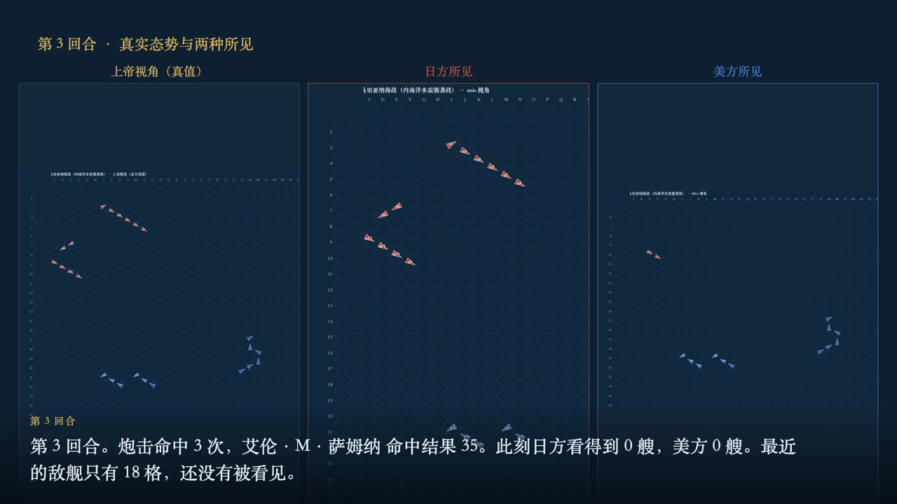

**日方**

总指挥的命令：

| 收件编队 | 命令原文 | 送达方式 | 媒介 | 链路开销 | 实际可读回合 |
|---|---|---|---|---|---|
| 日方第一战队（战列线） | 保持当前航向和速度，维持编队完整性。提高警惕，密切观察周围海域，随时准备应对突发情况。如有发现敌情，立即报告并准备交战。 | **当面交办** | TBS 短距 | +0 | T4 |
| 日方第二战队（巡洋战队） | 继续探索指定区域，保持编队完整性。与主力编队保持通讯联系，共享侦察信息。根据当前态势调整航速，但不要与主力编队失去联系。提高警惕，随时准备支援主力编队。 | 经电报 | TBS 短距 | +1 | T4 |
| 日方第三战队（水雷战队） | 继续执行当前任务，保持与主力编队的协调。作为侦察和警戒力量，优先发现敌方动向。根据需要调整航速和位置，确保覆盖关键海域。保持通讯畅通，及时报告发现情况。 | 经电报 | TBS 短距 | +1 | T4 |

分舰队指挥的决策：

| 编队 | 机动方案 | 情报新鲜度 | 报告动作 | 确认 | 理由（agent 自述） |
|---|---|---|---|---|---|
| 日方第一战队（战列线） | `0` | 情报新鲜 | ACKNOWLEDGEMENT | 是 | 无目视敌情，选择保持当前位置以维持编队完整性，同时确认收到命令。 |
| 日方第二战队（巡洋战队） | `1S1` | 情报新鲜 | ACKNOWLEDGEMENT | 是 | 执行命令扩大搜索范围同时保持编队完整性 |
| 日方第三战队（水雷战队） | `1` | 情报新鲜 | ACKNOWLEDGEMENT、SITREP | 是 | 按命令保持航向和速度向前移动扩大搜索范围，定期报告位置。 |

本回合发回的上报：

| 上报编队 | 类型 | 媒介 | 送达 | 延迟 | 亲笔正文 |
|---|---|---|---|---|---|
| 日方第二战队（巡洋战队） | 态势报告 | TBS 短距 | T3 | +0 | 确认收到命令。编队当前位于G6-G5-F4，航向4，速度3，保持完整队形并扩大搜索范围。 |
| 日方第三战队（水雷战队） | 态势报告 | TBS 短距 | T3 | +0 | 编队按命令前进至F10，保持航向2和速度1，扩大前方搜索范围。目前未发现敌情，无线电静默保持中。 |

> **总指挥的思考**（思维链结论）：这些命令强调了编队完整性和警惕性，同时给予了下级指挥官判断余地，特别是在没有具体敌情的情况下。

**美方**

总指挥的命令：

| 收件编队 | 命令原文 | 送达方式 | 媒介 | 链路开销 | 实际可读回合 |
|---|---|---|---|---|---|
| 美方战列线 | 本编队继续保持当前队形和航向，继续执行扩大搜索任务。全体保持高度警戒，注意观察周围海域情况。如有发现敌情，立即报告并根据敌情调整战术。 | **当面交办** | TBS 短距 | +0 | T3 |
| 美方巡洋战队 | 继续执行扩大搜索任务，保持高度警惕。根据当前态势灵活调整搜索范围，注意保持与主力编队的协同。如有发现敌情，立即报告并评估威胁程度，必要时可先行接触。 | 经电报 | TBS 短距 | +1 | T4 |
| 美方驱逐战队 | 继续保持当前航向和速度，扩大搜索范围。注意观察海面和空中情况，保持无线电静默但定期报告位置。如有发现敌情，立即报告并根据敌类型决定是规避还是发起接触。 | 经电报 | TBS 短距 | +1 | T4 |

分舰队指挥的决策：

| 编队 | 机动方案 | 情报新鲜度 | 报告动作 | 确认 | 理由（agent 自述） |
|---|---|---|---|---|---|
| 美方战列线 | `1P1P1S1S` | 情报新鲜 | SITREP | 是 | 无目视接触情况下，选择保持编队完整性并扩大搜索范围的移动方案，继续执行搜索任务。 |
| 美方巡洋战队 | `4P` | 情报新鲜 | SITREP | 是 | 执行命令向右前方偏移，扩大搜索范围 |
| 美方驱逐战队 | `5P` | 情报新鲜 | SITREP | 是 | 选择MOVE:5P向右前方偏移，符合命令要求扩大搜索范围并保持与主力编队联系。 |

本回合发回的上报：

| 上报编队 | 类型 | 媒介 | 送达 | 延迟 | 亲笔正文 |
|---|---|---|---|---|---|
| 美方巡洋战队 | 态势报告 | TBS 短距 | T3 | +0 | 正在执行向右前方偏移，扩大搜索范围的命令，当前航向改为4，未发现敌情。 |
| 美方驱逐战队 | 态势报告 | TBS 短距 | T3 | +0 | 正在执行向右前方偏移命令，扩大搜索范围并保持与主力编队联系，目前无敌方接触。 |

> **总指挥的思考**（思维链结论）：我将下达的命令： 1. 给自己编队（allies-battle-line）：继续保持当前队形和航向，继续执行扩大搜索任务 2. 给巡洋舰编队（allies-cruiser-line）：继续执行扩大搜索任务，保持高度警惕 3. 给驱逐舰编队（allies-destroyer-line）：继续执行扩大搜索任务，保持高度警惕 由于没有紧急情况，我会给下级留出判断余地，不指定具体战术细节，

### 第 4 回合

**真实态势**：日方 12 舰在航、美方 12 舰在航；此刻日方只看得见 5 艘敌舰、美方只看得见 2 艘
，而距离最近的、尚未被看见的敌舰只有 **12 格**。

裁决要点：

- `gunnery` **gunnery_result** — 岛风 命中结果 21
- `gunnery` **gunnery_result** — 岛风 命中结果 16
- `gunnery` **gunnery_result** — 岛风 命中结果 24
- `gunnery` **gunnery_result** — 岛风 命中结果 64
- `gunnery` **gunnery_result** — 岛风 命中结果 31
- `gunnery` **gunnery_result** — 岛风 命中结果 46

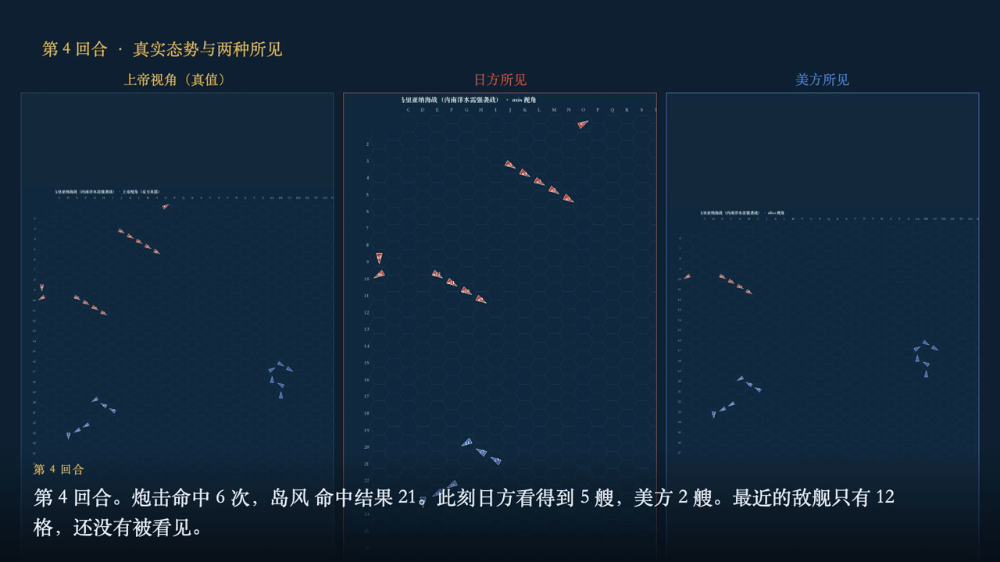

**日方**

总指挥的命令：

| 收件编队 | 命令原文 | 送达方式 | 媒介 | 链路开销 | 实际可读回合 |
|---|---|---|---|---|---|
| 日方第一战队（战列线） | 保持当前航向和速度，维持编队完整性。提高警惕，密切观察周围海域，随时准备应对突发情况。如有发现敌情，立即报告并准备交战。 | **当面交办** | TBS 短距 | +0 | T4 |
| 日方第二战队（巡洋战队） | 保持当前航向和速度，维持编队完整性。扩大搜索范围，与主力保持通讯联系。如发现敌情，立即报告并根据情况决定是否接战。 | 经电报 | TBS 短距 | +1 | T5 |
| 日方第三战队（水雷战队） | 保持当前航向和速度，维持编队完整性。加强前方搜索，保持无线电静默但随时准备接收和发送紧急信息。如发现敌情，立即报告并准备实施鱼雷攻击。 | 经电报 | TBS 短距 | +1 | T5 |

分舰队指挥的决策：

| 编队 | 机动方案 | 情报新鲜度 | 报告动作 | 确认 | 理由（agent 自述） |
|---|---|---|---|---|---|
| 日方第一战队（战列线） | `0` | 情报新鲜 | ACKNOWLEDGEMENT | 是 | 无目视敌情，选择保持当前位置以维持编队完整性，同时确认收到命令。 |
| 日方第二战队（巡洋战队） | `3P1S` | 情报新鲜 | ACKNOWLEDGEMENT | 是 | 继续执行探索任务，保持编队完整性并扩大搜索范围。 |
| 日方第三战队（水雷战队） | `2` | 情报新鲜 | ACKNOWLEDGEMENT、SITREP | 是 | 继续向东推进扩大搜索范围，同时调整对敌方重巡洋舰的火力优先级。 |

本回合发回的上报：

| 上报编队 | 类型 | 媒介 | 送达 | 延迟 | 亲笔正文 |
|---|---|---|---|---|---|
| 日方第二战队（巡洋战队） | 态势报告 | TBS 短距 | T4 | +0 | 已收到命令，继续探索指定区域并保持编队完整性，与主力编队保持通讯联系。 |
| 日方第三战队（水雷战队） | 接触报告 | TBS 短距 | T4 | +0 | 已确认命令。编队正在向东扩大搜索范围，发现两艘重巡洋舰和三艘驱逐舰在东北方向12-15海里外，保持警戒态势。 |

> **总指挥的思考**（思维链结论）：由于： - 没有目视敌情 - 各编队位置分散但保持队形 - 之前命令强调保持编队完整性和警戒 - 没有紧急情况 我认为可以继续保持当前态势，但可以给其他两个编队下达一些指导性命令，加强协调和警戒。

**美方**

总指挥的命令：

| 收件编队 | 命令原文 | 送达方式 | 媒介 | 链路开销 | 实际可读回合 |
|---|---|---|---|---|---|
| 美方战列线 | 本编队继续保持当前队形，航向微调为2，扩大东南方向搜索范围。全体保持高度警戒，注意观察周围海域情况。如有发现敌情，立即报告并根据敌情调整战术。 | **当面交办** | TBS 短距 | +0 | T4 |
| 美方巡洋战队 | 继续执行扩大搜索任务，将航向调整为3，以扩大东南方向搜索范围。保持与主力编队的联系，保持高度警戒，注意观察周围海域。如有发现敌情，立即报告并根据敌情调整战术。 | 经电报 | 转报再加密 | +2 | T6 |
| 美方驱逐战队 | 继续执行扩大搜索任务，将航向调整为3，以扩大东南方向搜索范围。保持与主力编队的联系，保持高度警戒，注意观察周围海域。如有发现敌情，立即报告并根据敌情调整战术。 | 经电报 | 转报再加密 | +2 | T6 |

分舰队指挥的决策：

| 编队 | 机动方案 | 情报新鲜度 | 报告动作 | 确认 | 理由（agent 自述） |
|---|---|---|---|---|---|
| 美方战列线 | `1S1` | 情报新鲜 | SITREP | 是 | 选择MOVE:1S1行动以保持编队完整性同时向东南方向扩大搜索范围，符合命令要求。 |
| 美方巡洋战队 | `2S4P` | 图已 1 回合旧 | SITREP | 是 | 执行扩大搜索任务，保持编队完整性 |
| 美方驱逐战队 | `5P` | 图已 1 回合旧 | CONTACT_REPORT | 是 | 选择MOVE:5P保持向右前方偏移扩大搜索范围，同时提高两个敌方驱逐舰的优先级以便监视。 |

本回合发回的上报：

| 上报编队 | 类型 | 媒介 | 送达 | 延迟 | 亲笔正文 |
|---|---|---|---|---|---|
| 美方巡洋战队 | 态势报告 | 转报再加密 | T6 | +2 | 无敌方接触，继续向东南方向扩大搜索范围，保持编队完整性。 |
| 美方驱逐战队 | 接触报告 | 转报再加密 | T6 | +2 | 发现两艘敌方驱逐舰'风云'和'岛风'，位于我编队左前方约12-13格处，航向2，速度1。正在扩大搜索范围并保持警戒。 |

> **总指挥的思考**（思维链结论）：同时，我会在记忆中记录当前命令，以便下一回合参考。

### 第 5 回合

**真实态势**：日方 12 舰在航、美方 12 舰在航；此刻日方只看得见 6 艘敌舰、美方只看得见 5 艘
，而距离最近的、尚未被看见的敌舰只有 **9 格**。

裁决要点：

- `movement_resolution` **formation_emergency_stop** — 关岛 紧急停车，避免撞上本编队前舰
- `movement_resolution` **formation_emergency_stop** — 阿拉斯加、衣阿华 紧急停车，避免友舰相撞
- `movement_resolution` **formation_emergency_stop** — 新泽西 跟随前舰紧急停车
- `movement_resolution` **formation_emergency_stop** — 密苏里 跟随前舰紧急停车
- `movement_resolution` **formation_emergency_stop** — 威斯康星 跟随前舰紧急停车
- `gunnery` **gunnery_result** — 伍斯特 命中结果 26
- `gunnery` **gunnery_result** — 伍斯特 命中结果 53
- `gunnery` **gunnery_result** — 伍斯特 命中结果 41
- （其余 19 条见「附录：数据文件」中的事件流）

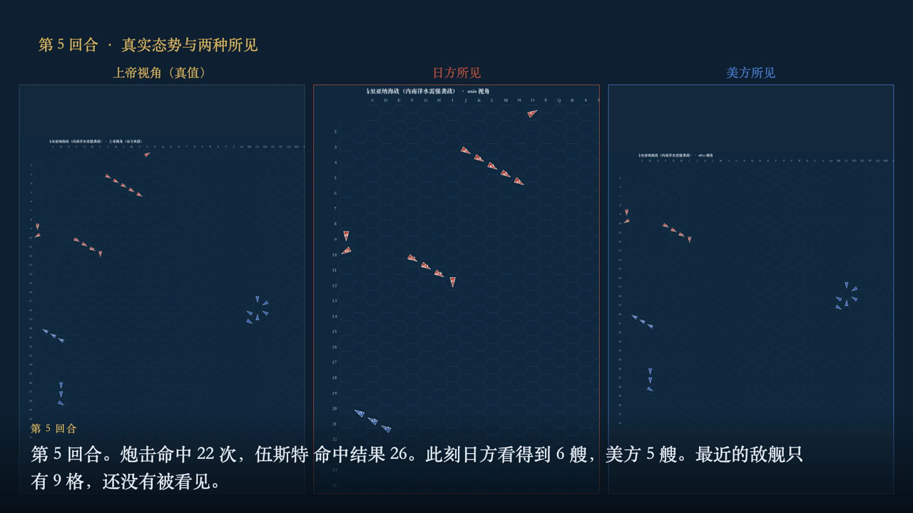

**日方**

总指挥的命令：

| 收件编队 | 命令原文 | 送达方式 | 媒介 | 链路开销 | 实际可读回合 |
|---|---|---|---|---|---|
| 日方第一战队（战列线） | 保持当前航向2和速度0，维持编队完整性。提高警戒级别，准备随时支援其他编队。保持与各编队的通讯联系，密切关注第3编队报告的敌情变化。 | **当面交办** | TBS 短距 | +0 | T5 |
| 日方第二战队（巡洋战队） | 向第3编队位置靠拢，增强侦察力量。保持与主力的通讯联系，提高警惕，准备应对可能的敌情。根据实际情况调整航速，但请保持编队完整性。 | 经电报 | TBS 短距 | +1 | T6 |
| 日方第三战队（水雷战队） | 继续监视已发现的敌情，但不主动接触。保持与第2编队的通讯联系，如敌情有变化，立即报告。保持安全距离，准备随时撤退或请求支援。 | 经电报 | TBS 短距 | +1 | T6 |

分舰队指挥的决策：

| 编队 | 机动方案 | 情报新鲜度 | 报告动作 | 确认 | 理由（agent 自述） |
|---|---|---|---|---|---|
| 日方第一战队（战列线） | `0` | 情报新鲜 | ACKNOWLEDGEMENT | 是 | 保持当前位置以维持编队完整性，同时确认收到命令并提高警戒级别 |
| 日方第二战队（巡洋战队） | `0` | 情报新鲜 | ACKNOWLEDGEMENT、CONTACT_REPORT | 是 | 维持编队完整性并扩大搜索范围，同时降低所有接触目标优先级以避免不必要的接战 |
| 日方第三战队（水雷战队） | `1S` | 情报新鲜 | ACKNOWLEDGEMENT、CONTACT_REPORT、SITREP | 是 | 维持航向2扩大搜索范围，优先打击最近重巡洋舰 |

本回合发回的上报：

| 上报编队 | 类型 | 媒介 | 送达 | 延迟 | 亲笔正文 |
|---|---|---|---|---|---|
| 日方第二战队（巡洋战队） | 接触报告 | TBS 短距 | T5 | +0 | 发现多艘美舰：2艘CA(得梅因、塞勒姆)、1艘CL(伍斯特)及3艘DD，距离13-15海里。保持编队完整性并扩大搜索范围中。 |
| 日方第三战队（水雷战队） | 接触报告 | TBS 短距 | T5 | +0 | 发现两艘美国重巡洋舰得梅因和塞勒姆距离9海里，多艘驱逐舰在10-15海里范围内。保持航向2扩大搜索范围，维持编队完整性。 |

> **总指挥的思考**（思维链结论）：让我分析当前的情况： 当前状态 - 当前回合：第5回合，运动规划阶段 - 我所在的编队：轴心第1编队（axis-battle-line），包括大和、武藏、信浓（BB）、吾妻、石狩（CB） - 其他编队： - 轴心第2编队（axis-cruiser-line）：2艘船，在D7位置，航向4，速度3 - 轴心第3编队（axis-destroyer-line）：4艘船，在F10位置，航向2，

**美方**

总指挥的命令：

| 收件编队 | 命令原文 | 送达方式 | 媒介 | 链路开销 | 实际可读回合 |
|---|---|---|---|---|---|
| 美方战列线 | 本编队继续保持当前队形，航向调整为3，进一步扩大东南方向搜索范围。全体保持高度警戒，注意观察周围海域情况。如有发现敌情，立即报告并根据敌情调整战术。 | **当面交办** | TBS 短距 | +0 | T5 |
| 美方巡洋战队 | 继续执行扩大搜索任务，可根据当前态势适当调整搜索方向，保持与主力编队联系。保持高度警戒，一旦发现敌情，立即报告并采取适当行动。如遇紧急情况，可根据现场态势自主决定应对措施，但需及时向指挥部报告。 | 经电报 | 转报再加密 | +2 | T7 |
| 美方驱逐战队 | 继续执行扩大搜索任务，可根据当前态势适当调整搜索方向，保持与主力编队联系。保持高度警戒，一旦发现敌情，立即报告并采取适当行动。如遇紧急情况，可根据现场态势自主决定应对措施，但需及时向指挥部报告。 | 经电报 | 转报再加密 | +2 | T7 |

分舰队指挥的决策：

| 编队 | 机动方案 | 情报新鲜度 | 报告动作 | 确认 | 理由（agent 自述） |
|---|---|---|---|---|---|
| 美方战列线 | `1S1S1S1S` | 情报新鲜 | SITREP | 是 | 选择MOVE:1S1S1S1S行动以调整航向为3并扩大东南方向搜索范围，符合命令要求。 |
| 美方巡洋战队 | `3S2` | 图已 2 回合旧 | CONTACT_REPORT | 是 | 保持编队完整性，向东北方向扩大搜索范围，同时提高对敌方主力舰和近距离驱逐舰的火力优先级。 |
| 美方驱逐战队 | `5P` | 图已 2 回合旧 | CONTACT_REPORT | 是 | 继续执行向右前方偏移命令，扩大搜索范围同时监视敌方接触。 |

本回合发回的上报：

| 上报编队 | 类型 | 媒介 | 送达 | 延迟 | 亲笔正文 |
|---|---|---|---|---|---|
| 美方巡洋战队 | 接触报告 | 转报再加密 | T7 | +2 | 发现敌编队：伊吹(CA)在A10，四艘驱逐舰在E10-H11区域。敌航向2-4，速度2-4。我正在扩大搜索范围并保持警惕。 |
| 美方驱逐战队 | 接触报告 | 转报再加密 | T7 | +2 | 发现四艘敌方驱逐舰，距离12-13海里，位于我编队前方。继续执行扩大搜索范围任务，保持无线电静默。 |

> **总指挥的思考**（思维链结论）：我决定： 1. 给自己所在的编队（allies-battle-line）下达新命令，调整搜索策略 2. 给其他两个编队也下达命令，协调搜索行动 命令内容应该包括： - 继续扩大搜索范围 - 调整搜索方向或队形 - 保持高度警戒 - 一旦发现敌情立即报告 由于我给其他编队的命令是通过电报发送的，会有延迟，所以我需要给下级留下判断余地，不要把命令写得太死。

### 第 6 回合

**真实态势**：日方 12 舰在航、美方 12 舰在航；此刻日方只看得见 3 艘敌舰、美方只看得见 6 艘
，而距离最近的、尚未被看见的敌舰只有 **11 格**。

裁决要点：

- `movement_resolution` **formation_emergency_stop** — 衣阿华、密苏里、新泽西、威斯康星 紧急停车，避免友舰相撞
- `gunnery` **ship_sunk** — 伊吹 沉没于原地
- `gunnery` **gunnery_result** — 伊吹 命中结果 55
- `gunnery` **gunnery_result** — 伊吹 命中结果 25
- `gunnery` **gunnery_result** — 伊吹 命中结果 45
- `gunnery` **gunnery_result** — 伊吹 命中结果 56
- `gunnery` **gunnery_result** — 伊吹 命中结果 34
- `gunnery` **gunnery_result** — 伊吹 命中结果 36
- （其余 11 条见「附录：数据文件」中的事件流）

**日方**

总指挥的命令：

| 收件编队 | 命令原文 | 送达方式 | 媒介 | 链路开销 | 实际可读回合 |
|---|---|---|---|---|---|
| 日方第一战队（战列线） | 保持当前航向和速度，维持编队完整性。提高警戒级别，做好随时支援前线的准备。保持与各编队的通讯联系，密切关注敌情变化。 | **当面交办** | TBS 短距 | +0 | T6 |
| 日方第二战队（巡洋战队） | 根据当前敌情，可考虑适当调整航向以保持有利阵位，但优先保持编队完整性。敌舰以CA为主，优先打击敌重巡洋舰。保持与第3编队的协调，避免单独行动。根据实际情况决定是否交战，保持通讯畅通。 | 经电报 | TBS 短距 | +1 | T7 |
| 日方第三战队（水雷战队） | 敌舰距离较近，保持警惕但避免过早交火。可考虑调整航向以保持有利阵位，但优先保持编队完整性。优先打击敌重巡洋舰，同时警惕敌方驱逐舰的鱼雷威胁。根据实际情况决定是否交战，保持与第2编队的协调。 | 经电报 | TBS 短距 | +1 | T7 |

分舰队指挥的决策：

| 编队 | 机动方案 | 情报新鲜度 | 报告动作 | 确认 | 理由（agent 自述） |
|---|---|---|---|---|---|
| 日方第一战队（战列线） | `0` | 情报新鲜 | ACKNOWLEDGEMENT | 是 | 维持当前位置以保持编队完整性，同时确认收到命令并提高警戒级别。 |
| 日方第二战队（巡洋战队） | `0` | 情报新鲜 | ACKNOWLEDGEMENT、CONTACT_REPORT | 是 | 保持编队完整性并提高对最近敌舰的监视优先级，同时准备向第3编队靠拢。 |
| 日方第三战队（水雷战队） | `1S1S1` | 情报新鲜 | ACKNOWLEDGEMENT、SITREP | 是 | 调整航向保持与敌安全距离，降低目标优先级避免主动接触，符合监视命令 |

本回合发回的上报：

| 上报编队 | 类型 | 媒介 | 送达 | 延迟 | 亲笔正文 |
|---|---|---|---|---|---|
| 日方第二战队（巡洋战队） | 接触报告 | TBS 短距 | T6 | +0 | 发现美舰编队：得梅因CA、塞勒姆CA和伍斯特CL，正以航向5速度5向东北移动，距离11-13格。正在保持编队完整性并执行侦察任务。 |
| 日方第三战队（水雷战队） | 接触报告 | TBS 短距 | T6 | +0 | 发现敌重巡洋舰得梅因和塞勒姆及轻巡洋舰伍斯特在我西北12海里处，航向5速度5。我已调整航向向东南移动以保持安全距离，不主动接触。 |

> **总指挥的思考**（思维链结论）：而给自己的第1编队是当面命令，可以更明确。

**美方**

总指挥的命令：

| 收件编队 | 命令原文 | 送达方式 | 媒介 | 链路开销 | 实际可读回合 |
|---|---|---|---|---|---|
| 美方战列线 | 发现敌方重巡洋舰伊吹号在左前方。全体保持当前航向和速度，优先攻击敌方重巡洋舰目标。同时注意观察周围海域，警惕可能的敌方驱逐舰威胁。保持编队完整性，随时准备根据敌情调整战术。 | **当面交办** | TBS 短距 | +0 | T6 |
| 美方巡洋战队 | 继续执行扩大搜索范围的命令，提高警惕。注意观察是否有敌方重巡洋舰或驱逐舰出现。如有发现敌情，立即报告并根据敌情调整战术。保持编队完整性，注意安全。 | 经电报 | 转报再加密 | +2 | T8 |
| 美方驱逐战队 | 继续追踪和监视之前发现的敌方驱逐舰'风云'和'岛风'。保持安全距离，不要贸然接近。如有变化，立即报告。同时继续扩大搜索范围，注意观察周围海域情况。 | 经电报 | 转报再加密 | +2 | T8 |

分舰队指挥的决策：

| 编队 | 机动方案 | 情报新鲜度 | 报告动作 | 确认 | 理由（agent 自述） |
|---|---|---|---|---|---|
| 美方战列线 | `4` | 情报新鲜 | SITREP | 是 | 保持当前航向和速度，优先攻击敌方重巡洋舰目标，同时保持编队完整性 |
| 美方巡洋战队 | `1PP2P` | 图已 2 回合旧 | CONTACT_REPORT、SITREP | 是 | 调整航向为3执行搜索任务，提高对敌方主力舰火力优先级，同时保持编队完整性。 |
| 美方驱逐战队 | `5P` | 图已 2 回合旧 | SITREP | 是 | 继续执行扩大搜索范围的命令，同时保持对已知敌方驱逐舰的监视。 |

本回合发回的上报：

| 上报编队 | 类型 | 媒介 | 送达 | 延迟 | 亲笔正文 |
|---|---|---|---|---|---|
| 美方巡洋战队 | 接触报告 | 转报再加密 | T8 | +2 | 发现敌伊吹(CA)及四艘驱逐舰在A10-H11区域，航向2-4，速度0-1。已调整航向为3扩大搜索范围，保持高度警戒。 |
| 美方驱逐战队 | 接触报告 | 转报再加密 | T8 | +2 | 编队保持航向2速度5，继续向右前方偏移扩大搜索范围。未发现新敌情，继续监视距离12-13范围内的四艘敌方驱逐舰。 |

> **总指挥的思考**（思维链结论）：对其他编队的命令是电报形式，设置了截止回合数。

### 第 7 回合

**真实态势**：日方 11 舰在航、美方 12 舰在航；此刻日方只看得见 3 艘敌舰、美方只看得见 5 艘
，而距离最近的、尚未被看见的敌舰只有 **10 格**。

裁决要点：

- `gunnery` **gunnery_result** — 得梅因 命中结果 33
- `gunnery` **gunnery_result** — 得梅因 命中结果 21
- `gunnery` **gunnery_result** — 塞勒姆 命中结果 65
- `gunnery` **gunnery_result** — 塞勒姆 命中结果 46
- `gunnery` **gunnery_result** — 塞勒姆 命中结果 54
- `gunnery` **gunnery_result** — 五濑 命中结果 45
- `gunnery` **gunnery_result** — 五濑 命中结果 63
- `gunnery` **gunnery_result** — 五濑 命中结果 31
- （其余 12 条见「附录：数据文件」中的事件流）

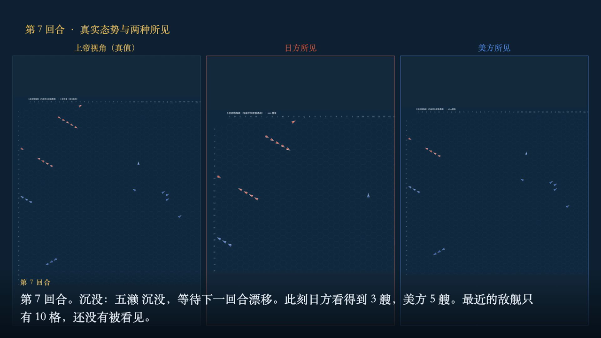

**日方**

总指挥的命令：

| 收件编队 | 命令原文 | 送达方式 | 媒介 | 链路开销 | 实际可读回合 |
|---|---|---|---|---|---|
| 日方第一战队（战列线） | 保持当前航向和速度，维持编队完整性。提高警戒级别，做好随时支援前线的准备。密切观察周围海域，随时准备应对突发情况。如有需要，准备向第2或第3编队方向机动。 | **当面交办** | TBS 短距 | +0 | T7 |
| 日方第三战队（水雷战队） | 继续保持高度警戒，维持与敌编队的安全距离。优先监视敌舰动向，随时报告敌情变化。维持编队完整性，不主动接触敌舰。根据敌情变化，随时准备调整战术位置或支援主力编队。 | 经电报 | TBS 短距 | +1 | T8 |

分舰队指挥的决策：

| 编队 | 机动方案 | 情报新鲜度 | 报告动作 | 确认 | 理由（agent 自述） |
|---|---|---|---|---|---|
| 日方第一战队（战列线） | `0` | 情报新鲜 | ACKNOWLEDGEMENT | 是 | 维持当前位置和航向以保持编队完整性，同时确认收到命令并提高警戒级别。 |
| 日方第二战队（巡洋战队） | `1P` | 图已 1 回合旧 | ACKNOWLEDGEMENT、CONTACT_REPORT | 是 | 保持编队完整性同时调整航向以对准敌重巡洋舰 |
| 日方第三战队（水雷战队） | `2` | 情报新鲜 | ACKNOWLEDGEMENT、SITREP | 是 | 保持编队完整性同时扩大与敌距离，优先打击重巡洋舰 |

本回合发回的上报：

| 上报编队 | 类型 | 媒介 | 送达 | 延迟 | 亲笔正文 |
|---|---|---|---|---|---|
| 日方第二战队（巡洋战队） | 接触报告 | 无通路 | 未送达 | +0 | 发现3艘美舰：得梅因(CA)距离11、塞勒姆(CA)距离12、伍斯特(CL)距离13，正以东北方向移动。保持编队完整性，准备打击敌重巡洋舰。 |
| 日方第三战队（水雷战队） | 接触报告 | TBS 短距 | T7 | +0 | 确认收到命令，当前两艘美重巡洋舰在10海里处，正向东机动保持安全距离，已提高对重巡洋舰火力优先级。 |

> **总指挥的思考**（思维链结论）：最终，我决定使用这个命令。

**美方**

总指挥的命令：

| 收件编队 | 命令原文 | 送达方式 | 媒介 | 链路开销 | 实际可读回合 |
|---|---|---|---|---|---|
| 美方战列线 | 保持当前航向和速度，继续作为主力支援。优先攻击敌方重巡洋舰目标，同时保持编队完整性，警惕可能的敌方驱逐舰威胁。根据敌情变化随时准备调整战术。 | **当面交办** | TBS 短距 | +0 | T8 |
| 美方巡洋战队 | 继续追踪敌方重巡洋舰伊吹号，优先攻击此目标。警惕并准备应对敌方驱逐舰的威胁，保持编队完整性。根据敌情变化调整战术，确保火力集中且自身安全。 | 经电报 | 转报再加密 | +2 | T9 |
| 美方驱逐战队 | 处理发现的敌方驱逐舰，优先攻击敌方驱逐舰目标。保持无线电静默，保持编队完整性。根据敌情变化调整战术，确保自身安全的同时有效执行任务。 | 经电报 | 转报再加密 | +2 | T9 |

分舰队指挥的决策：

| 编队 | 机动方案 | 情报新鲜度 | 报告动作 | 确认 | 理由（agent 自述） |
|---|---|---|---|---|---|
| 美方战列线 | `6` | 情报新鲜 | ACKNOWLEDGEMENT | 是 | 保持当前航向和速度，继续执行搜索任务，符合命令要求。 |
| 美方巡洋战队 | `0` | 图已 2 回合旧 | CONTACT_REPORT、DEVIATION_REPORT、SITREP | 是 | 保持当前位置，提高对敌舰火力优先级，报告无法执行航向调整命令 |
| 美方驱逐战队 | `1S1S3` | 图已 2 回合旧 | SITREP | 是 | 选择MOVE:1S1S3调整航向至3，同时保持编队完整性并扩大搜索范围，符合命令要求。 |

本回合发回的上报：

| 上报编队 | 类型 | 媒介 | 送达 | 延迟 | 亲笔正文 |
|---|---|---|---|---|---|
| 美方巡洋战队 | 接触报告 | 转报再加密 | T9 | +2 | 发现敌方编队：五濑(CL)在A9，四艘驱逐舰在G13-I13区域。敌舰航向3-5，速度0-3。我方无法执行航向调整为3的命令，当前保持航向5，速度4，维持编队完整性。高度警戒中，准备根据敌情调整战术。 |
| 美方巡洋战队 | 偏离报告 | 转报再加密 | T9 | +2 | 发现敌方编队：五濑(CL)在A9，四艘驱逐舰在G13-I13区域。敌舰航向3-5，速度0-3。我方无法执行航向调整为3的命令，当前保持航向5，速度4，维持编队完整性。高度警戒中，准备根据敌情调整战术。 |
| 美方驱逐战队 | 态势报告 | 转报再加密 | T9 | +2 | 执行航向调整命令，当前航向已调整为3，正在扩大东南方向搜索范围，保持与主力编队联系，维持高度警戒状态。 |

> **总指挥的思考**（思维链结论）：考虑到当前态势，我认为需要： 1. 保持我编队（第1编队）的当前航向和速度，继续作为主力支援 2. 给第2编队（巡洋舰编队）下达新命令，让他们继续追踪和攻击伊吹号，同时警惕敌方驱逐舰 3. 给第3编队（驱逐舰编队）下达新命令，让他们处理发现的敌方驱逐舰 由于我无法直接控制单舰的机动，也不能指定炮位或射击解，只能给出目标类型优先级，我将下达适当的命令。

### 第 8 回合

**真实态势**：日方 10 舰在航、美方 12 舰在航；此刻日方只看得见 4 艘敌舰、美方只看得见 4 艘
，而距离最近的、尚未被看见的敌舰只有 **10 格**。

裁决要点：

- `gunnery` **gunnery_result** — 塞勒姆 命中结果 33
- `gunnery` **gunnery_result** — 塞勒姆 命中结果 62
- `gunnery` **gunnery_result** — 塞勒姆 命中结果 32
- `gunnery` **gunnery_result** — 衣阿华 命中结果 22
- `gunnery` **gunnery_result** — 衣阿华 命中结果 43
- `gunnery` **gunnery_result** — 衣阿华 命中结果 34
- `gunnery` **gunnery_result** — 衣阿华 命中结果 23
- `gunnery` **gunnery_result** — 衣阿华 命中结果 63
- （其余 13 条见「附录：数据文件」中的事件流）

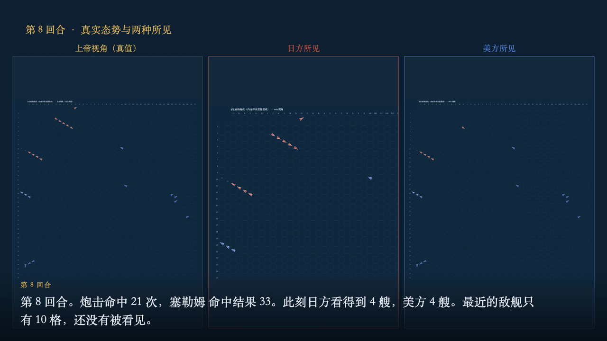

**日方**

总指挥的命令：

| 收件编队 | 命令原文 | 送达方式 | 媒介 | 链路开销 | 实际可读回合 |
|---|---|---|---|---|---|
| 日方第一战队（战列线） | 本编队立即提高速度至10节，保持当前航向不变。维持编队完整性，密切监视敌战列舰动向。优先目标为敌方战列舰，保持警戒准备交战。各舰注意保持队形，避免分散。 | **当面交办** | TBS 短距 | +0 | T8 |
| 日方第三战队（水雷战队） | 继续监视敌重巡洋舰动向，根据实际情况调整战术。保持与主力编队的通讯联系，及时报告敌情变化。如有机会可对敌进行骚扰，但避免过度冒险。优先目标为敌方重巡洋舰。 | 经电报 | TBS 短距 | +1 | T9 |

分舰队指挥的决策：

| 编队 | 机动方案 | 情报新鲜度 | 报告动作 | 确认 | 理由（agent 自述） |
|---|---|---|---|---|---|
| 日方第一战队（战列线） | `0` | 情报新鲜 | ACKNOWLEDGEMENT | 是 | 保持当前位置和航向以维持编队完整性，同时提高速度至10节，并增加敌战列舰优先级权重 |
| 日方第三战队（水雷战队） | `2` | 情报新鲜 | ACKNOWLEDGEMENT、CONTACT_REPORT、SITREP | 是 | 维持编队完整性同时扩大与敌安全距离，降低目标优先级符合监视命令 |

本回合发回的上报：

| 上报编队 | 类型 | 媒介 | 送达 | 延迟 | 亲笔正文 |
|---|---|---|---|---|---|
| 日方第三战队（水雷战队） | 接触报告 | TBS 短距 | T8 | +0 | 确认收到命令。当前侦测到两艘美重巡洋舰和一艘轻巡洋舰，距离10海里，敌舰静止。我编队正向东扩大搜索范围，保持安全距离，未主动接触。 |

> **总指挥的思考**（思维链结论）：给主力编队的命令（当面下达，即刻生效）： - 提高速度至中等水平，保持航向不变，以保持对敌舰的接触能力 - 优先目标是敌方战列舰（衣阿华） - 维持编队完整性 给第3编队的命令（电报，有延迟）： - 继续监视并跟踪敌重巡洋舰 - 根据敌情变化调整战术，但保持与主力的通讯联系 - 如有机会，可对敌重巡洋舰进行骚扰，但避免过度冒险 这样既保持了主力编队的战斗准备，

**美方**

总指挥的命令：

| 收件编队 | 命令原文 | 送达方式 | 媒介 | 链路开销 | 实际可读回合 |
|---|---|---|---|---|---|
| 美方战列线 | 保持当前航向和速度，继续作为主力支援。优先攻击敌方重巡洋舰目标，同时保持编队完整性，警惕可能的敌方驱逐舰威胁。根据敌情变化随时准备调整战术。 | **当面交办** | TBS 短距 | +0 | T8 |
| 美方巡洋战队 | 继续追踪并攻击敌方重巡洋舰伊吹号，保持高度警戒，注意敌方驱逐舰威胁。根据实际情况调整战术，保持编队完整性，随时准备应对敌情变化。 | 经电报 | 转报再加密 | +2 | T10 |
| 美方驱逐战队 | 继续监视敌方驱逐舰，根据需要提供支援。保持高度警戒，保持编队完整性，随时准备应对敌情变化。 | 经电报 | 转报再加密 | +2 | T10 |

分舰队指挥的决策：

| 编队 | 机动方案 | 情报新鲜度 | 报告动作 | 确认 | 理由（agent 自述） |
|---|---|---|---|---|---|
| 美方战列线 | `2P2` | 情报新鲜 | SITREP | 是 | 保持编队完整性并继续扩大搜索范围，符合命令要求 |
| 美方巡洋战队 | `0` | 图已 2 回合旧 | ACKNOWLEDGEMENT、CONTACT_REPORT、SITREP | 是 | 保持当前位置，维持编队完整性，报告敌情并确认命令 |
| 美方驱逐战队 | `5P` | 图已 2 回合旧 | SITREP | 是 | 继续执行扩大搜索任务，保持与主力编队联系 |

本回合发回的上报：

| 上报编队 | 类型 | 媒介 | 送达 | 延迟 | 亲笔正文 |
|---|---|---|---|---|---|
| 美方巡洋战队 | 接触报告 | 转报再加密 | T10 | +2 | 我编队位于A20-C21，发现敌四艘驱逐舰(E12-H12)保持与我方相同航向5，速度2，距离10。无法执行航向调整命令，保持当前位置扩大搜索范围。 |
| 美方驱逐战队 | 态势报告 | 转报再加密 | T10 | +2 | 继续执行扩大搜索任务，当前航向4速度5，编队完整。无新发现敌情，保持高度警戒状态。 |

> **总指挥的思考**（思维链结论）：最近接触 - T6回合见到伊吹（CA）距离27 决策分析 1. 信息时效性： - 我自己所在编队的信息是最新的（第1回合报告，但年龄7回合，可能已过时） - 第2编队报告是第6回合的（2回合前） - 第3编队报告也是第6回合的（2回合前） - 这意味着我手中的信息可能已经过时，

### 第 9 回合

**真实态势**：日方 10 舰在航、美方 12 舰在航；此刻日方只看得见 4 艘敌舰、美方只看得见 5 艘
，而距离最近的、尚未被看见的敌舰只有 **10 格**。

裁决要点：

- `movement_resolution` **formation_emergency_stop** — 信浓 紧急停车，避免撞上本编队前舰
- `movement_resolution` **formation_emergency_stop** — 吾妻 紧急停车，避免撞上本编队前舰
- `movement_resolution` **formation_emergency_stop** — 石狩 紧急停车，避免撞上本编队前舰
- `movement_resolution` **ship_withdrawn** — 关岛 从 TT28 安全撤出战场
- `movement_resolution` **ship_withdrawn** — 密苏里 从 TT22 安全撤出战场
- `movement_resolution` **ship_withdrawn** — 新泽西 从 TT23 安全撤出战场
- `gunnery` **gunnery_result** — 塞勒姆 命中结果 42
- `gunnery` **gunnery_result** — 塞勒姆 命中结果 45
- （其余 11 条见「附录：数据文件」中的事件流）

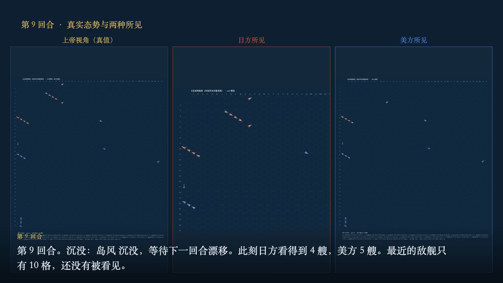

**日方**

总指挥的命令：

| 收件编队 | 命令原文 | 送达方式 | 媒介 | 链路开销 | 实际可读回合 |
|---|---|---|---|---|---|
| 日方第一战队（战列线） | 本编队维持当前航向和10节速度，保持编队完整性。密切监视衣阿华号战列舰动向，准备应对可能的交战。优先目标为敌方战列舰，保持最高警戒级别。各舰注意保持队形，避免分散。 | **当面交办** | TBS 短距 | +0 | T9 |
| 日方第三战队（水雷战队） | 继续向东扩大搜索范围，监视敌重巡洋舰和轻巡洋舰动向。保持安全距离，根据敌情变化决定是否接触。如敌舰有移动迹象，立即报告。保持与主力的通讯联系，每回合报告一次敌情变化。 | 经电报 | TBS 短距 | +1 | T10 |

分舰队指挥的决策：

| 编队 | 机动方案 | 情报新鲜度 | 报告动作 | 确认 | 理由（agent 自述） |
|---|---|---|---|---|---|
| 日方第一战队（战列线） | `1S1` | 情报新鲜 | ACKNOWLEDGEMENT | 是 | 维持编队完整性同时调整位置以更好地监视敌战列舰 |
| 日方第三战队（水雷战队） | `2` | 情报新鲜 | ACKNOWLEDGEMENT、CONTACT_REPORT、SITREP | 是 | 保持航向监视敌人同时扩大安全距离，提高重巡洋舰优先级符合命令要求 |

本回合发回的上报：

| 上报编队 | 类型 | 媒介 | 送达 | 延迟 | 亲笔正文 |
|---|---|---|---|---|---|
| 日方第三战队（水雷战队） | 接触报告 | TBS 短距 | T9 | +0 | 确认收到命令。当前发现两艘美重巡洋舰(得梅因、塞勒姆)和一艘轻巡洋舰(伍斯特)在我西北10海里处，航向5速度0。继续监视敌情，保持安全距离。 |

> **总指挥的思考**（思维链结论）：2. 给第3编队：继续监视敌重巡洋舰和轻巡洋舰，根据实际情况决定是否接触或保持距离。

**美方**

总指挥的命令：

| 收件编队 | 命令原文 | 送达方式 | 媒介 | 链路开销 | 实际可读回合 |
|---|---|---|---|---|---|
| 美方战列线 | 保持当前航向和速度，继续作为主力支援。优先攻击敌方战列舰(大和)目标，同时保持编队完整性，警惕可能的敌方驱逐舰威胁。 | **当面交办** | TBS 短距 | +0 | T9 |
| 美方巡洋战队 | 继续追踪并攻击敌方重巡洋舰目标，保持高度警戒。根据敌情变化，可适当调整战术，但务必保持编队完整性。若遭遇敌方驱逐舰威胁，可优先处理威胁后再继续主任务。 | 经电报 | 转报再加密 | +2 | T11 |
| 美方驱逐战队 | 继续监视并处理敌方驱逐舰编队，保持编队完整性。在确保自身安全的前提下，可考虑支援第2编队对抗敌方重巡洋舰。根据敌情变化灵活调整战术，但不要贸然接近敌方主力战舰。 | 经电报 | 转报再加密 | +2 | T11 |

分舰队指挥的决策：

| 编队 | 机动方案 | 情报新鲜度 | 报告动作 | 确认 | 理由（agent 自述） |
|---|---|---|---|---|---|
| 美方战列线 | `1PP1P1` | 情报新鲜 | SITREP | 是 | 按命令优先攻击大和，保持编队完整性，调整航向接近高价值目标 |
| 美方巡洋战队 | `0` | 图已 2 回合旧 | CONTACT_REPORT、SITREP | 是 | 保持当前位置并报告敌情，调整对近距离驱逐舰火力优先级 |
| 美方驱逐战队 | `3P` | 图已 2 回合旧 | SITREP | 是 | 选择向右前方偏移继续扩大搜索范围，同时保持对可见敌方驱逐舰的监视。 |

本回合发回的上报：

| 上报编队 | 类型 | 媒介 | 送达 | 延迟 | 亲笔正文 |
|---|---|---|---|---|---|
| 美方巡洋战队 | 接触报告 | 转报再加密 | T11 | +2 | 发现敌方四艘驱逐舰(风云、卷波、长波、岛风)与我方保持相同航向5，速度2，距离10。无重巡洋舰发现。保持当前位置，维持编队完整性，高度警戒。 |
| 美方驱逐战队 | 接触报告 | 转报再加密 | T11 | +2 | 发现敌方驱逐舰'岛风'在距离25处，航向5速度2。我编队正在扩大搜索范围，保持对敌监视。 |

> **总指挥的思考**（思维链结论）：6. 各编队的任务分配： - 第1编队(我所在的)：主力支援 - 第2编队：负责攻击重巡洋舰 - 第3编队：负责处理敌方驱逐舰 分析当前局势： - 第2编队已经发现了敌方重巡洋舰(五濑)和驱逐舰编队 - 第3编队在监视敌方驱逐舰 - 我能看到敌方大和战列舰和岛风驱逐舰 - 敌方似乎分散成多个编队行动 基于以上分析，

### 第 10 回合

**真实态势**：日方 9 舰在航、美方 12 舰在航；此刻日方只看得见 4 艘敌舰、美方只看得见 4 艘
，而距离最近的、尚未被看见的敌舰只有 **10 格**。

裁决要点：

- `movement_resolution` **ship_withdrawn** — 威斯康星 从 TT25 安全撤出战场
- `gunnery` **gunnery_result** — 衣阿华 命中结果 42
- `gunnery` **gunnery_result** — 衣阿华 命中结果 52
- `gunnery` **gunnery_result** — 长波 命中结果 65
- `gunnery` **gunnery_result** — 长波 命中结果 35
- `gunnery` **gunnery_result** — 长波 命中结果 44
- `gunnery` **gunnery_result** — 长波 命中结果 53
- `gunnery` **gunnery_result** — 长波 命中结果 12
- （其余 9 条见「附录：数据文件」中的事件流）

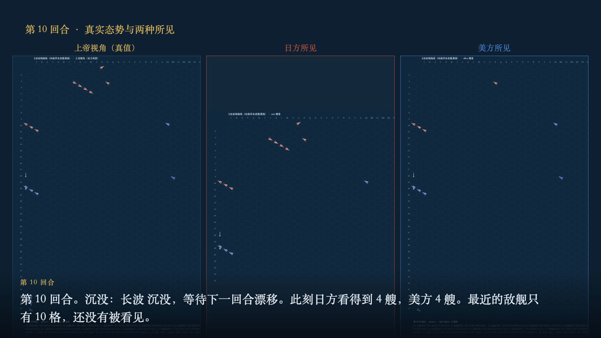

**日方**

总指挥的命令：

| 收件编队 | 命令原文 | 送达方式 | 媒介 | 链路开销 | 实际可读回合 |
|---|---|---|---|---|---|
| 日方第三战队（水雷战队） | 第3编队，你们报告的敌情（两艘重巡洋舰和一艘轻巡洋舰）需要高度关注。保持当前航向和速度，继续监视敌情。如敌舰接近至8海里内，可考虑调整位置以保持安全距离，但避免主动接触。优先目标为敌方重巡洋舰，保持最高警戒级别。随时报告敌舰动向和距离变化。 | 经电报 | TBS 短距 | +1 | T11 |
| 日方第一战队（战列线） | 本编队，将速度提升至10节，维持航向2，保持编队完整性。继续密切监视衣阿华号战列舰动向，准备应对可能的交战。优先目标为敌方战列舰，保持最高警戒级别。各舰注意保持队形，避免分散。 | **当面交办** | TBS 短距 | +0 | T10 |

分舰队指挥的决策：

| 编队 | 机动方案 | 情报新鲜度 | 报告动作 | 确认 | 理由（agent 自述） |
|---|---|---|---|---|---|
| 日方第一战队（战列线） | `1S1` | 情报新鲜 | ACKNOWLEDGEMENT | 是 | 提高速度并调整位置以更好监视敌战列舰，同时保持编队完整性 |
| 日方第三战队（水雷战队） | `1S` | 情报新鲜 | ACKNOWLEDGEMENT、CONTACT_REPORT、SITREP | 是 | 选择MOVE:1S向东扩大搜索范围同时保持与敌舰安全距离，提高重巡洋舰优先级符合监视命令 |

本回合发回的上报：

| 上报编队 | 类型 | 媒介 | 送达 | 延迟 | 亲笔正文 |
|---|---|---|---|---|---|
| 日方第三战队（水雷战队） | 接触报告 | TBS 短距 | T10 | +0 | 确认收到命令。当前发现两艘美国重巡洋舰和一艘轻巡洋舰在10海里处，航向5速度0。我编队向东移动扩大搜索范围，保持安全距离。 |

> **总指挥的思考**（思维链结论）：我将下达以下命令： 1. 给第3编队：指导他们应对接近的敌方重巡洋舰和轻巡洋舰，保持警戒但避免不必要的冲突 2. 给自己的编队：调整速度以匹配之前的命令，继续保持对衣阿华号的监视 注意：我不能指定炮位、射界或具体射击解，只能指定目标类型优先级。

**美方**

总指挥的命令：

| 收件编队 | 命令原文 | 送达方式 | 媒介 | 链路开销 | 实际可读回合 |
|---|---|---|---|---|---|
| 美方战列线 | 继续保持航向5速度6，全力攻击大和号战列舰，集中火力优先摧毁敌方主力。保持编队完整性，同时为第2和第3编队提供火力支援。注意观察周围水域，警惕敌方驱逐舰可能的偷袭行动。 | **当面交办** | TBS 短距 | +0 | T10 |
| 美方巡洋战队 | 继续监视和攻击发现的敌方驱逐舰编队。如有可能，尝试恢复机动能力以占据有利位置。保持与主力的通信联系。如敌方驱逐舰威胁解除，可转向协助主力攻击大和号或寻找伊吹号重巡洋舰。 | 经电报 | 转报再加密 | +2 | T12 |
| 美方驱逐战队 | 继续按当前航向3速度5扩大东南方向搜索范围，寻找伊吹号重巡洋舰。保持高度警戒状态，随时准备应对可能的敌方接触。如发现敌方重巡洋舰，立即报告并准备攻击。同时保持与主力的联系，必要时可转向支援第2编队对付驱逐舰。 | 经电报 | 转报再加密 | +2 | T12 |

分舰队指挥的决策：

| 编队 | 机动方案 | 情报新鲜度 | 报告动作 | 确认 | 理由（agent 自述） |
|---|---|---|---|---|---|
| 美方战列线 | `1PP1P1` | 情报新鲜 | SITREP | 是 | 调整航向接近大和号，保持编队完整性并集中火力攻击敌方主力 |
| 美方巡洋战队 | `0` | 图已 2 回合旧 | CONTACT_REPORT、SITREP | 是 | 保持当前位置，调整对驱逐舰的火力优先级以维持警戒，同时准备继续追踪伊吹号。 |
| 美方驱逐战队 | `0` | 图已 2 回合旧 | SITREP | 是 | 保持当前位置和航向，维持编队完整性，同时监视已知敌方目标。 |

本回合发回的上报：

| 上报编队 | 类型 | 媒介 | 送达 | 延迟 | 亲笔正文 |
|---|---|---|---|---|---|
| 美方巡洋战队 | 接触报告 | 转报再加密 | T12 | +2 | 发现敌方三艘驱逐舰在B10-D11区域，航向5，速度2，距离10。伊吹号不在当前视野中。保持当前位置并维持警戒。 |
| 美方驱逐战队 | 态势报告 | 转报再加密 | T12 | +2 | 未见新敌方接触，但记忆中有多艘敌方驱逐舰在12-25距离范围内，保持高度警戒。 |

> **总指挥的思考**（思维链结论）：让我分析当前局势并制定适当的命令： 当前态势分析 1. 自己所在编队（同盟第1编队）： - 位置：Y23（AA11） - 航向：5 - 速度：6 - 舰船：6艘（包括旗舰衣阿华号） - 队形：纵列 - 目视接触：大和号（BB）在O6位置 2. 同盟第2编队（重巡洋舰编队）： - 位置：A20-C21 - 航向：5 - 速度：0 - 舰船：3艘 - 最新报告：发现敌4艘驱逐舰在E12-H12，

### 第 11 回合

**真实态势**：日方 8 舰在航、美方 12 舰在航；此刻日方只看得见 4 艘敌舰、美方只看得见 3 艘
，而距离最近的、尚未被看见的敌舰只有 **10 格**。

裁决要点：

- `gunnery` **gunnery_result** — 衣阿华 命中结果 33
- `gunnery` **gunnery_result** — 衣阿华 命中结果 45
- `gunnery` **gunnery_result** — 衣阿华 命中结果 34
- `gunnery` **gunnery_result** — 得梅因 命中结果 43
- `gunnery` **gunnery_result** — 得梅因 命中结果 22
- `gunnery` **gunnery_result** — 塞勒姆 命中结果 14
- `gunnery` **gunnery_result** — 塞勒姆 命中结果 13
- `gunnery` **gunnery_result** — 塞勒姆 命中结果 54
- （其余 28 条见「附录：数据文件」中的事件流）

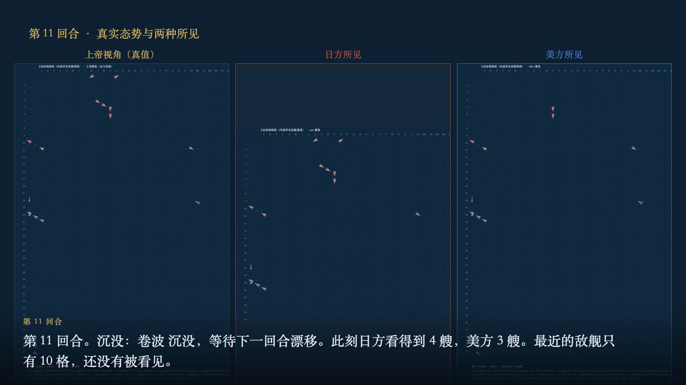

**日方**

总指挥的命令：

| 收件编队 | 命令原文 | 送达方式 | 媒介 | 链路开销 | 实际可读回合 |
|---|---|---|---|---|---|
| 日方第一战队（战列线） | 维持当前航向2和速度10节，保持编队完整性。继续密切监视衣阿华号战列舰动向，保持最高警戒级别。如敌舰接近，准备交战，优先目标为敌方战列舰。 | **当面交办** | TBS 短距 | +0 | T11 |
| 日方第三战队（水雷战队） | 根据当前敌情，评估与敌重巡洋舰和轻巡洋舰交战的可行性。如决定交战，请保持编队完整性并集中火力攻击敌方重巡洋舰。如敌情不利，可考虑撤退或寻求支援。保持与主力编队的通讯联系，及时报告敌情变化。 | 经电报 | TBS 短距 | +1 | T12 |

分舰队指挥的决策：

| 编队 | 机动方案 | 情报新鲜度 | 报告动作 | 确认 | 理由（agent 自述） |
|---|---|---|---|---|---|
| 日方第一战队（战列线） | `1S1` | 情报新鲜 | ACKNOWLEDGEMENT | 是 | 选择MOVE:1S1机动方案以更好地监视衣阿华号同时保持编队完整性，并略微提高其优先级以保持警惕。 |
| 日方第三战队（水雷战队） | `0` | 情报新鲜 | ACKNOWLEDGEMENT、SITREP | 是 | 保持当前位置继续监视敌情，提高重巡洋舰优先级符合命令要求 |

本回合发回的上报：

| 上报编队 | 类型 | 媒介 | 送达 | 延迟 | 亲笔正文 |
|---|---|---|---|---|---|
| 日方第三战队（水雷战队） | 接触报告 | TBS 短距 | T11 | +0 | 确认收到命令。两艘重巡洋舰和一艘轻巡洋舰在我西北10海里处，航向5速度0。保持当前航向和速度继续监视，已提高重巡洋舰火力优先级。 |

> **总指挥的思考**（思维链结论）：看起来我的命令符合所有要求，并且合理应对了当前情况。

**美方**

总指挥的命令：

| 收件编队 | 命令原文 | 送达方式 | 媒介 | 链路开销 | 实际可读回合 |
|---|---|---|---|---|---|
| 美方战列线 | 继续全力攻击大和号战列舰，集中火力优先摧毁敌方主力。调整航向以缩短与大和号的距离，同时保持编队完整性。各舰注意观察周围水域，警惕敌方驱逐舰可能的偷袭行动。保持高度警戒，随时准备应对敌情变化。 | **当面交办** | TBS 短距 | +0 | T11 |
| 美方巡洋战队 | 继续处理已发现的敌方驱逐舰威胁，保持高度警戒。扩大搜索范围寻找敌方重巡洋舰，特别是伊吹号。根据实际情况调整战术，保持编队完整性。若发现敌方重巡洋舰，优先攻击；若驱逐舰威胁加剧，可适当调整火力分配。保持通信畅通，及时报告敌情变化。 | 经电报 | 转报再加密 | +2 | 未送达（停战时在队列中） |
| 美方驱逐战队 | 继续监视敌方驱逐舰'岛风'，扩大搜索范围寻找其他敌方目标。保持编队完整性，警惕敌方可能的伏击行动。若发现敌方重巡洋舰，立即报告并准备实施鱼雷攻击。根据战场态势灵活调整搜索方向，优先保障主力编队安全。保持通信畅通，及时报告接触情况。 | 经电报 | 转报再加密 | +2 | 未送达（停战时在队列中） |

分舰队指挥的决策：

| 编队 | 机动方案 | 情报新鲜度 | 报告动作 | 确认 | 理由（agent 自述） |
|---|---|---|---|---|---|
| 美方战列线 | `1PP1P1` | 情报新鲜 | SITREP | 是 | 选择MOVE:1PP1P1行动接近大和号，同时保持编队完整性并优先分配火力给大和号。 |
| 美方巡洋战队 | `0` | 图已 2 回合旧 | ACKNOWLEDGEMENT、CONTACT_REPORT、SITREP | 是 | 保持当前位置，提高对敌方驱逐舰火力优先级，维持编队完整性并继续追踪任务。 |
| 美方驱逐战队 | `0` | 图已 2 回合旧 | SITREP | 是 | 保持当前位置和航向以维持编队完整性，同时继续执行监视任务 |

本回合发回的上报：

| 上报编队 | 类型 | 媒介 | 送达 | 延迟 | 亲笔正文 |
|---|---|---|---|---|---|
| 美方巡洋战队 | 接触报告 | 转报再加密 | 未送达 | +2 | 发现两艘敌方驱逐舰在A10和C11，距离10，航向5。伊吹号不在视野内，继续追踪任务。维持编队完整性，保持高度警戒。 |
| 美方驱逐战队 | 态势报告 | 转报再加密 | 未送达 | +2 | 当前无直接可见敌方目标，编队保持完整性和高度警戒状态，继续执行监视任务。 |

> **总指挥的思考**（思维链结论）：注意观察周围水域，警惕敌方驱逐舰可能的偷袭行动。

### 第 12 回合

**真实态势**：日方 7 舰在航、美方 12 舰在航；此刻日方只看得见 4 艘敌舰、美方只看得见 1 艘
，而距离最近的、尚未被看见的敌舰只有 **10 格**。

裁决要点：

- `gunnery` **gunnery_result** — 风云 命中结果 24
- `gunnery` **gunnery_result** — 风云 命中结果 62
- `gunnery` **gunnery_result** — 风云 命中结果 43
- `gunnery` **gunnery_result** — 风云 命中结果 25
- `gunnery` **gunnery_result** — 风云 命中结果 33
- `gunnery` **gunnery_result** — 风云 命中结果 16
- `gunnery` **ship_sunk** — 风云 沉没于原地
- `gunnery` **gunnery_result** — 风云 命中结果 25
- （其余 13 条见「附录：数据文件」中的事件流）

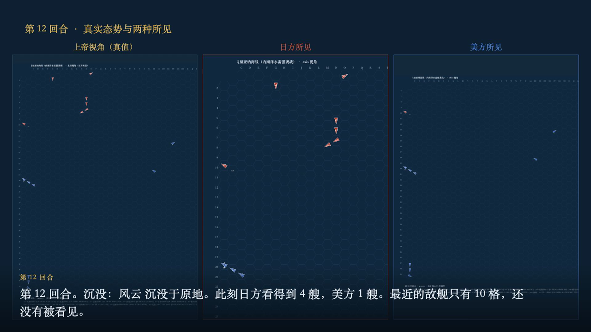

**日方**

总指挥的命令：

| 收件编队 | 命令原文 | 送达方式 | 媒介 | 链路开销 | 实际可读回合 |
|---|---|---|---|---|---|
| 日方第一战队（战列线） | 衣阿华号已确认沉没。维持当前航向和速度继续前进，保持编队完整性。提高警戒级别，密切监视周围海域，特别是第3编队方向的情况。准备应对可能的敌情变化，保持与各编队的通讯联系。 | **当面交办** | TBS 短距 | +0 | T12 |
| 日方第三战队（水雷战队） | 你们报告的敌重巡洋舰和轻巡洋舰情况已收到。根据敌舰速度为0，可能是停泊或低速移动。保持当前监视态势，但提高警戒级别。如果敌舰有敌意行动，可自行决定是否交战。保持与主力编队的通讯联系，及时报告敌情变化。 | 经电报 | TBS 短距 | +1 | 未送达（停战时在队列中） |

分舰队指挥的决策：

| 编队 | 机动方案 | 情报新鲜度 | 报告动作 | 确认 | 理由（agent 自述） |
|---|---|---|---|---|---|
| 日方第一战队（战列线） | `1S1` | 情报新鲜 | ACKNOWLEDGEMENT、SITREP | 是 | 维持编队完整性同时监视可疑的衣阿华号接触 |
| 日方第三战队（水雷战队） | `0` | 情报新鲜 | ACKNOWLEDGEMENT、CONTACT_REPORT、SITREP | 是 | 敌情不利，保持安全距离，准备撤退或寻求支援 |

本回合发回的上报：

| 上报编队 | 类型 | 媒介 | 送达 | 延迟 | 亲笔正文 |
|---|---|---|---|---|---|
| 日方第三战队（水雷战队） | 接触报告 | TBS 短距 | T12 | +0 | 发现敌两艘重巡洋舰和一艘轻巡洋舰在10-12海里处，航向5速度0。我方单艘驱逐舰火力不足以对抗敌方重巡洋舰编队，保持安全距离，准备随时撤退或请求支援。 |

> **总指挥的思考**（思维链结论）：最终决定：给两个编队都下达新命令。

**美方**

总指挥的命令：

| 收件编队 | 命令原文 | 送达方式 | 媒介 | 链路开销 | 实际可读回合 |
|---|---|---|---|---|---|
| 美方巡洋战队 | 第2编队，根据最新情报，你们已发现敌方三艘驱逐舰在B10-D11区域。由于未发现伊吹号重巡洋舰，请根据当前态势调整战术：若敌方驱逐舰构成直接威胁，优先处理；若情况允许，继续搜索敌方重巡洋舰。保持编队完整性，随时准备支援主力编队作战。注意保存实力，避免与敌方主力正面冲突。 | 经电报 | 转报再加密 | +2 | 未送达（停战时在队列中） |
| 美方驱逐战队 | 第3编队，继续执行驱逐舰搜索任务，扩大搜索范围寻找敌方驱逐舰。根据之前报告，岛风驱逐舰可能在你们活动区域。保持高度警惕，注意保存自身安全。若发现敌方驱逐舰，优先攻击但避免深入敌阵。保持与主力编队的通信畅通，随时准备支援主力作战。 | 经电报 | 转报再加密 | +2 | 未送达（停战时在队列中） |

分舰队指挥的决策：

| 编队 | 机动方案 | 情报新鲜度 | 报告动作 | 确认 | 理由（agent 自述） |
|---|---|---|---|---|---|
| 美方巡洋战队 | `0` | 图已 2 回合旧 | ACKNOWLEDGEMENT、CONTACT_REPORT、SITREP | 是 | 保持当前位置并提高对敌方驱逐舰火力优先级，符合命令要求 |
| 美方驱逐战队 | `0` | 图已 2 回合旧 | SITREP | 是 | 保持当前位置以维持编队完整性，同时继续执行监视任务。 |

本回合发回的上报：

| 上报编队 | 类型 | 媒介 | 送达 | 延迟 | 亲笔正文 |
|---|---|---|---|---|---|
| 美方巡洋战队 | 接触报告 | 转报再加密 | 未送达 | +2 | 确认收到命令。当前仅见风云号驱逐舰在A10，距离10，航向5。我方编队保持航向5，速度0，维持编队完整性。 |
| 美方驱逐战队 | 态势报告 | 转报再加密 | 未送达 | +2 | 当前无可见接触，编队保持完整性，继续执行监视任务，维持无线电静默。 |

> **总指挥的思考**（思维链结论）：2. 对同盟第3编队：继续执行驱逐舰搜索任务，但根据最新情况调整战术。

## 3. 通信台账（全部报文）

| 报文 | 类型 | 阵营 | 发端 | 收端 | 媒介 | 优先级 | 链路开销 | 发出 | 送达 | 状态 | 说明 |
|---|---|---|---|---|---|---|---|---|---|---|---|
| `MSG-00001` | 任务命令 | 日方 | `IBS-U-IJN-ERMA-YAMATO` | `axis-cruiser-line` | TBS 短距 | operational | +1 | T2 | T3 | delivered | 确认落地于 T2 |
| `MSG-00002` | 任务命令 | 日方 | `IBS-U-IJN-ERMA-YAMATO` | `axis-destroyer-line` | TBS 短距 | operational | +1 | T2 | T3 | delivered | 确认落地于 T2 |
| `MSG-00003` | 任务命令 | 美方 | `IBS-U-USN-ERMA-IOWA` | `allies-cruiser-line` | TBS 短距 | operational | +1 | T2 | T3 | delivered |  |
| `MSG-00004` | 任务命令 | 美方 | `IBS-U-USN-ERMA-IOWA` | `allies-destroyer-line` | TBS 短距 | operational | +1 | T2 | T3 | delivered | 确认落地于 T2 |
| `MSG-00005` | 任务命令 | 日方 | `IBS-U-IJN-ERMA-YAMATO` | `axis-battle-line` | TBS 短距 | operational | +0 | T2 | T2 | delivered | 同编队当面下令 |
| `MSG-00006` | 任务命令 | 日方 | `IBS-U-IJN-ERMA-YAMATO` | `axis-cruiser-line` | TBS 短距 | operational | +1 | T2 | T3 | delivered | 命令：保持当前航向和速度，与第1编队保持适当距离。扩大搜索范围，保持警惕。如有发现敌情 |
| `MSG-00007` | 任务命令 | 日方 | `IBS-U-IJN-ERMA-YAMATO` | `axis-destroyer-line` | TBS 短距 | operational | +1 | T2 | T3 | delivered | 命令：保持当前航向和速度，在前方扩大搜索范围。保持无线电静默，但定期报告位置。如有发现 |
| `MSG-00008` | 任务命令 | 美方 | `IBS-U-USN-ERMA-IOWA` | `allies-battle-line` | TBS 短距 | operational | +0 | T2 | T2 | delivered | 同编队当面下令 |
| `MSG-00009` | 任务命令 | 美方 | `IBS-U-USN-ERMA-IOWA` | `allies-cruiser-line` | TBS 短距 | operational | +1 | T2 | T3 | delivered | 命令：向右前方偏移，扩大搜索范围，保持与主力编队的联系。保持高度警戒，注意观察左右舷和 |
| `MSG-00010` | 任务命令 | 美方 | `IBS-U-USN-ERMA-IOWA` | `allies-destroyer-line` | TBS 短距 | operational | +1 | T2 | T3 | delivered | 命令：进一步向右前方偏移，扩大搜索范围，保持与主力编队的联系。保持高度警戒，注意观察左 |
| `MSG-00011` | 态势报告 | 日方 | `IBS-U-IJN-ERMA-IBUKI` | `axis-battle-line` | TBS 短距 | routine | +0 | T2 | T2 | delivered | 上报正文：未收到具体命令，保持编队完整性并继续当前航向探索区域。 |
| `MSG-00012` | 确认 | 日方 | `IBS-U-IJN-ERMA-IBUKI` | `axis-battle-line` | TBS 短距 | routine | +0 | T2 | T2 | delivered |  |
| `MSG-00013` | 态势报告 | 日方 | `IBS-U-IJN-ERMA-SHIMAKAZE` | `axis-battle-line` | TBS 短距 | routine | +0 | T2 | T2 | delivered | 上报正文：未收到具体命令，保持当前航向和航速继续执行任务。 |
| `MSG-00014` | 确认 | 日方 | `IBS-U-IJN-ERMA-SHIMAKAZE` | `axis-battle-line` | TBS 短距 | routine | +0 | T2 | T2 | delivered |  |
| `MSG-00015` | 态势报告 | 美方 | `IBS-U-USN-ERMA-DES-MOINES` | `allies-battle-line` | TBS 短距 | routine | +0 | T2 | T2 | delivered | 上报正文：得梅因编队当前位置V25-W26-X26，航向5，速度6，编队完整，未发现敌情。 |
| `MSG-00016` | 态势报告 | 美方 | `IBS-U-USN-ERMA-ALLEN-M-SUMNER` | `allies-battle-line` | TBS 短距 | routine | +0 | T2 | T2 | delivered | 上报正文：Flotilla proceeding on course with forma |
| `MSG-00017` | 确认 | 美方 | `IBS-U-USN-ERMA-ALLEN-M-SUMNER` | `allies-battle-line` | TBS 短距 | routine | +0 | T2 | T2 | delivered |  |
| `MSG-00018` | 任务命令 | 日方 | `IBS-U-IJN-ERMA-YAMATO` | `axis-battle-line` | TBS 短距 | operational | +0 | T3 | T3 | delivered | 同编队当面下令 |
| `MSG-00019` | 任务命令 | 日方 | `IBS-U-IJN-ERMA-YAMATO` | `axis-cruiser-line` | TBS 短距 | operational | +1 | T3 | T4 | delivered | 命令：继续探索指定区域，保持编队完整性。与主力编队保持通讯联系，共享侦察信息。根据当前 |
| `MSG-00020` | 任务命令 | 日方 | `IBS-U-IJN-ERMA-YAMATO` | `axis-destroyer-line` | TBS 短距 | operational | +1 | T3 | T4 | delivered | 命令：继续执行当前任务，保持与主力编队的协调。作为侦察和警戒力量，优先发现敌方动向。根 |
| `MSG-00021` | 任务命令 | 美方 | `IBS-U-USN-ERMA-IOWA` | `allies-battle-line` | TBS 短距 | operational | +0 | T3 | T3 | delivered | 同编队当面下令 |
| `MSG-00022` | 任务命令 | 美方 | `IBS-U-USN-ERMA-IOWA` | `allies-cruiser-line` | TBS 短距 | operational | +1 | T3 | T4 | delivered | 命令：继续执行扩大搜索任务，保持高度警惕。根据当前态势灵活调整搜索范围，注意保持与主力 |
| `MSG-00023` | 任务命令 | 美方 | `IBS-U-USN-ERMA-IOWA` | `allies-destroyer-line` | TBS 短距 | operational | +1 | T3 | T4 | delivered | 命令：继续保持当前航向和速度，扩大搜索范围。注意观察海面和空中情况，保持无线电静默但定 |
| `MSG-00024` | 态势报告 | 日方 | `IBS-U-IJN-ERMA-IBUKI` | `axis-battle-line` | TBS 短距 | routine | +0 | T3 | T3 | delivered | 上报正文：确认收到命令。编队当前位于G6-G5-F4，航向4，速度3，保持完整队形并扩大搜 |
| `MSG-00025` | 确认 | 日方 | `IBS-U-IJN-ERMA-IBUKI` | `axis-battle-line` | TBS 短距 | routine | +0 | T3 | T3 | delivered |  |
| `MSG-00026` | 态势报告 | 日方 | `IBS-U-IJN-ERMA-SHIMAKAZE` | `axis-battle-line` | TBS 短距 | routine | +0 | T3 | T3 | delivered | 上报正文：编队按命令前进至F10，保持航向2和速度1，扩大前方搜索范围。目前未发现敌情，无 |
| `MSG-00027` | 确认 | 日方 | `IBS-U-IJN-ERMA-SHIMAKAZE` | `axis-battle-line` | TBS 短距 | routine | +0 | T3 | T3 | delivered |  |
| `MSG-00028` | 态势报告 | 美方 | `IBS-U-USN-ERMA-DES-MOINES` | `allies-battle-line` | TBS 短距 | routine | +0 | T3 | T3 | delivered | 上报正文：正在执行向右前方偏移，扩大搜索范围的命令，当前航向改为4，未发现敌情。 |
| `MSG-00029` | 确认 | 美方 | `IBS-U-USN-ERMA-DES-MOINES` | `allies-battle-line` | TBS 短距 | routine | +0 | T3 | T3 | delivered |  |
| `MSG-00030` | 态势报告 | 美方 | `IBS-U-USN-ERMA-ALLEN-M-SUMNER` | `allies-battle-line` | TBS 短距 | routine | +0 | T3 | T3 | delivered | 上报正文：正在执行向右前方偏移命令，扩大搜索范围并保持与主力编队联系，目前无敌方接触。 |
| `MSG-00031` | 确认 | 美方 | `IBS-U-USN-ERMA-ALLEN-M-SUMNER` | `allies-battle-line` | TBS 短距 | routine | +0 | T3 | T3 | delivered |  |
| `MSG-00032` | 任务命令 | 日方 | `IBS-U-IJN-ERMA-YAMATO` | `axis-battle-line` | TBS 短距 | operational | +0 | T4 | T4 | delivered | 同编队当面下令 |
| `MSG-00033` | 任务命令 | 日方 | `IBS-U-IJN-ERMA-YAMATO` | `axis-cruiser-line` | TBS 短距 | operational | +1 | T4 | T5 | delivered | 命令：保持当前航向和速度，维持编队完整性。扩大搜索范围，与主力保持通讯联系。如发现敌情 |
| `MSG-00034` | 任务命令 | 日方 | `IBS-U-IJN-ERMA-YAMATO` | `axis-destroyer-line` | TBS 短距 | operational | +1 | T4 | T5 | delivered | 命令：保持当前航向和速度，维持编队完整性。加强前方搜索，保持无线电静默但随时准备接收和 |
| `MSG-00035` | 任务命令 | 美方 | `IBS-U-USN-ERMA-IOWA` | `allies-battle-line` | TBS 短距 | operational | +0 | T4 | T4 | delivered | 同编队当面下令 |
| `MSG-00036` | 任务命令 | 美方 | `IBS-U-USN-ERMA-IOWA` | `allies-cruiser-line` | 转报再加密 | operational | +2 | T4 | T6 | delivered | 命令：继续执行扩大搜索任务，将航向调整为3，以扩大东南方向搜索范围。保持与主力编队的联 |
| `MSG-00037` | 任务命令 | 美方 | `IBS-U-USN-ERMA-IOWA` | `allies-destroyer-line` | 转报再加密 | operational | +2 | T4 | T6 | delivered | 命令：继续执行扩大搜索任务，将航向调整为3，以扩大东南方向搜索范围。保持与主力编队的联 |
| `MSG-00038` | 态势报告 | 日方 | `IBS-U-IJN-ERMA-IBUKI` | `axis-battle-line` | TBS 短距 | routine | +0 | T4 | T4 | delivered | 上报正文：已收到命令，继续探索指定区域并保持编队完整性，与主力编队保持通讯联系。 |
| `MSG-00039` | 确认 | 日方 | `IBS-U-IJN-ERMA-IBUKI` | `axis-battle-line` | TBS 短距 | routine | +0 | T4 | T4 | delivered |  |
| `MSG-00040` | 接触报告 | 日方 | `IBS-U-IJN-ERMA-SHIMAKAZE` | `axis-battle-line` | TBS 短距 | urgent | +0 | T4 | T4 | delivered | 上报正文：已确认命令。编队正在向东扩大搜索范围，发现两艘重巡洋舰和三艘驱逐舰在东北方向12 |
| `MSG-00041` | 确认 | 日方 | `IBS-U-IJN-ERMA-SHIMAKAZE` | `axis-battle-line` | TBS 短距 | routine | +0 | T4 | T4 | delivered |  |
| `MSG-00042` | 态势报告 | 美方 | `IBS-U-USN-ERMA-DES-MOINES` | `allies-battle-line` | 转报再加密 | routine | +2 | T4 | T6 | delivered | 上报正文：无敌方接触，继续向东南方向扩大搜索范围，保持编队完整性。 |
| `MSG-00043` | 确认 | 美方 | `IBS-U-USN-ERMA-DES-MOINES` | `allies-battle-line` | 转报再加密 | routine | +2 | T4 | T6 | delivered |  |
| `MSG-00044` | 接触报告 | 美方 | `IBS-U-USN-ERMA-ALLEN-M-SUMNER` | `allies-battle-line` | 转报再加密 | urgent | +2 | T4 | T6 | delivered | 上报正文：发现两艘敌方驱逐舰'风云'和'岛风'，位于我编队左前方约12-13格处，航向2， |
| `MSG-00045` | 确认 | 美方 | `IBS-U-USN-ERMA-ALLEN-M-SUMNER` | `allies-battle-line` | 转报再加密 | routine | +2 | T4 | T6 | delivered |  |
| `MSG-00046` | 任务命令 | 日方 | `IBS-U-IJN-ERMA-YAMATO` | `axis-battle-line` | TBS 短距 | operational | +0 | T5 | T5 | delivered | 同编队当面下令 |
| `MSG-00047` | 任务命令 | 日方 | `IBS-U-IJN-ERMA-YAMATO` | `axis-cruiser-line` | TBS 短距 | operational | +1 | T5 | T6 | delivered | 命令：向第3编队位置靠拢，增强侦察力量。保持与主力的通讯联系，提高警惕，准备应对可能的 |
| `MSG-00048` | 任务命令 | 日方 | `IBS-U-IJN-ERMA-YAMATO` | `axis-destroyer-line` | TBS 短距 | operational | +1 | T5 | T6 | delivered | 命令：继续监视已发现的敌情，但不主动接触。保持与第2编队的通讯联系，如敌情有变化，立即 |
| `MSG-00049` | 任务命令 | 美方 | `IBS-U-USN-ERMA-IOWA` | `allies-battle-line` | TBS 短距 | operational | +0 | T5 | T5 | delivered | 同编队当面下令 |
| `MSG-00050` | 任务命令 | 美方 | `IBS-U-USN-ERMA-IOWA` | `allies-cruiser-line` | 转报再加密 | operational | +2 | T5 | T7 | delivered | 命令：继续执行扩大搜索任务，可根据当前态势适当调整搜索方向，保持与主力编队联系。保持高 |
| `MSG-00051` | 任务命令 | 美方 | `IBS-U-USN-ERMA-IOWA` | `allies-destroyer-line` | 转报再加密 | operational | +2 | T5 | T7 | delivered | 命令：继续执行扩大搜索任务，可根据当前态势适当调整搜索方向，保持与主力编队联系。保持高 |
| `MSG-00052` | 接触报告 | 日方 | `IBS-U-IJN-ERMA-IBUKI` | `axis-battle-line` | TBS 短距 | urgent | +0 | T5 | T5 | delivered | 上报正文：发现多艘美舰：2艘CA(得梅因、塞勒姆)、1艘CL(伍斯特)及3艘DD，距离13 |
| `MSG-00053` | 确认 | 日方 | `IBS-U-IJN-ERMA-IBUKI` | `axis-battle-line` | TBS 短距 | routine | +0 | T5 | T5 | delivered |  |
| `MSG-00054` | 接触报告 | 日方 | `IBS-U-IJN-ERMA-SHIMAKAZE` | `axis-battle-line` | TBS 短距 | urgent | +0 | T5 | T5 | delivered | 上报正文：发现两艘美国重巡洋舰得梅因和塞勒姆距离9海里，多艘驱逐舰在10-15海里范围内。 |
| `MSG-00055` | 确认 | 日方 | `IBS-U-IJN-ERMA-SHIMAKAZE` | `axis-battle-line` | TBS 短距 | routine | +0 | T5 | T5 | delivered |  |
| `MSG-00056` | 接触报告 | 美方 | `IBS-U-USN-ERMA-DES-MOINES` | `allies-battle-line` | 转报再加密 | urgent | +2 | T5 | T7 | delivered | 上报正文：发现敌编队：伊吹(CA)在A10，四艘驱逐舰在E10-H11区域。敌航向2-4， |
| `MSG-00057` | 确认 | 美方 | `IBS-U-USN-ERMA-DES-MOINES` | `allies-battle-line` | 转报再加密 | routine | +2 | T5 | T7 | delivered |  |
| `MSG-00058` | 接触报告 | 美方 | `IBS-U-USN-ERMA-ALLEN-M-SUMNER` | `allies-battle-line` | 转报再加密 | urgent | +2 | T5 | T7 | delivered | 上报正文：发现四艘敌方驱逐舰，距离12-13海里，位于我编队前方。继续执行扩大搜索范围任务 |
| `MSG-00059` | 确认 | 美方 | `IBS-U-USN-ERMA-ALLEN-M-SUMNER` | `allies-battle-line` | 转报再加密 | routine | +2 | T5 | T7 | delivered |  |
| `MSG-00060` | 任务命令 | 日方 | `IBS-U-IJN-ERMA-YAMATO` | `axis-battle-line` | TBS 短距 | operational | +0 | T6 | T6 | delivered | 同编队当面下令 |
| `MSG-00061` | 任务命令 | 日方 | `IBS-U-IJN-ERMA-YAMATO` | `axis-cruiser-line` | TBS 短距 | operational | +1 | T6 | T7 | delivered | 命令：根据当前敌情，可考虑适当调整航向以保持有利阵位，但优先保持编队完整性。敌舰以CA |
| `MSG-00062` | 任务命令 | 日方 | `IBS-U-IJN-ERMA-YAMATO` | `axis-destroyer-line` | TBS 短距 | operational | +1 | T6 | T7 | delivered | 命令：敌舰距离较近，保持警惕但避免过早交火。可考虑调整航向以保持有利阵位，但优先保持编 |
| `MSG-00063` | 任务命令 | 美方 | `IBS-U-USN-ERMA-IOWA` | `allies-battle-line` | TBS 短距 | operational | +0 | T6 | T6 | delivered | 同编队当面下令 |
| `MSG-00064` | 任务命令 | 美方 | `IBS-U-USN-ERMA-IOWA` | `allies-cruiser-line` | 转报再加密 | operational | +2 | T6 | T8 | delivered | 命令：继续执行扩大搜索范围的命令，提高警惕。注意观察是否有敌方重巡洋舰或驱逐舰出现。如 |
| `MSG-00065` | 任务命令 | 美方 | `IBS-U-USN-ERMA-IOWA` | `allies-destroyer-line` | 转报再加密 | operational | +2 | T6 | T8 | delivered | 命令：继续追踪和监视之前发现的敌方驱逐舰'风云'和'岛风'。保持安全距离，不要贸然接近 |
| `MSG-00066` | 接触报告 | 日方 | `IBS-U-IJN-ERMA-GOKASE` | `axis-battle-line` | TBS 短距 | urgent | +0 | T6 | T6 | delivered | 上报正文：发现美舰编队：得梅因CA、塞勒姆CA和伍斯特CL，正以航向5速度5向东北移动，距 |
| `MSG-00067` | 确认 | 日方 | `IBS-U-IJN-ERMA-GOKASE` | `axis-battle-line` | TBS 短距 | routine | +0 | T6 | T6 | delivered |  |
| `MSG-00068` | 接触报告 | 日方 | `IBS-U-IJN-ERMA-SHIMAKAZE` | `axis-battle-line` | TBS 短距 | urgent | +0 | T6 | T6 | delivered | 上报正文：发现敌重巡洋舰得梅因和塞勒姆及轻巡洋舰伍斯特在我西北12海里处，航向5速度5。我 |
| `MSG-00069` | 确认 | 日方 | `IBS-U-IJN-ERMA-SHIMAKAZE` | `axis-battle-line` | TBS 短距 | routine | +0 | T6 | T6 | delivered |  |
| `MSG-00070` | 接触报告 | 美方 | `IBS-U-USN-ERMA-DES-MOINES` | `allies-battle-line` | 转报再加密 | urgent | +2 | T6 | T8 | delivered | 上报正文：发现敌伊吹(CA)及四艘驱逐舰在A10-H11区域，航向2-4，速度0-1。已调 |
| `MSG-00071` | 确认 | 美方 | `IBS-U-USN-ERMA-DES-MOINES` | `allies-battle-line` | 转报再加密 | routine | +2 | T6 | T8 | delivered |  |
| `MSG-00072` | 接触报告 | 美方 | `IBS-U-USN-ERMA-ALLEN-M-SUMNER` | `allies-battle-line` | 转报再加密 | urgent | +2 | T6 | T8 | delivered | 上报正文：编队保持航向2速度5，继续向右前方偏移扩大搜索范围。未发现新敌情，继续监视距离1 |
| `MSG-00073` | 确认 | 美方 | `IBS-U-USN-ERMA-ALLEN-M-SUMNER` | `allies-battle-line` | 转报再加密 | routine | +2 | T6 | T8 | delivered |  |
| `MSG-00074` | 任务命令 | 日方 | `IBS-U-IJN-ERMA-YAMATO` | `axis-battle-line` | TBS 短距 | operational | +0 | T7 | T7 | delivered | 同编队当面下令 |
| `MSG-00075` | 任务命令 | 日方 | `IBS-U-IJN-ERMA-YAMATO` | `axis-destroyer-line` | TBS 短距 | operational | +1 | T7 | T8 | delivered | 命令：继续保持高度警戒，维持与敌编队的安全距离。优先监视敌舰动向，随时报告敌情变化。维 |
| `MSG-00076` | 任务命令 | 美方 | `IBS-U-USN-ERMA-IOWA` | `allies-battle-line` | TBS 短距 | operational | +0 | T7 | T7 | delivered | 同编队当面下令 |
| `MSG-00077` | 任务命令 | 美方 | `IBS-U-USN-ERMA-IOWA` | `allies-cruiser-line` | 转报再加密 | operational | +2 | T7 | T9 | delivered | 命令：继续追踪敌方重巡洋舰伊吹号，优先攻击此目标。警惕并准备应对敌方驱逐舰的威胁，保持 |
| `MSG-00078` | 任务命令 | 美方 | `IBS-U-USN-ERMA-IOWA` | `allies-destroyer-line` | 转报再加密 | operational | +2 | T7 | T9 | delivered | 命令：处理发现的敌方驱逐舰，优先攻击敌方驱逐舰目标。保持无线电静默，保持编队完整性。根 |
| `MSG-00079` | 接触报告 | 日方 | `IBS-U-IJN-ERMA-GOKASE` | `axis-battle-line` | 无通路 | urgent | +0 | T7 | — | queued | 上报正文：发现3艘美舰：得梅因(CA)距离11、塞勒姆(CA)距离12、伍斯特(CL)距离 |
| `MSG-00080` | 确认 | 日方 | `IBS-U-IJN-ERMA-GOKASE` | `axis-battle-line` | 无通路 | routine | +0 | T7 | — | queued |  |
| `MSG-00081` | 接触报告 | 日方 | `IBS-U-IJN-ERMA-SHIMAKAZE` | `axis-battle-line` | TBS 短距 | urgent | +0 | T7 | T7 | delivered | 上报正文：确认收到命令，当前两艘美重巡洋舰在10海里处，正向东机动保持安全距离，已提高对重 |
| `MSG-00082` | 确认 | 日方 | `IBS-U-IJN-ERMA-SHIMAKAZE` | `axis-battle-line` | TBS 短距 | routine | +0 | T7 | T7 | delivered |  |
| `MSG-00083` | 接触报告 | 美方 | `IBS-U-USN-ERMA-DES-MOINES` | `allies-battle-line` | 转报再加密 | urgent | +2 | T7 | T9 | delivered | 上报正文：发现敌方编队：五濑(CL)在A9，四艘驱逐舰在G13-I13区域。敌舰航向3-5 |
| `MSG-00084` | 偏离报告 | 美方 | `IBS-U-USN-ERMA-DES-MOINES` | `allies-battle-line` | 转报再加密 | urgent | +2 | T7 | T9 | delivered | 上报正文：发现敌方编队：五濑(CL)在A9，四艘驱逐舰在G13-I13区域。敌舰航向3-5 |
| `MSG-00085` | 确认 | 美方 | `IBS-U-USN-ERMA-DES-MOINES` | `allies-battle-line` | 转报再加密 | routine | +2 | T7 | T9 | delivered |  |
| `MSG-00086` | 态势报告 | 美方 | `IBS-U-USN-ERMA-ALLEN-M-SUMNER` | `allies-battle-line` | 转报再加密 | routine | +2 | T7 | T9 | delivered | 上报正文：执行航向调整命令，当前航向已调整为3，正在扩大东南方向搜索范围，保持与主力编队联 |
| `MSG-00087` | 确认 | 美方 | `IBS-U-USN-ERMA-ALLEN-M-SUMNER` | `allies-battle-line` | 转报再加密 | routine | +2 | T7 | T9 | delivered |  |
| `MSG-00088` | 任务命令 | 日方 | `IBS-U-IJN-ERMA-YAMATO` | `axis-battle-line` | TBS 短距 | operational | +0 | T8 | T8 | delivered | 同编队当面下令 |
| `MSG-00089` | 任务命令 | 日方 | `IBS-U-IJN-ERMA-YAMATO` | `axis-destroyer-line` | TBS 短距 | operational | +1 | T8 | T9 | delivered | 命令：继续监视敌重巡洋舰动向，根据实际情况调整战术。保持与主力编队的通讯联系，及时报告 |
| `MSG-00090` | 任务命令 | 美方 | `IBS-U-USN-ERMA-IOWA` | `allies-battle-line` | TBS 短距 | operational | +0 | T8 | T8 | delivered | 同编队当面下令 |
| `MSG-00091` | 任务命令 | 美方 | `IBS-U-USN-ERMA-IOWA` | `allies-cruiser-line` | 转报再加密 | operational | +2 | T8 | T10 | delivered | 命令：继续追踪并攻击敌方重巡洋舰伊吹号，保持高度警戒，注意敌方驱逐舰威胁。根据实际情况 |
| `MSG-00092` | 任务命令 | 美方 | `IBS-U-USN-ERMA-IOWA` | `allies-destroyer-line` | 转报再加密 | operational | +2 | T8 | T10 | delivered | 命令：继续监视敌方驱逐舰，根据需要提供支援。保持高度警戒，保持编队完整性，随时准备应对 |
| `MSG-00093` | 接触报告 | 日方 | `IBS-U-IJN-ERMA-SHIMAKAZE` | `axis-battle-line` | TBS 短距 | urgent | +0 | T8 | T8 | delivered | 上报正文：确认收到命令。当前侦测到两艘美重巡洋舰和一艘轻巡洋舰，距离10海里，敌舰静止。我 |
| `MSG-00094` | 确认 | 日方 | `IBS-U-IJN-ERMA-SHIMAKAZE` | `axis-battle-line` | TBS 短距 | routine | +0 | T8 | T8 | delivered |  |
| `MSG-00095` | 接触报告 | 美方 | `IBS-U-USN-ERMA-DES-MOINES` | `allies-battle-line` | 转报再加密 | urgent | +2 | T8 | T10 | delivered | 上报正文：我编队位于A20-C21，发现敌四艘驱逐舰(E12-H12)保持与我方相同航向5 |
| `MSG-00096` | 确认 | 美方 | `IBS-U-USN-ERMA-DES-MOINES` | `allies-battle-line` | 转报再加密 | routine | +2 | T8 | T10 | delivered |  |
| `MSG-00097` | 态势报告 | 美方 | `IBS-U-USN-ERMA-ALLEN-M-SUMNER` | `allies-battle-line` | 转报再加密 | routine | +2 | T8 | T10 | delivered | 上报正文：继续执行扩大搜索任务，当前航向4速度5，编队完整。无新发现敌情，保持高度警戒状态 |
| `MSG-00098` | 确认 | 美方 | `IBS-U-USN-ERMA-ALLEN-M-SUMNER` | `allies-battle-line` | 转报再加密 | routine | +2 | T8 | T10 | delivered |  |
| `MSG-00099` | 任务命令 | 日方 | `IBS-U-IJN-ERMA-YAMATO` | `axis-battle-line` | TBS 短距 | operational | +0 | T9 | T9 | delivered | 同编队当面下令 |
| `MSG-00100` | 任务命令 | 日方 | `IBS-U-IJN-ERMA-YAMATO` | `axis-destroyer-line` | TBS 短距 | operational | +1 | T9 | T10 | delivered | 命令：继续向东扩大搜索范围，监视敌重巡洋舰和轻巡洋舰动向。保持安全距离，根据敌情变化决 |
| `MSG-00101` | 任务命令 | 美方 | `IBS-U-USN-ERMA-IOWA` | `allies-battle-line` | TBS 短距 | operational | +0 | T9 | T9 | delivered | 同编队当面下令 |
| `MSG-00102` | 任务命令 | 美方 | `IBS-U-USN-ERMA-IOWA` | `allies-cruiser-line` | 转报再加密 | operational | +2 | T9 | T11 | delivered | 命令：继续追踪并攻击敌方重巡洋舰目标，保持高度警戒。根据敌情变化，可适当调整战术，但务 |
| `MSG-00103` | 任务命令 | 美方 | `IBS-U-USN-ERMA-IOWA` | `allies-destroyer-line` | 转报再加密 | operational | +2 | T9 | T11 | delivered | 命令：继续监视并处理敌方驱逐舰编队，保持编队完整性。在确保自身安全的前提下，可考虑支援 |
| `MSG-00104` | 接触报告 | 日方 | `IBS-U-IJN-ERMA-SHIMAKAZE` | `axis-battle-line` | TBS 短距 | urgent | +0 | T9 | T9 | delivered | 上报正文：确认收到命令。当前发现两艘美重巡洋舰(得梅因、塞勒姆)和一艘轻巡洋舰(伍斯特)在 |
| `MSG-00105` | 确认 | 日方 | `IBS-U-IJN-ERMA-SHIMAKAZE` | `axis-battle-line` | TBS 短距 | routine | +0 | T9 | T9 | delivered |  |
| `MSG-00106` | 接触报告 | 美方 | `IBS-U-USN-ERMA-DES-MOINES` | `allies-battle-line` | 转报再加密 | urgent | +2 | T9 | T11 | delivered | 上报正文：发现敌方四艘驱逐舰(风云、卷波、长波、岛风)与我方保持相同航向5，速度2，距离1 |
| `MSG-00107` | 确认 | 美方 | `IBS-U-USN-ERMA-DES-MOINES` | `allies-battle-line` | 转报再加密 | routine | +2 | T9 | T11 | delivered |  |
| `MSG-00108` | 接触报告 | 美方 | `IBS-U-USN-ERMA-ALLEN-M-SUMNER` | `allies-battle-line` | 转报再加密 | urgent | +2 | T9 | T11 | delivered | 上报正文：发现敌方驱逐舰'岛风'在距离25处，航向5速度2。我编队正在扩大搜索范围，保持对 |
| `MSG-00109` | 确认 | 美方 | `IBS-U-USN-ERMA-ALLEN-M-SUMNER` | `allies-battle-line` | 转报再加密 | routine | +2 | T9 | T11 | delivered |  |
| `MSG-00110` | 任务命令 | 日方 | `IBS-U-IJN-ERMA-YAMATO` | `axis-destroyer-line` | TBS 短距 | operational | +1 | T10 | T11 | delivered | 命令：第3编队，你们报告的敌情（两艘重巡洋舰和一艘轻巡洋舰）需要高度关注。保持当前航向 |
| `MSG-00111` | 任务命令 | 日方 | `IBS-U-IJN-ERMA-YAMATO` | `axis-battle-line` | TBS 短距 | operational | +0 | T10 | T10 | delivered | 同编队当面下令 |
| `MSG-00112` | 任务命令 | 美方 | `IBS-U-USN-ERMA-IOWA` | `allies-battle-line` | TBS 短距 | operational | +0 | T10 | T10 | delivered | 同编队当面下令 |
| `MSG-00113` | 任务命令 | 美方 | `IBS-U-USN-ERMA-IOWA` | `allies-cruiser-line` | 转报再加密 | operational | +2 | T10 | T12 | delivered | 命令：继续监视和攻击发现的敌方驱逐舰编队。如有可能，尝试恢复机动能力以占据有利位置。保 |
| `MSG-00114` | 任务命令 | 美方 | `IBS-U-USN-ERMA-IOWA` | `allies-destroyer-line` | 转报再加密 | operational | +2 | T10 | T12 | delivered | 命令：继续按当前航向3速度5扩大东南方向搜索范围，寻找伊吹号重巡洋舰。保持高度警戒状态 |
| `MSG-00115` | 接触报告 | 日方 | `IBS-U-IJN-ERMA-KAZEGUMO` | `axis-battle-line` | TBS 短距 | urgent | +0 | T10 | T10 | delivered | 上报正文：确认收到命令。当前发现两艘美国重巡洋舰和一艘轻巡洋舰在10海里处，航向5速度0。 |
| `MSG-00116` | 确认 | 日方 | `IBS-U-IJN-ERMA-KAZEGUMO` | `axis-battle-line` | TBS 短距 | routine | +0 | T10 | T10 | delivered |  |
| `MSG-00117` | 接触报告 | 美方 | `IBS-U-USN-ERMA-DES-MOINES` | `allies-battle-line` | 转报再加密 | urgent | +2 | T10 | T12 | delivered | 上报正文：发现敌方三艘驱逐舰在B10-D11区域，航向5，速度2，距离10。伊吹号不在当前 |
| `MSG-00118` | 确认 | 美方 | `IBS-U-USN-ERMA-DES-MOINES` | `allies-battle-line` | 转报再加密 | routine | +2 | T10 | T12 | delivered |  |
| `MSG-00119` | 态势报告 | 美方 | `IBS-U-USN-ERMA-ALLEN-M-SUMNER` | `allies-battle-line` | 转报再加密 | routine | +2 | T10 | T12 | delivered | 上报正文：未见新敌方接触，但记忆中有多艘敌方驱逐舰在12-25距离范围内，保持高度警戒。 |
| `MSG-00120` | 确认 | 美方 | `IBS-U-USN-ERMA-ALLEN-M-SUMNER` | `allies-battle-line` | 转报再加密 | routine | +2 | T10 | T12 | delivered |  |
| `MSG-00121` | 任务命令 | 日方 | `IBS-U-IJN-ERMA-YAMATO` | `axis-battle-line` | TBS 短距 | operational | +0 | T11 | T11 | delivered | 同编队当面下令 |
| `MSG-00122` | 任务命令 | 日方 | `IBS-U-IJN-ERMA-YAMATO` | `axis-destroyer-line` | TBS 短距 | operational | +1 | T11 | T12 | delivered | 命令：根据当前敌情，评估与敌重巡洋舰和轻巡洋舰交战的可行性。如决定交战，请保持编队完整 |
| `MSG-00123` | 任务命令 | 美方 | `IBS-U-USN-ERMA-IOWA` | `allies-battle-line` | TBS 短距 | operational | +0 | T11 | T11 | delivered | 同编队当面下令 |
| `MSG-00124` | 任务命令 | 美方 | `IBS-U-USN-ERMA-IOWA` | `allies-cruiser-line` | 转报再加密 | operational | +2 | T11 | — | queued | 命令：继续处理已发现的敌方驱逐舰威胁，保持高度警戒。扩大搜索范围寻找敌方重巡洋舰，特别 |
| `MSG-00125` | 任务命令 | 美方 | `IBS-U-USN-ERMA-IOWA` | `allies-destroyer-line` | 转报再加密 | operational | +2 | T11 | — | queued | 命令：继续监视敌方驱逐舰'岛风'，扩大搜索范围寻找其他敌方目标。保持编队完整性，警惕敌 |
| `MSG-00126` | 接触报告 | 日方 | `IBS-U-IJN-ERMA-KAZEGUMO` | `axis-battle-line` | TBS 短距 | urgent | +0 | T11 | T11 | delivered | 上报正文：确认收到命令。两艘重巡洋舰和一艘轻巡洋舰在我西北10海里处，航向5速度0。保持当 |
| `MSG-00127` | 确认 | 日方 | `IBS-U-IJN-ERMA-KAZEGUMO` | `axis-battle-line` | TBS 短距 | routine | +0 | T11 | T11 | delivered |  |
| `MSG-00128` | 接触报告 | 美方 | `IBS-U-USN-ERMA-DES-MOINES` | `allies-battle-line` | 转报再加密 | urgent | +2 | T11 | — | queued | 上报正文：发现两艘敌方驱逐舰在A10和C11，距离10，航向5。伊吹号不在视野内，继续追踪 |
| `MSG-00129` | 确认 | 美方 | `IBS-U-USN-ERMA-DES-MOINES` | `allies-battle-line` | 转报再加密 | routine | +2 | T11 | — | queued |  |
| `MSG-00130` | 态势报告 | 美方 | `IBS-U-USN-ERMA-ALLEN-M-SUMNER` | `allies-battle-line` | 转报再加密 | routine | +2 | T11 | — | queued | 上报正文：当前无直接可见敌方目标，编队保持完整性和高度警戒状态，继续执行监视任务。 |
| `MSG-00131` | 确认 | 美方 | `IBS-U-USN-ERMA-ALLEN-M-SUMNER` | `allies-battle-line` | 转报再加密 | routine | +2 | T11 | — | queued |  |
| `MSG-00132` | 任务命令 | 日方 | `IBS-U-IJN-ERMA-YAMATO` | `axis-battle-line` | TBS 短距 | operational | +0 | T12 | T12 | delivered | 同编队当面下令 |
| `MSG-00133` | 任务命令 | 日方 | `IBS-U-IJN-ERMA-YAMATO` | `axis-destroyer-line` | TBS 短距 | operational | +1 | T12 | — | queued | 命令：你们报告的敌重巡洋舰和轻巡洋舰情况已收到。根据敌舰速度为0，可能是停泊或低速移动 |
| `MSG-00134` | 任务命令 | 美方 | `IBS-U-USN-ERMA-IOWA` | `allies-cruiser-line` | 转报再加密 | operational | +2 | T12 | — | queued | 命令：第2编队，根据最新情报，你们已发现敌方三艘驱逐舰在B10-D11区域。由于未发现 |
| `MSG-00135` | 任务命令 | 美方 | `IBS-U-USN-ERMA-IOWA` | `allies-destroyer-line` | 转报再加密 | operational | +2 | T12 | — | queued | 命令：第3编队，继续执行驱逐舰搜索任务，扩大搜索范围寻找敌方驱逐舰。根据之前报告，岛风 |
| `MSG-00136` | 接触报告 | 日方 | `IBS-U-IJN-ERMA-KAZEGUMO` | `axis-battle-line` | TBS 短距 | urgent | +0 | T12 | T12 | delivered | 上报正文：发现敌两艘重巡洋舰和一艘轻巡洋舰在10-12海里处，航向5速度0。我方单艘驱逐舰 |
| `MSG-00137` | 确认 | 日方 | `IBS-U-IJN-ERMA-KAZEGUMO` | `axis-battle-line` | TBS 短距 | routine | +0 | T12 | T12 | delivered |  |
| `MSG-00138` | 接触报告 | 美方 | `IBS-U-USN-ERMA-DES-MOINES` | `allies-battle-line` | 转报再加密 | urgent | +2 | T12 | — | queued | 上报正文：确认收到命令。当前仅见风云号驱逐舰在A10，距离10，航向5。我方编队保持航向5 |
| `MSG-00139` | 确认 | 美方 | `IBS-U-USN-ERMA-DES-MOINES` | `allies-battle-line` | 转报再加密 | routine | +2 | T12 | — | queued |  |
| `MSG-00140` | 态势报告 | 美方 | `IBS-U-USN-ERMA-ALLEN-M-SUMNER` | `allies-battle-line` | 转报再加密 | routine | +2 | T12 | — | queued | 上报正文：当前无可见接触，编队保持完整性，继续执行监视任务，维持无线电静默。 |
| `MSG-00141` | 确认 | 美方 | `IBS-U-USN-ERMA-ALLEN-M-SUMNER` | `allies-battle-line` | 转报再加密 | routine | +2 | T12 | — | queued |  |

## 4. 上报台账（分舰队亲笔）

| 作者 | 类型 | 发出 | 送达 | 延迟 | 正文 |
|---|---|---|---|---|---|
| 日方第二战队（巡洋战队） | 态势报告 | T2 | T2 | +0 | 未收到具体命令，保持编队完整性并继续当前航向探索区域。 |
| 日方第三战队（水雷战队） | 态势报告 | T2 | T2 | +0 | 未收到具体命令，保持当前航向和航速继续执行任务。 |
| 美方巡洋战队 | 态势报告 | T2 | T2 | +0 | 得梅因编队当前位置V25-W26-X26，航向5，速度6，编队完整，未发现敌情。 |
| 美方驱逐战队 | 态势报告 | T2 | T2 | +0 | Flotilla proceeding on course with formation intact. No contacts detected in local area. All ships operational and maintaining speed. |
| 日方第二战队（巡洋战队） | 态势报告 | T3 | T3 | +0 | 确认收到命令。编队当前位于G6-G5-F4，航向4，速度3，保持完整队形并扩大搜索范围。 |
| 日方第三战队（水雷战队） | 态势报告 | T3 | T3 | +0 | 编队按命令前进至F10，保持航向2和速度1，扩大前方搜索范围。目前未发现敌情，无线电静默保持中。 |
| 美方巡洋战队 | 态势报告 | T3 | T3 | +0 | 正在执行向右前方偏移，扩大搜索范围的命令，当前航向改为4，未发现敌情。 |
| 美方驱逐战队 | 态势报告 | T3 | T3 | +0 | 正在执行向右前方偏移命令，扩大搜索范围并保持与主力编队联系，目前无敌方接触。 |
| 日方第二战队（巡洋战队） | 态势报告 | T4 | T4 | +0 | 已收到命令，继续探索指定区域并保持编队完整性，与主力编队保持通讯联系。 |
| 日方第三战队（水雷战队） | 接触报告 | T4 | T4 | +0 | 已确认命令。编队正在向东扩大搜索范围，发现两艘重巡洋舰和三艘驱逐舰在东北方向12-15海里外，保持警戒态势。 |
| 美方巡洋战队 | 态势报告 | T4 | T6 | +2 | 无敌方接触，继续向东南方向扩大搜索范围，保持编队完整性。 |
| 美方驱逐战队 | 接触报告 | T4 | T6 | +2 | 发现两艘敌方驱逐舰'风云'和'岛风'，位于我编队左前方约12-13格处，航向2，速度1。正在扩大搜索范围并保持警戒。 |
| 日方第二战队（巡洋战队） | 接触报告 | T5 | T5 | +0 | 发现多艘美舰：2艘CA(得梅因、塞勒姆)、1艘CL(伍斯特)及3艘DD，距离13-15海里。保持编队完整性并扩大搜索范围中。 |
| 日方第三战队（水雷战队） | 接触报告 | T5 | T5 | +0 | 发现两艘美国重巡洋舰得梅因和塞勒姆距离9海里，多艘驱逐舰在10-15海里范围内。保持航向2扩大搜索范围，维持编队完整性。 |
| 美方巡洋战队 | 接触报告 | T5 | T7 | +2 | 发现敌编队：伊吹(CA)在A10，四艘驱逐舰在E10-H11区域。敌航向2-4，速度2-4。我正在扩大搜索范围并保持警惕。 |
| 美方驱逐战队 | 接触报告 | T5 | T7 | +2 | 发现四艘敌方驱逐舰，距离12-13海里，位于我编队前方。继续执行扩大搜索范围任务，保持无线电静默。 |
| 日方第二战队（巡洋战队） | 接触报告 | T6 | T6 | +0 | 发现美舰编队：得梅因CA、塞勒姆CA和伍斯特CL，正以航向5速度5向东北移动，距离11-13格。正在保持编队完整性并执行侦察任务。 |
| 日方第三战队（水雷战队） | 接触报告 | T6 | T6 | +0 | 发现敌重巡洋舰得梅因和塞勒姆及轻巡洋舰伍斯特在我西北12海里处，航向5速度5。我已调整航向向东南移动以保持安全距离，不主动接触。 |
| 美方巡洋战队 | 接触报告 | T6 | T8 | +2 | 发现敌伊吹(CA)及四艘驱逐舰在A10-H11区域，航向2-4，速度0-1。已调整航向为3扩大搜索范围，保持高度警戒。 |
| 美方驱逐战队 | 接触报告 | T6 | T8 | +2 | 编队保持航向2速度5，继续向右前方偏移扩大搜索范围。未发现新敌情，继续监视距离12-13范围内的四艘敌方驱逐舰。 |
| 日方第二战队（巡洋战队） | 接触报告 | T7 | 未送达 | +0 | 发现3艘美舰：得梅因(CA)距离11、塞勒姆(CA)距离12、伍斯特(CL)距离13，正以东北方向移动。保持编队完整性，准备打击敌重巡洋舰。 |
| 日方第三战队（水雷战队） | 接触报告 | T7 | T7 | +0 | 确认收到命令，当前两艘美重巡洋舰在10海里处，正向东机动保持安全距离，已提高对重巡洋舰火力优先级。 |
| 美方巡洋战队 | 接触报告 | T7 | T9 | +2 | 发现敌方编队：五濑(CL)在A9，四艘驱逐舰在G13-I13区域。敌舰航向3-5，速度0-3。我方无法执行航向调整为3的命令，当前保持航向5，速度4，维持编队完整性。高度警戒中，准备根据敌情调整战术。 |
| 美方巡洋战队 | 偏离报告 | T7 | T9 | +2 | 发现敌方编队：五濑(CL)在A9，四艘驱逐舰在G13-I13区域。敌舰航向3-5，速度0-3。我方无法执行航向调整为3的命令，当前保持航向5，速度4，维持编队完整性。高度警戒中，准备根据敌情调整战术。 |
| 美方驱逐战队 | 态势报告 | T7 | T9 | +2 | 执行航向调整命令，当前航向已调整为3，正在扩大东南方向搜索范围，保持与主力编队联系，维持高度警戒状态。 |
| 日方第三战队（水雷战队） | 接触报告 | T8 | T8 | +0 | 确认收到命令。当前侦测到两艘美重巡洋舰和一艘轻巡洋舰，距离10海里，敌舰静止。我编队正向东扩大搜索范围，保持安全距离，未主动接触。 |
| 美方巡洋战队 | 接触报告 | T8 | T10 | +2 | 我编队位于A20-C21，发现敌四艘驱逐舰(E12-H12)保持与我方相同航向5，速度2，距离10。无法执行航向调整命令，保持当前位置扩大搜索范围。 |
| 美方驱逐战队 | 态势报告 | T8 | T10 | +2 | 继续执行扩大搜索任务，当前航向4速度5，编队完整。无新发现敌情，保持高度警戒状态。 |
| 日方第三战队（水雷战队） | 接触报告 | T9 | T9 | +0 | 确认收到命令。当前发现两艘美重巡洋舰(得梅因、塞勒姆)和一艘轻巡洋舰(伍斯特)在我西北10海里处，航向5速度0。继续监视敌情，保持安全距离。 |
| 美方巡洋战队 | 接触报告 | T9 | T11 | +2 | 发现敌方四艘驱逐舰(风云、卷波、长波、岛风)与我方保持相同航向5，速度2，距离10。无重巡洋舰发现。保持当前位置，维持编队完整性，高度警戒。 |
| 美方驱逐战队 | 接触报告 | T9 | T11 | +2 | 发现敌方驱逐舰'岛风'在距离25处，航向5速度2。我编队正在扩大搜索范围，保持对敌监视。 |
| 日方第三战队（水雷战队） | 接触报告 | T10 | T10 | +0 | 确认收到命令。当前发现两艘美国重巡洋舰和一艘轻巡洋舰在10海里处，航向5速度0。我编队向东移动扩大搜索范围，保持安全距离。 |
| 美方巡洋战队 | 接触报告 | T10 | T12 | +2 | 发现敌方三艘驱逐舰在B10-D11区域，航向5，速度2，距离10。伊吹号不在当前视野中。保持当前位置并维持警戒。 |
| 美方驱逐战队 | 态势报告 | T10 | T12 | +2 | 未见新敌方接触，但记忆中有多艘敌方驱逐舰在12-25距离范围内，保持高度警戒。 |
| 日方第三战队（水雷战队） | 接触报告 | T11 | T11 | +0 | 确认收到命令。两艘重巡洋舰和一艘轻巡洋舰在我西北10海里处，航向5速度0。保持当前航向和速度继续监视，已提高重巡洋舰火力优先级。 |
| 美方巡洋战队 | 接触报告 | T11 | 未送达 | +2 | 发现两艘敌方驱逐舰在A10和C11，距离10，航向5。伊吹号不在视野内，继续追踪任务。维持编队完整性，保持高度警戒。 |
| 美方驱逐战队 | 态势报告 | T11 | 未送达 | +2 | 当前无直接可见敌方目标，编队保持完整性和高度警戒状态，继续执行监视任务。 |
| 日方第三战队（水雷战队） | 接触报告 | T12 | T12 | +0 | 发现敌两艘重巡洋舰和一艘轻巡洋舰在10-12海里处，航向5速度0。我方单艘驱逐舰火力不足以对抗敌方重巡洋舰编队，保持安全距离，准备随时撤退或请求支援。 |
| 美方巡洋战队 | 接触报告 | T12 | 未送达 | +2 | 确认收到命令。当前仅见风云号驱逐舰在A10，距离10，航向5。我方编队保持航向5，速度0，维持编队完整性。 |
| 美方驱逐战队 | 态势报告 | T12 | 未送达 | +2 | 当前无可见接触，编队保持完整性，继续执行监视任务，维持无线电静默。 |

## 5. 命令延迟统计

| 媒介 | 报文数 |
|---|---|
| TBS 短距 | 84 |
| 转报再加密 | 55 |
| 无通路 | 2 |

- 任务命令共 63 封：**当面交办 21 封**、经电报 42 封。
- 跨回合送达 66 封；当面交办的那部分零延迟，其余按媒介开销延迟。
- 上报延迟：40 封上报中，21 封同回合可达、19 封有链路开销。

## 6. 代理自主性：如实记账

被引擎驳回、当回合改由确定性教条执行的批次：

| 回合 | 阵营 | 驳回原因（引擎原文） |
|---|---|---|
| T3 | 日方 | axis-cruiser-line: IBS-U-IJN-ERMA-KURAMA (鞍马) cannot follow guide trail before advancing |
| T6 | 美方 | allies-battle-line: speed 4 is outside member limits; reduce or detach |
| T9 | 日方 | axis-battle-line: IBS-U-IJN-ERMA-YAMATO forced movement prevents formation following |

驳回的原因是**合法性**（航速超出成员上限、尾随无法保持等硬约束），不是战术分歧；这些回合的机动出自教条，不应记在模型头上。

另有 43 次调用因传输失败而重试（沙箱网络对 provider 的连接会成片返回 503 或中断 TLS），全部在同一个决策内重试成功，未产生教条回退。

## 7. 舰队总指挥的思维链（逐回合结论）

- **T2 日方**：3. 由于没有具体情报，我应该给各编队下达一般性命令，让他们根据情况灵活应对。
- **T2 美方**：我的判断依据是：没有目视接触的情况下，保持编队完整性并扩大搜索范围是最安全的策略。
- **T3 日方**：这些命令强调了编队完整性和警惕性，同时给予了下级指挥官判断余地，特别是在没有具体敌情的情况下。
- **T3 美方**：我将下达的命令： 1. 给自己编队（allies-battle-line）：继续保持当前队形和航向，继续执行扩大搜索任务 2. 给巡洋舰编队（allies-cruiser-line）：继续执行扩大搜索任务，保持高度警惕 3. 给驱逐舰编队（allies-destroyer-line）：继续执行扩大搜索任务，保持高度警惕 由于没有紧急情况，我会给下级留出判断余地，不指定具体战术细节，
- **T4 日方**：由于： - 没有目视敌情 - 各编队位置分散但保持队形 - 之前命令强调保持编队完整性和警戒 - 没有紧急情况 我认为可以继续保持当前态势，但可以给其他两个编队下达一些指导性命令，加强协调和警戒。
- **T4 美方**：同时，我会在记忆中记录当前命令，以便下一回合参考。
- **T5 日方**：让我分析当前的情况： 当前状态 - 当前回合：第5回合，运动规划阶段 - 我所在的编队：轴心第1编队（axis-battle-line），包括大和、武藏、信浓（BB）、吾妻、石狩（CB） - 其他编队： - 轴心第2编队（axis-cruiser-line）：2艘船，在D7位置，航向4，速度3 - 轴心第3编队（axis-destroyer-line）：4艘船，在F10位置，航向2，
- **T5 美方**：我决定： 1. 给自己所在的编队（allies-battle-line）下达新命令，调整搜索策略 2. 给其他两个编队也下达命令，协调搜索行动 命令内容应该包括： - 继续扩大搜索范围 - 调整搜索方向或队形 - 保持高度警戒 - 一旦发现敌情立即报告 由于我给其他编队的命令是通过电报发送的，会有延迟，所以我需要给下级留下判断余地，不要把命令写得太死。
- **T6 日方**：而给自己的第1编队是当面命令，可以更明确。
- **T6 美方**：对其他编队的命令是电报形式，设置了截止回合数。
- **T7 日方**：最终，我决定使用这个命令。
- **T7 美方**：考虑到当前态势，我认为需要： 1. 保持我编队（第1编队）的当前航向和速度，继续作为主力支援 2. 给第2编队（巡洋舰编队）下达新命令，让他们继续追踪和攻击伊吹号，同时警惕敌方驱逐舰 3. 给第3编队（驱逐舰编队）下达新命令，让他们处理发现的敌方驱逐舰 由于我无法直接控制单舰的机动，也不能指定炮位或射击解，只能给出目标类型优先级，我将下达适当的命令。
- **T8 日方**：给主力编队的命令（当面下达，即刻生效）： - 提高速度至中等水平，保持航向不变，以保持对敌舰的接触能力 - 优先目标是敌方战列舰（衣阿华） - 维持编队完整性 给第3编队的命令（电报，有延迟）： - 继续监视并跟踪敌重巡洋舰 - 根据敌情变化调整战术，但保持与主力的通讯联系 - 如有机会，可对敌重巡洋舰进行骚扰，但避免过度冒险 这样既保持了主力编队的战斗准备，
- **T8 美方**：最近接触 - T6回合见到伊吹（CA）距离27 决策分析 1. 信息时效性： - 我自己所在编队的信息是最新的（第1回合报告，但年龄7回合，可能已过时） - 第2编队报告是第6回合的（2回合前） - 第3编队报告也是第6回合的（2回合前） - 这意味着我手中的信息可能已经过时，
- **T9 日方**：2. 给第3编队：继续监视敌重巡洋舰和轻巡洋舰，根据实际情况决定是否接触或保持距离。
- **T9 美方**：6. 各编队的任务分配： - 第1编队(我所在的)：主力支援 - 第2编队：负责攻击重巡洋舰 - 第3编队：负责处理敌方驱逐舰 分析当前局势： - 第2编队已经发现了敌方重巡洋舰(五濑)和驱逐舰编队 - 第3编队在监视敌方驱逐舰 - 我能看到敌方大和战列舰和岛风驱逐舰 - 敌方似乎分散成多个编队行动 基于以上分析，
- **T10 日方**：我将下达以下命令： 1. 给第3编队：指导他们应对接近的敌方重巡洋舰和轻巡洋舰，保持警戒但避免不必要的冲突 2. 给自己的编队：调整速度以匹配之前的命令，继续保持对衣阿华号的监视 注意：我不能指定炮位、射界或具体射击解，只能指定目标类型优先级。
- **T10 美方**：让我分析当前局势并制定适当的命令： 当前态势分析 1. 自己所在编队（同盟第1编队）： - 位置：Y23（AA11） - 航向：5 - 速度：6 - 舰船：6艘（包括旗舰衣阿华号） - 队形：纵列 - 目视接触：大和号（BB）在O6位置 2. 同盟第2编队（重巡洋舰编队）： - 位置：A20-C21 - 航向：5 - 速度：0 - 舰船：3艘 - 最新报告：发现敌4艘驱逐舰在E12-H12，
- **T11 日方**：看起来我的命令符合所有要求，并且合理应对了当前情况。
- **T11 美方**：注意观察周围水域，警惕敌方驱逐舰可能的偷袭行动。
- **T12 日方**：最终决定：给两个编队都下达新命令。
- **T12 美方**：2. 对同盟第3编队：继续执行驱逐舰搜索任务，但根据最新情况调整战术。

## 8. 核验与证据

### 8.1 重演一致性

- 判定 **PASS**：从记录重演，逐阶段与对局快照比对，共 80 个阶段、0 处不一致。
- 使用记录的指令批次 90 / 90 个，并重新提供了 60 条编队模型回复与 22 条舰队模型回复。

**这一项最初是失败的，值得记下来**：只重演 `orders.jsonl`（指令批次）时，第 5 回合的鱼雷结算出现 3 处舰体差异，而所有位置、航向、航速完全一致——因为**模型撰写的报文流量（总指挥的命令、各编队的上报、火力优先级）本身就是战斗的一部分**，只重演指令批次会打出另一场仗。补上「重新提供模型回复」之后才逐阶段一致。

### 8.2 信息泄漏核验

- 判定 **PASS**：扫描 92 条实际发给模型的提示词，0 处违规。
- 判据：No side is ever told about an enemy ship that none of its own ships had sighted: every opposing-ship id or name in a prompt must fall inside the cumulative sightings of that side. Within-side ordering (a formation learning from a sibling's report before delivery) is not claimed - a formation's view legitimately carries the fleet's copies of sibling reports.
- 正对照：把「IBS-U-USN-ERMA-ALASKA」注入一条真实提示词（该编队从未目视过该舰）→ 被抓，基线发现数 0。

**判据自身修正过三次**，每次都记在脚本注释里：先把编队自己的舰当成敌方（假阳性），再忽略后期沉没的舰（漏报），最后按结构化快照而非正文散文扫描（漏报）。一个判据出错比没有判据更糟——这也是本项目在审计判据上反复出现的失败模式。

### 8.3 数据文件

| 文件 | 内容 |
|---|---|
| `battle_data.json` | 对局全记录：逐回合事件、92 次决策、各编队记忆、电报台账、三视角观测快照 |
| `calls.jsonl` | 每次模型调用：提示词、回复、**思维链**、token 用量、延迟、传输失败 |
| `orders.jsonl` | 引擎接受的每一个指令批次（配合模型回复可逐阶段重演） |
| `reports.jsonl` | 每一封上报：作者、亲笔正文、发出/送达回合与延迟 |
| `views/` | 逐阶段三视角观测（上帝/日方/美方）与全状态快照（可由重演再生） |
| `replay_verification.json` | 重演一致性核验结果 |
| `leak_scan.json / leak_self_test.json` | 泄漏核验与注入正对照 |
| `REPORT.md` | 本文件 |
